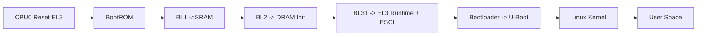
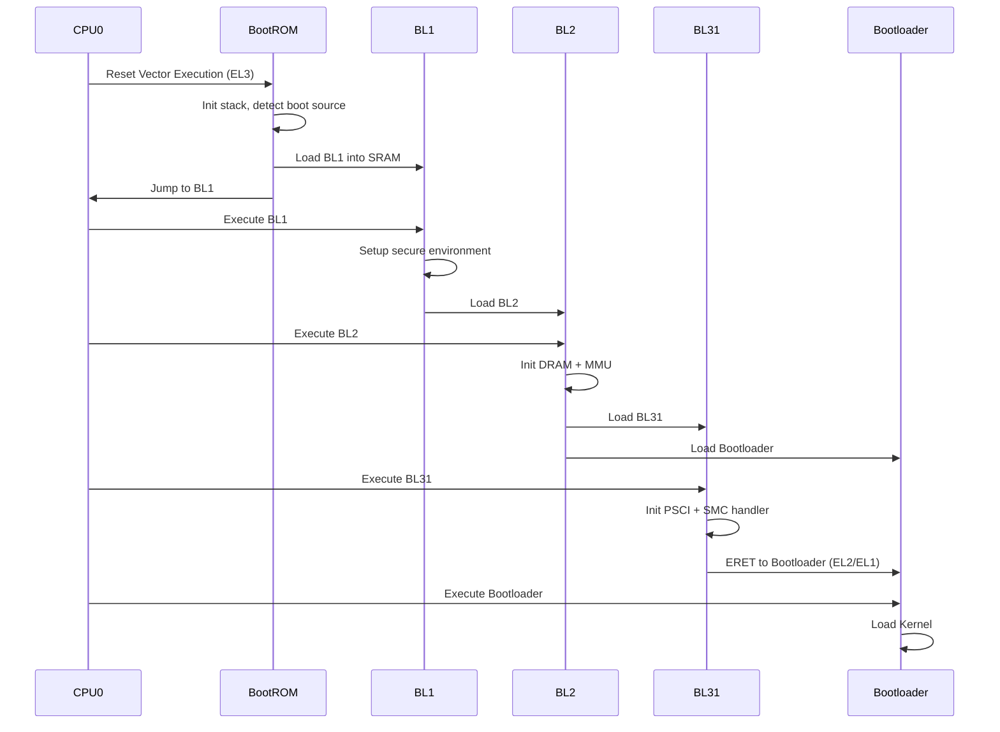

# ARMv8 End-to-End Boot Flow Deep Dive (Primary Core → BootROM → BL1 → BL2 → BL31 → Bootloader)

---

# 🧭 1. Block Diagram (ARMv8 Boot Architecture)

---

# 🔬 2. Each Component Explained from Scratch

## 🔹 CPU0 (Primary Core)

* First core to execute after reset
* Starts in EL3 (Secure state)
* MMU OFF, caches OFF
* Fetches instruction from reset vector

---

## 🔹 BootROM

* Immutable code inside SoC
* Runs in EL3

### Responsibilities:

* Initialize stack (SP_EL3)
* Detect boot source (eMMC, SPI, NAND)
* Minimal clock setup
* Load BL1 into SRAM
* Transfer control to BL1

---

## 🔹 BL1 (Stage 1 Firmware)

* Runs in EL3
* Located in SRAM

### Responsibilities:

* Setup exception vectors (VBAR_EL3)
* Initialize secure environment
* Load BL2

---

## 🔹 BL2 (Stage 2 Firmware)

* Runs in EL3

### Responsibilities:

* Initialize DRAM controller
* Setup MMU and page tables
* Load BL31 and BL33 (Bootloader)

---

## 🔹 BL31 (EL3 Runtime Firmware)

### Responsibilities:

* Implements PSCI (CPU power management)
* Handles SMC calls from kernel
* Controls secondary CPU boot
* Prepares transition to non-secure world

---

## 🔹 Bootloader (BL33)

### Responsibilities:

* Runs in EL2/EL1
* Loads kernel image
* Passes device tree
* Transfers control to kernel

---

# 🔁 3. End-to-End Mermaid Sequence Flow

---

# 🧠 4. Explanation of Mermaid Flow

### Step-by-step:

1. CPU0 starts at reset in EL3
2. BootROM initializes minimal environment
3. BL1 is loaded into SRAM and executed
4. BL1 prepares secure context and loads BL2
5. BL2 initializes DRAM and loads further stages
6. BL31 installs PSCI and secure monitor
7. Control is handed to Bootloader via ERET
8. Bootloader loads OS kernel

---

# ⚡ 5. Importance in ARMv8

* Ensures secure boot chain
* Enables trusted firmware separation
* Allows controlled CPU power management (PSCI)
* Supports multi-core bring-up
* Provides hardware abstraction before OS

---

# 🔥 6. Why This is Critical in ARMv8

* ARMv8 introduces multiple exception levels
* Secure vs Non-secure world separation
* Firmware must manage transitions safely
* Without BL31, kernel cannot control CPUs
* Boot flow ensures platform independence

---

# 🎯 7. Interview Questions (Deep Level)

## Q1: Why does ARMv8 start in EL3?

**Answer:**
EL3 provides the highest privilege level required to initialize secure state, configure SCR_EL3, and control transitions to non-secure worlds.

---

## Q2: What is the role of BootROM?

**Answer:**
BootROM is immutable and responsible for selecting boot source, initializing minimal hardware, and loading the first stage firmware (BL1).

---

## Q3: Why is BL1 needed?

**Answer:**
BL1 provides a controlled environment before DRAM is available and ensures secure initialization before loading BL2.

---

## Q4: What happens if DRAM is not initialized in BL2?

**Answer:**
The system cannot proceed because larger firmware stages and kernel require DRAM.

---

## Q5: What is PSCI and why is it important?

**Answer:**
PSCI is the standard interface for CPU power management, enabling OS to control cores through firmware.

---

## Q6: Why is BL31 critical?

**Answer:**
It implements PSCI and acts as a secure monitor handling SMC calls.

---

## Q7: What is ERET?

**Answer:**
Exception return instruction used to switch from EL3 to lower EL.

---

## Q8: Why separate BL stages?

**Answer:**
To modularize responsibilities and maintain secure boot chain.

---

## Q9: What is SCR_EL3?

**Answer:**
Controls secure/non-secure execution and interrupt routing.

---

## Q10: What happens during reset vector execution?

**Answer:**
CPU fetches first instruction from a fixed address defined by hardware.

---

## Q11: Why is MMU off initially?

**Answer:**
No memory mapping is configured yet.

---

## Q12: How is boot source selected?

**Answer:**
Using hardware straps or eFuse configuration.

---

## Q13: What is BL33?

**Answer:**
Non-secure bootloader (e.g., U-Boot).

---

## Q14: Why is secure monitor needed?

**Answer:**
To mediate access between secure and non-secure worlds.

---

## Q15: What happens if BL31 is missing?

**Answer:**
Kernel cannot manage CPUs or power states, breaking SMP functionality.

---

# 📌 End of Document
