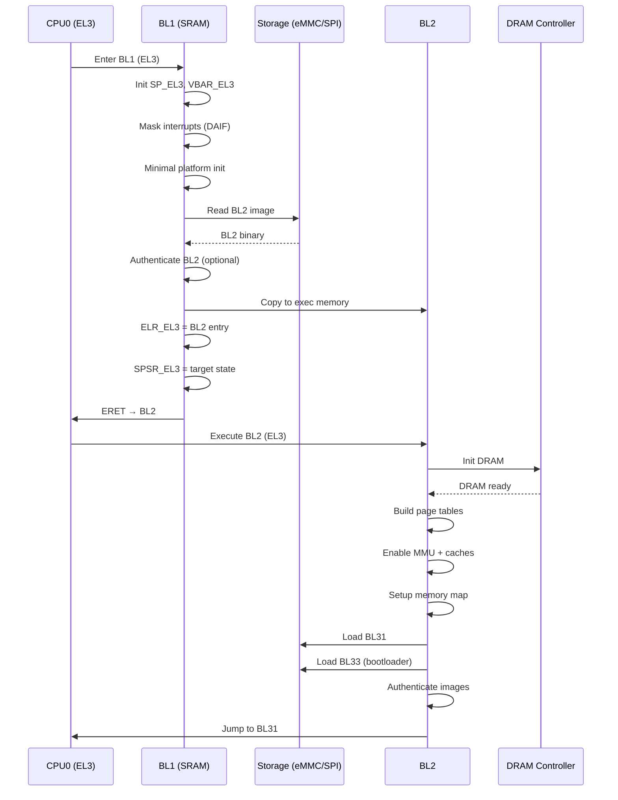

# ARMv8 Boot Flow: BL1 → BL2 (Deep Dive, GitHub Ready)

This document provides an in-depth, from-scratch explanation of the transition from BL1 to BL2 in ARMv8-A systems. It includes architecture context, detailed responsibilities, register-level insights, and Mermaid diagrams that render correctly on GitHub.

---

## 🧭 1. Context in the Boot Chain

```
RESET → BootROM → BL1 → BL2 → BL31 → BL33 (Bootloader) → Kernel
```

* **BL1**: Minimal, trusted stage (runs from SRAM, EL3)
* **BL2**: Platform bring-up (DRAM, MMU, image loading, still EL3)

---

## 🔬 2. Execution State at BL1 Entry

* Exception Level: **EL3 (Secure)**
* MMU: **OFF** (or minimal)
* Caches: **OFF** or partially enabled
* Stack: Initialized in **SRAM** (SP_EL3)
* Interrupts: Masked (DAIF set)

Key registers used in EL3:

* `SP_EL3` – stack pointer
* `VBAR_EL3` – exception vectors
* `SCR_EL3` – secure configuration
* `SPSR_EL3` – saved program state (for ERET)
* `ELR_EL3` – return address (for ERET)

---

## ⚙️ 3. BL1 Responsibilities (From Scratch)

### 3.1 Minimal Runtime Setup

* Initialize `SP_EL3`
* Program `VBAR_EL3`
* Mask interrupts (DAIF)
* Establish trusted SRAM layout

### 3.2 Platform Bring-up (Minimal)

* Basic clocks (if not done by ROM)
* Early console (optional)

### 3.3 I/O & Image Loading Framework

* Initialize storage drivers (eMMC/SPI/NAND/SD)
* Setup IO abstraction to read images

### 3.4 Secure Boot (Optional but Critical)

* Authenticate BL2 image (hash/signature)
* Abort on failure

### 3.5 Load BL2

* Read BL2 from boot device
* Copy BL2 into executable memory (SRAM or temporary region)

### 3.6 Prepare EL3 Context for Handoff

* `ELR_EL3 = <BL2 entry address>`
* `SPSR_EL3 = <target state for BL2>` (AArch64, EL3h typically)

### 3.7 Transfer Control

* Use `ERET` to branch with correct context to BL2

---

## 🚀 4. BL2 Responsibilities (From Scratch)

### 4.1 Early Platform Init

* Initialize **DRAM controller**
* Configure PLLs/clocks, power domains

### 4.2 Enable MMU & Caches

* Build translation tables
* Enable MMU, I-cache, D-cache

### 4.3 Memory Map Definition

* Define secure/non-secure regions
* Map device memory vs normal memory

### 4.4 Load Next Images

* Load **BL31** (EL3 runtime firmware)
* Load **BL33** (non-secure bootloader)

### 4.5 Authentication (if enabled)

* Verify BL31 and BL33 images

### 4.6 Parameter Passing

* Prepare entry point info (addresses, args)
* Setup structures for next stage handoff

### 4.7 Handoff to BL31

* Jump/branch to BL31 entry (EL3 continues)

---

## 🔁 5. End-to-End Sequence (BL1 → BL2)



---

## 🧠 6. Step-by-Step Explanation

1. **BL1 runs in EL3** with minimal environment.
2. It sets up stack, vectors, and basic IO.
3. BL1 reads BL2 from the selected boot device.
4. Optional **secure boot** verifies BL2 integrity.
5. BL1 prepares **EL3 context** (`ELR_EL3`, `SPSR_EL3`).
6. `ERET` transfers control to BL2 cleanly.
7. **BL2 starts** and initializes DRAM (major milestone).
8. BL2 enables **MMU and caches** (switch to virtual memory).
9. BL2 loads next stages (BL31, BL33) and verifies them.
10. Control passes to BL31 for runtime services (PSCI, SMC handling).

---

## ⚡ 7. Critical Points & Importance

* **EL3 Control**: Both BL1 and BL2 run at highest privilege.
* **DRAM Init (BL2)**: Required for loading large images (kernel).
* **MMU Enablement**: Enables full system performance and memory safety.
* **Secure Boot Chain**: BL1→BL2 verification establishes trust.
* **Clean Handoff via ERET**: Ensures correct CPU state transition.

---

## 🎯 8. Mental Model

```
BL1 = Tiny trusted loader (SRAM, verifies, hands off)
BL2 = System bring-up engine (DRAM, MMU, loads next stages)
```

---

## 🧪 9. Common Pitfalls

* Incorrect `SPSR_EL3` → wrong EL/stack on entry
* Missing cache maintenance when copying images
* DRAM timing misconfiguration → random crashes
* Wrong memory attributes → MMU faults
* Skipping authentication in secure systems

---

## 📌 10. GitHub Notes

* Mermaid diagrams above are **GitHub-safe** (no unescaped parentheses in node labels).
* Paste this file into `README.md` to render diagrams automatically.

---

**End of Document**
