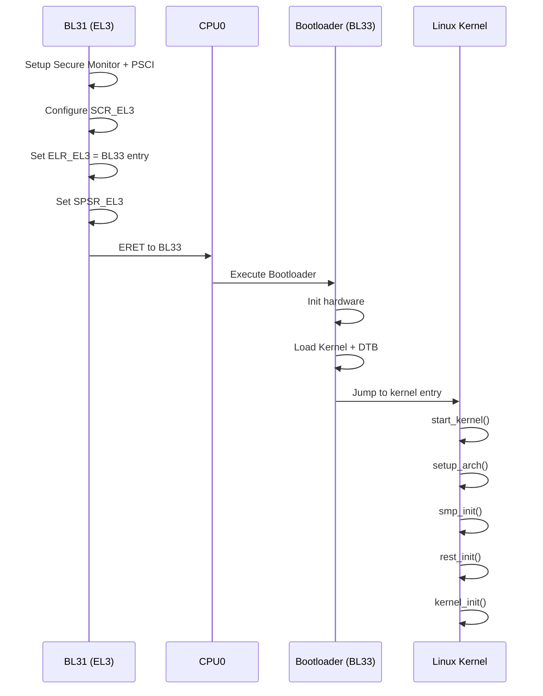

# ARMv8 Boot Flow: BL31 → Bootloader → Kernel (Deep Dive)

This document explains in depth the transition from BL31 (EL3 runtime firmware) to Bootloader (BL33) and finally to the Linux Kernel in ARMv8-A systems. It is structured for GitHub with Mermaid diagrams.

---

## 🧭 1. Context in Boot Chain

```
RESET → BootROM → BL1 → BL2 → BL31 → BL33 (Bootloader) → Kernel → User Space
```

* **BL31**: Secure monitor + PSCI (EL3)
* **BL33**: Bootloader (Non-secure EL2/EL1)
* **Kernel**: OS (EL1)

---

## 🔬 2. Execution State at BL31 Entry

* EL: EL3 (Secure)
* MMU: ON
* Caches: ON
* DRAM: Available

BL31 is responsible for managing secure world and transitioning to non-secure execution.

---

## ⚙️ 3. BL31 Responsibilities

### 3.1 Secure Monitor Setup

* Setup VBAR_EL3
* Install SMC handler

### 3.2 PSCI Initialization

* Setup CPU topology
* Power domain hierarchy

### 3.3 Runtime Services

* Handle SMC calls from OS
* CPU ON/OFF/SUSPEND

### 3.4 Context Setup for BL33

* Configure SCR_EL3 (Non-secure enable)
* Setup SPSR_EL3 (target EL2/EL1)
* Setup ELR_EL3 (entry point of BL33)

### 3.5 Transition to Non-secure World

* Execute ERET → BL33

---

## 🚀 4. Bootloader (BL33) Responsibilities

### 4.1 Execution State

* EL2 or EL1 (Non-secure)

### 4.2 Hardware Initialization

* Initialize peripherals
* Setup clocks, timers

### 4.3 Load Kernel

* Load kernel image (Image/zImage)
* Load Device Tree (DTB)
* Load initrd (optional)

### 4.4 Setup Kernel Arguments

* x0 = DTB pointer
* x1–x3 = reserved

### 4.5 Jump to Kernel

* Branch to kernel entry point

---

## 🐧 5. Kernel Responsibilities (Early Boot)

### 5.1 Entry Point

* start_kernel()

### 5.2 Setup

* setup_arch()
* paging_init()

### 5.3 SMP Init

* smp_init()
* psci_cpu_on() (secondary cores)

### 5.4 Init Process

* rest_init()
* kernel_init()
* run_init_process()

---

## 🔁 6. Mermaid Sequence Diagram



---

## 🧠 7. Step-by-Step Explanation

1. BL31 prepares secure monitor and PSCI
2. Configures EL transition registers
3. Executes ERET → enters non-secure world
4. Bootloader initializes system and loads kernel
5. Kernel starts execution and initializes subsystems
6. SMP bring-up begins
7. User space eventually starts

---

## ⚡ 8. Critical Concepts

* **ERET**: Transition from EL3 → EL2/EL1
* **SCR_EL3**: Controls secure/non-secure execution
* **PSCI**: Enables kernel to manage CPUs

---

## 🎯 9. Importance in ARMv8

* Defines boundary between secure firmware and OS
* Enables multi-core systems
* Provides standard interface (PSCI)

---

## 🧠 10. Mental Model

```
BL31 = Secure controller (power + security)
Bootloader = System loader
Kernel = OS manager
```

---

## 🧪 11. Common Pitfalls

* Wrong SPSR_EL3 → incorrect EL transition
* Missing DTB → kernel fails
* PSCI not working → SMP failure

---

## 📌 12. GitHub Notes

* Mermaid diagrams are GitHub-safe
* Use quotes for labels if needed

---

**End of Document**
