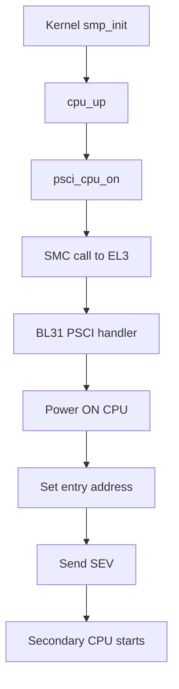
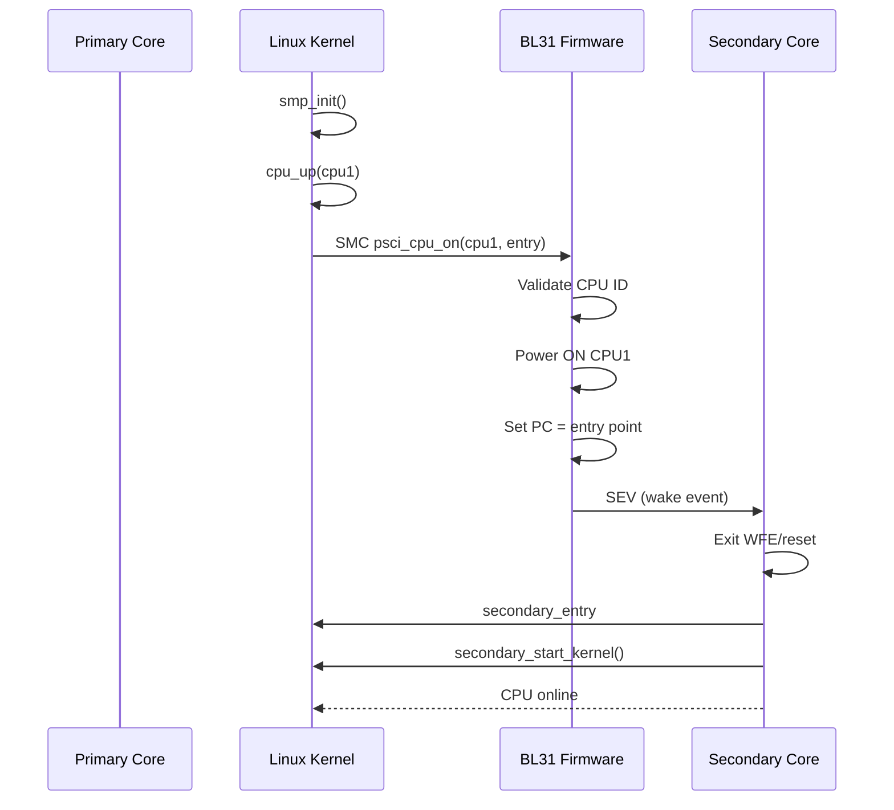

# ARMv8 Multi-Core Bring-Up (PSCI CPU_ON Deep Dive)

This document explains in detail how secondary cores are brought up in ARMv8-A using PSCI (Power State Coordination Interface). It is GitHub-ready with Mermaid diagrams.

---

## 🧭 1. Context

After kernel boot on CPU0:

```
Primary Core (CPU0) → Kernel Init → smp_init() → cpu_up() → psci_cpu_on()
```

Secondary cores are initially:

* Held in reset OR
* In WFE (Wait For Event) loop

---

## 🔬 2. Initial State of Secondary Cores

* Power state: OFF or IDLE
* Execution: Not running kernel
* Entry point: Undefined or parked loop

---

## ⚙️ 3. PSCI CPU_ON Flow (High Level)



---

## 🔁 4. Detailed Sequence Diagram



---

## 🧠 5. Step-by-Step Explanation

### Step 1: Kernel Requests CPU Bring-Up

* Function: `smp_init()` → `cpu_up()`

### Step 2: PSCI Call

* Kernel executes SMC
* Parameters:

  * x0 = PSCI_CPU_ON
  * x1 = target CPU ID
  * x2 = entry address

### Step 3: EL3 Firmware Handles Request

* BL31 validates request
* Powers on CPU using platform-specific code

### Step 4: Entry Point Setup

* Program reset vector or mailbox
* Set PC for secondary CPU

### Step 5: Wake-Up Signal

* SEV instruction wakes CPU

### Step 6: Secondary CPU Starts

* Executes from entry point
* Runs kernel secondary init

---

## 🔥 6. Secondary CPU Boot Code Path

```text
secondary_entry (assembly)
  → secondary_startup
    → secondary_start_kernel()
      → cpu_startup_entry()
```

---

## ⚡ 7. Important Concepts

### PSCI

* Standard interface for power management

### SMC

* Secure Monitor Call (EL1 → EL3)

### SEV/WFE

* Event-based wake mechanism

---

## 🎯 8. Importance in ARMv8

* Enables SMP systems
* Abstracts hardware differences
* Secure control of CPU power states

---

## 🧠 9. Mental Model

```
CPU0 = Manager
EL3 = Power controller
CPU1..N = Workers
```

---

## 🧪 10. Common Pitfalls

* Wrong entry address → crash
* PSCI not implemented → no SMP
* Cache not coherent → instability

---

## 📌 11. GitHub Notes

* Mermaid diagrams are compatible
* Ready for README.md

---

**End of Document**
