## 🧠 **Cache Coherency in ARMv8 (Top Answer)**

**Cache coherency in ARMv8 ensures that multiple processors (cores) see a consistent and up-to-date view of memory, even when each core has its own private cache.**
It is implemented using **hardware cache coherency protocols (like MESI/MOESI variants)** combined with **interconnects (CCI/CMN)** and **memory ordering rules.**

---

# 📌 1. Why Cache Coherency is Needed

In a multi-core ARMv8 system:

* Each core has:

  * L1 cache (private)
  * L2 cache (sometimes shared or private)
* Multiple cores may cache the same memory address

⚠️ Problem:

* Core 1 updates value → Core 2 still sees old value

✔️ Solution:

* Hardware ensures **all caches stay consistent**

---

# 🧩 2. Key ARMv8 Concepts

### 🔹 Shareability Domains

Memory is categorized as:

| Type            | Meaning                  |
| --------------- | ------------------------ |
| Non-shareable   | Only visible to one core |
| Inner Shareable | Within cluster           |
| Outer Shareable | Across clusters          |

---

### 🔹 Cache States (Simplified MOESI-like)

| State         | Meaning                         |
| ------------- | ------------------------------- |
| Modified (M)  | Only this cache has latest data |
| Owned (O)     | Shared but dirty                |
| Exclusive (E) | Clean, single owner             |
| Shared (S)    | Multiple caches                 |
| Invalid (I)   | Not valid                       |

---

# 🔄 3. High-Level Flow (Mermaid)

```mermaid
flowchart LR
    A[Core 1 Write] --> B[Update L1 Cache]
    B --> C[Send Coherency Message]
    C --> D[Interconnect (CCI/CMN)]
    D --> E[Invalidate Other Caches]
    E --> F[Other Cores Update State]
    F --> G[Memory Consistent View]
```

---

# 🔁 4. Detailed Sequence Diagram

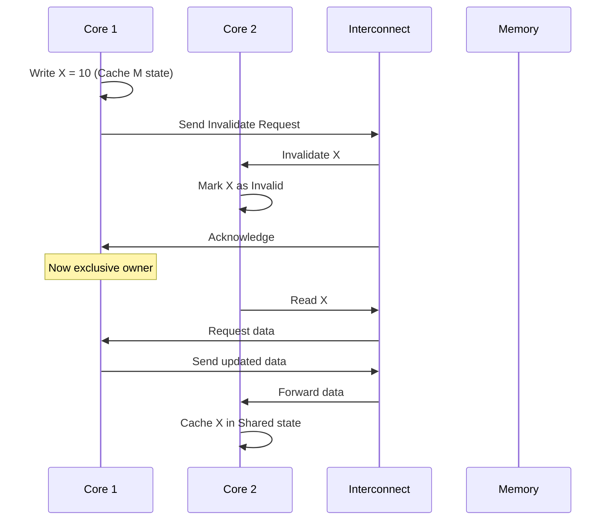

---

# ⚙️ 5. How It Works Internally (Deep Dive)

## 🔹 Step 1: Write Operation

* Core writes to cache line
* Cache line moves to **Modified (M)**
* Broadcast:

  * “Invalidate others”

---

## 🔹 Step 2: Snoop Mechanism

Other cores:

* Listen via **snoop bus/interconnect**
* If they have the line:

  * Mark as **Invalid**

---

## 🔹 Step 3: Read from Another Core

* Core 2 requests data
* Interconnect checks:

  * Who has latest copy?
* Data sourced from:

  * Core cache (not memory!) → faster

---

## 🔹 Step 4: Write-back

* Modified data eventually written to memory
* Happens on:

  * Eviction
  * Synchronization events

---

# 🧱 6. ARMv8 Hardware Components

### 🔸 CCI (Cache Coherent Interconnect)

* Used in earlier ARM designs
* Connects clusters

### 🔸 CMN (Coherent Mesh Network)

* Used in modern SoCs
* Scalable mesh interconnect

---

# 🔐 7. Memory Ordering + Barriers

ARMv8 is **weakly ordered**, so:

### Important Instructions:

| Instruction | Purpose                      |
| ----------- | ---------------------------- |
| DMB         | Data Memory Barrier          |
| DSB         | Data Synchronization Barrier |
| ISB         | Instruction Sync Barrier     |

---

### Example Flow:

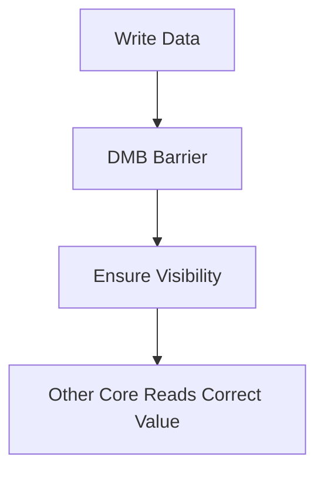

---

# 🧪 8. Real Example

### Scenario:

```c
Core1: X = 1;
Core2: print(X);
```

Without coherency:
❌ Core2 might print 0

With ARMv8 coherency:
✔️ Core2 sees 1

---

# 🚀 9. System Design Interview (Qualcomm / NVIDIA / Meta)

## ❓ Q1: How does ARM handle cache coherency across clusters?

### ✅ Answer:

* Uses **CCI/CMN interconnect**
* Maintains:

  * Directory-based tracking
  * Snoop filters
* Reduces unnecessary broadcasts

---

## ❓ Q2: How do you optimize cache coherency traffic?

### ✅ Answer:

* Use:

  * Data locality
  * Cache line alignment
  * Avoid false sharing
* Prefer:

  * Read-only sharing
  * Partition workloads

---

## ❓ Q3: What is False Sharing?

### ✅ Answer:

* Two cores modify different variables
* But in same cache line

🔥 Causes:

* Excess invalidations

---

## ❓ Q4: How does GPU (NVIDIA-style) coherency differ?

### ✅ Answer:

* GPUs often:

  * Use relaxed coherency
  * Explicit sync
* CPU-GPU coherency:

  * Managed via:

    * I/O coherency
    * Unified memory

---

## ❓ Q5: How would you debug coherency issues?

### ✅ Answer:

* Use:

  * Memory barriers
  * Cache flush/invalidate
* Tools:

  * Performance counters
  * Trace analyzers

---

# 🧭 10. Advanced Flow (Full System)

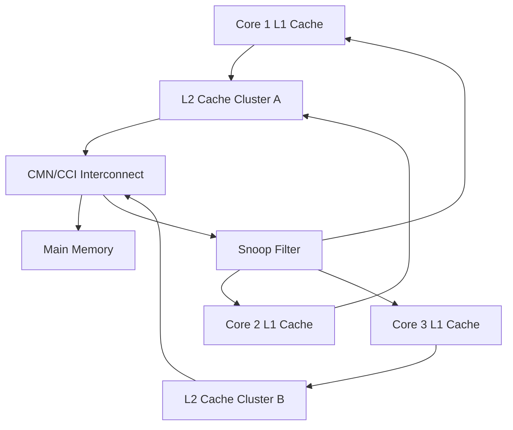

---

# 🎯 11. Key Takeaways

✔ ARMv8 uses **hardware-managed coherency**
✔ Based on **MOESI-like protocols**
✔ Interconnect (CCI/CMN) is critical
✔ Weak memory model → requires barriers
✔ Performance depends on minimizing coherency traffic

---
## 🧠 **Cache Enable at Boot (ARMv8) + MESI + Snoop — Deep Structured Answer**

---

# 📌 1. Who Enables Cache? (CPU vs Kernel)

👉 **Short Answer:**

* **CPU (hardware)** → starts with caches **disabled**
* **Firmware (Bootloader / EL3 / EL2)** → *initial setup*
* **Kernel (EL1)** → **final authority to enable caches**

👉 Typical flow:

1. ROM Boot → minimal setup (no cache)
2. Trusted Firmware / Bootloader → may enable temporarily
3. **Kernel → configures MMU + enables caches properly**

✔ Final responsibility = **Kernel**

---

# 🔄 2. Boot-Time Cache Enable Flow (Step-by-Step)

### 🔹 Preconditions required:

Before enabling cache, ARM requires:

* MMU setup (page tables)
* Memory attributes (Normal vs Device)
* Shareability defined
* Translation tables valid

---

## 🎨 3. Full Boot Flow (Coloured Mermaid)

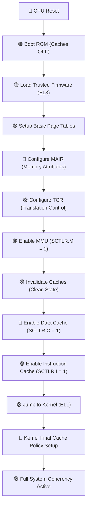

---

# 🔁 4. Sequence Diagram (CPU ↔ Firmware ↔ Kernel)

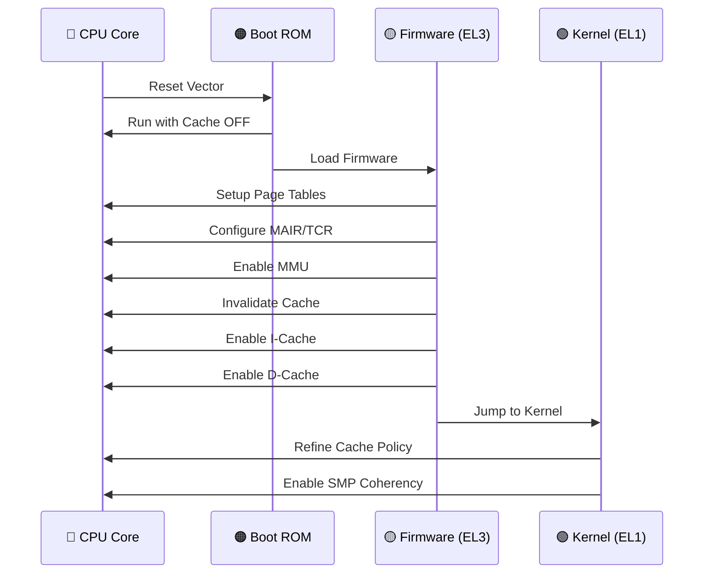

---

# ⚙️ 5. Key Registers Involved

| Register  | Purpose             |
| --------- | ------------------- |
| SCTLR_EL1 | Enable MMU + Cache  |
| MAIR_EL1  | Memory types        |
| TCR_EL1   | Address translation |
| TTBR0/1   | Page tables         |

---

# 🔥 6. Critical Rule (VERY IMPORTANT)

🚨 **Never enable cache before MMU**

Why?

* Cache needs memory attributes
* Otherwise → **data corruption**

---

# 🧩 7. MESI Protocol — From Scratch

---

## 🔹 States Recap

| State | Meaning                     |
| ----- | --------------------------- |
| M 🔴  | Modified (dirty, only copy) |
| E 🟢  | Exclusive                   |
| S 🔵  | Shared                      |
| I ⚫   | Invalid                     |

---

## 🎨 8. MESI Flow Diagram

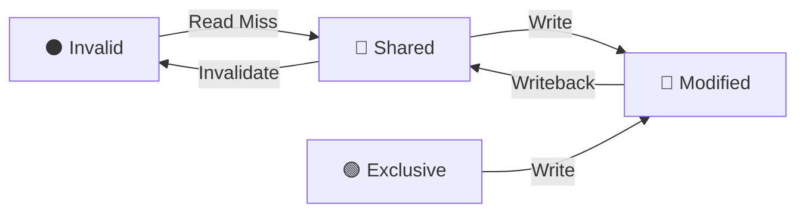

---

# 🔍 9. How Snoop Works (Core Concept)

👉 **Snoop = “Other cores watching your cache actions”**

---

## 🔁 Snoop Interaction Flow

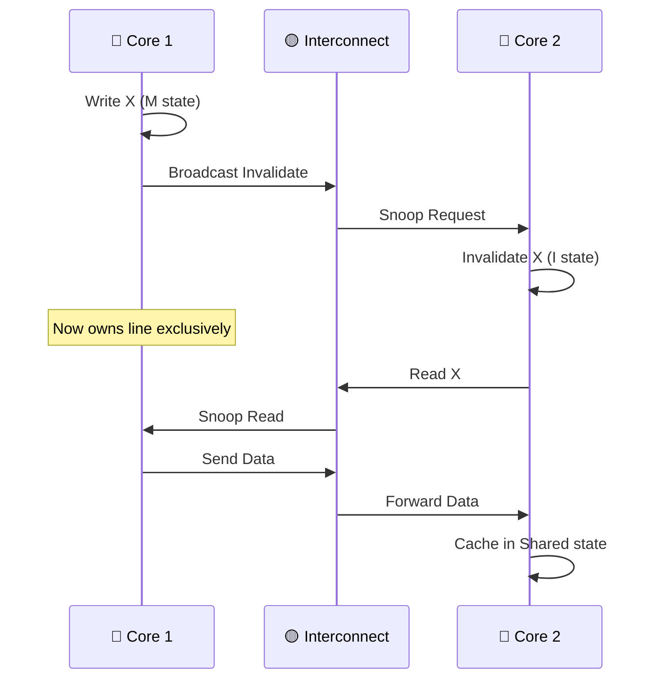

---

# 🧠 10. Deep Interaction: MESI + Snoop Together

---

## 🔥 Full Flow Example

### Scenario:

* Core1 writes
* Core2 reads

---

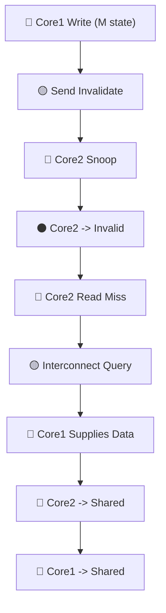

---

# ⚡ 11. Important Internal Mechanisms

---

## 🔹 1. Snoop Filter

* Tracks which core has which cache line
* Avoids unnecessary broadcasts

---

## 🔹 2. Directory-Based Coherency

* Instead of broadcasting to all cores
* Interconnect keeps a **directory**

---

## 🔹 3. Cache Line Granularity

* Coherency works at:

  * 64 bytes (typical)

---

# 🧪 12. Real Boot + Coherency Combined Flow

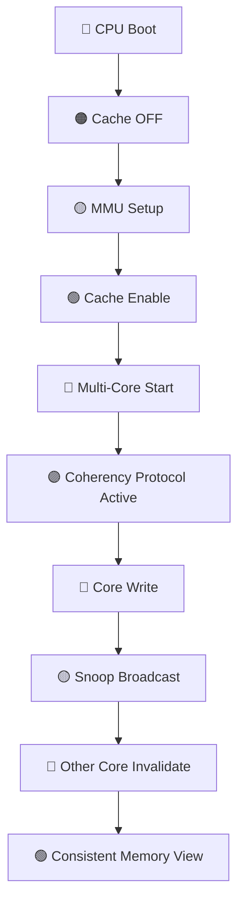

---

# 🎯 13. Interview-Level Insights (Qualcomm / NVIDIA / Meta)

---

## ❓ Q1: Why invalidate cache before enabling?

✅ Ensures:

* No stale data
* Clean coherency start

---

## ❓ Q2: What happens if snoop fails?

❌ Data inconsistency
❌ Race conditions
❌ Hard-to-debug bugs

---

## ❓ Q3: Why MESI instead of simple write-through?

✅ Reduces memory traffic
✅ Improves performance
✅ Enables cache-to-cache transfer

---

## ❓ Q4: What is biggest bottleneck?

🔥 Coherency traffic:

* Too many invalidations
* False sharing

---

# 🚀 14. Key Takeaways

✔ Cache is **enabled by Kernel (final authority)**
✔ Must configure **MMU before cache**
✔ MESI ensures **correct data ownership**
✔ Snoop ensures **real-time coordination between cores**
✔ Interconnect is the **brain of coherency**

---
Alright — now we’ll go **from real code → registers → hardware → coherency protocol → snoop** in one continuous flow. This is exactly the level expected in **Qualcomm / NVIDIA / Meta system interviews**.

---

# 🧠 1. Big Picture (Before Code)

When you ask *“where exactly cache coherency happens?”*:

👉 It happens at **3 layers simultaneously**:

| Layer        | Who                     | Responsibility        |
| ------------ | ----------------------- | --------------------- |
| Software     | Kernel                  | Enable + configure    |
| CPU          | Core + Cache controller | Maintain MESI states  |
| Interconnect | CCI / CMN               | Snoop + data transfer |

---

# 📌 2. Real Kernel Code Path (ARMv8 Linux)

### 🔹 Entry point (early boot)

```c
// arch/arm64/kernel/head.S

__primary_switch:
    bl  __enable_mmu
```

---

## 🔹 Step 1: Enable MMU + Cache

```c
// arch/arm64/mm/proc.S

__enable_mmu:
    // Set Translation Table Base
    msr ttbr0_el1, x0

    // Configure memory attributes
    msr mair_el1, x1

    // Configure translation control
    msr tcr_el1, x2

    // Enable MMU + Cache
    mrs x0, sctlr_el1
    orr x0, x0, #(1 << 0)   // M = MMU enable
    orr x0, x0, #(1 << 2)   // C = Data cache enable
    orr x0, x0, #(1 << 12)  // I = Instruction cache enable
    msr sctlr_el1, x0

    isb   // Synchronization barrier
    ret
```

---

# 🔍 3. What Happens EXACTLY at This Instruction

### 🔥 Critical line:

```c
msr sctlr_el1, x0
```

👉 This is where:

* L1 I-cache turns ON
* L1 D-cache turns ON
* CPU starts using cache instead of memory

---

# 🎨 4. CPU Internal Flow (When Cache Turns ON)

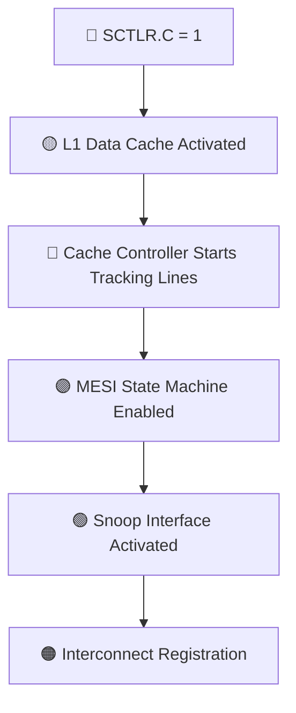

---

# 🧩 5. Now: Where Coherency Starts

👉 Coherency does NOT happen at enable time
👉 It happens when **multiple cores access same address**

---

# 🔄 6. Example Code Triggering Coherency

```c
int x = 0;

// Core 1
x = 10;

// Core 2
printf("%d", x);
```

---

# 🔁 7. FULL FLOW (Kernel → CPU → Hardware)

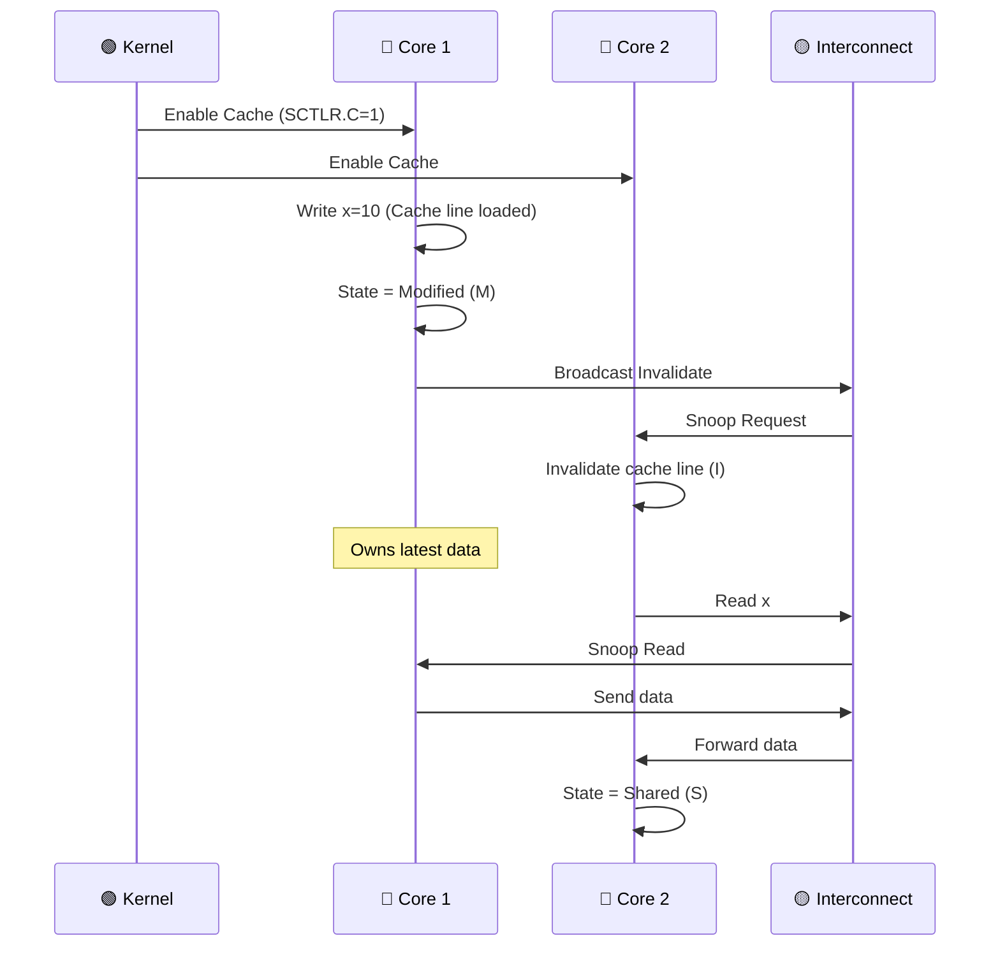

---

# 🔬 8. CPU Perspective (Cycle-Level Thinking)

---

## 🔹 Step A: Core1 Write

```c
x = 10;
```

### CPU does:

1. Check L1 cache:

   * Miss → fetch cache line
2. Upgrade state:

   * S → M (needs ownership)
3. Send:

   * **Read-For-Ownership (RFO)**

---

## 🔹 Step B: Interconnect Action


---

## 🔹 Step C: Other Core Reaction

Core2:

* Receives snoop
* If has line:

  * Invalidate
  * Send ACK

---

# 🧠 9. MESI State Transition (REAL FLOW)

```mermaid
flowchart TD
    I["⚫ Invalid"] -->|Read| S["🔵 Shared"]
    S -->|Write (RFO)| M["🔴 Modified"]
    M -->|Snoop Read| S
    S -->|Invalidate| I
```

---

# 🔥 10. Where EXACTLY Snoop Happens

👉 Hardware block:

* Inside:

  * L2 cache controller
  * Interconnect (CCI / CMN)

---

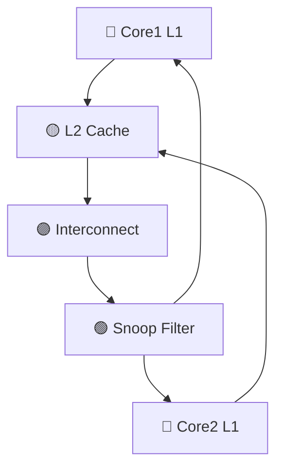

---

# ⚙️ 11. Important Kernel Functions (Real)

---

## 🔹 Cache Maintenance APIs

```c
void flush_dcache_area(void *addr, size_t len);
void invalidate_dcache_range(unsigned long start, unsigned long end);
```

👉 Used when:

* DMA
* Device memory
* Non-coherent systems

---

## 🔹 Barrier Instructions

```c
dsb(sy);   // Complete all memory ops
dmb(ish);  // Ensure visibility
isb();     // Sync instruction pipeline
```

---

# 🚨 12. Critical Insight (Interview GOLD)

👉 Kernel DOES NOT manage coherency per access

✔ Hardware does:

* MESI state transitions
* Snoop handling
* Cache line ownership

👉 Kernel only:

* Enables system
* Defines memory types
* Uses barriers when needed

---

# 🎯 13. End-to-End Flow (From Scratch)

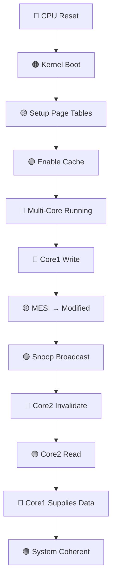

---

# 🧠 14. Final Mental Model

👉 Think of system like:

* **Kernel** = “turn on rules”
* **CPU cache controller** = “track ownership”
* **Interconnect** = “police communication”
* **Snoop** = “watch everyone”

---


