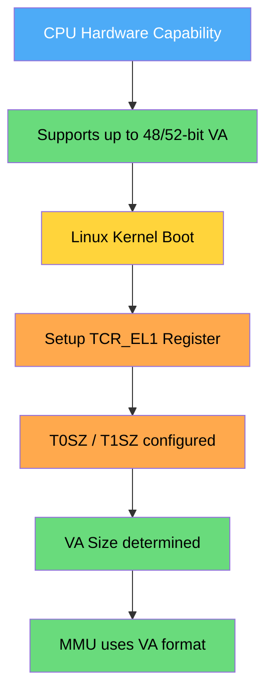
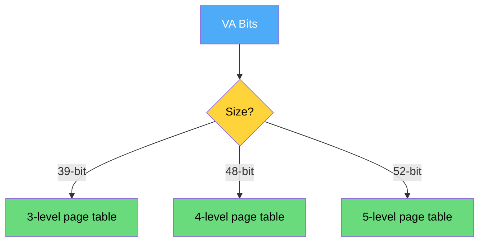
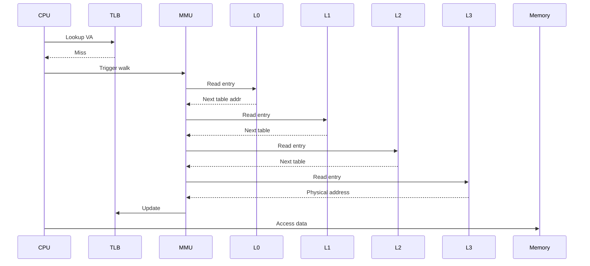
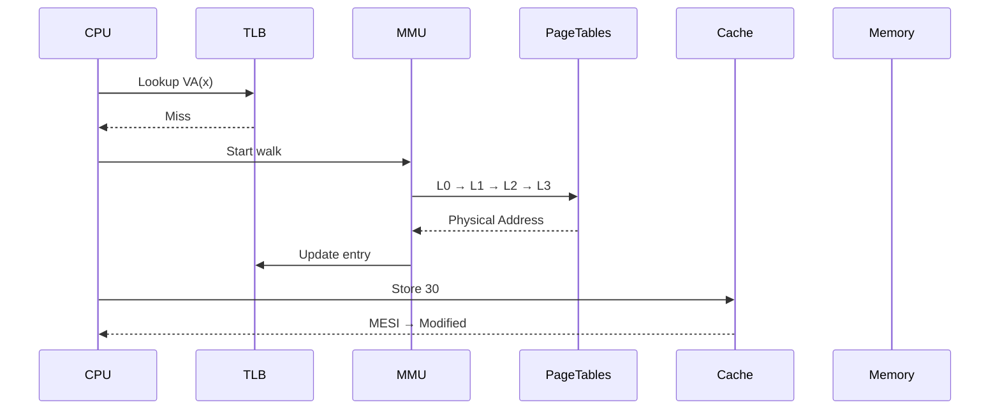
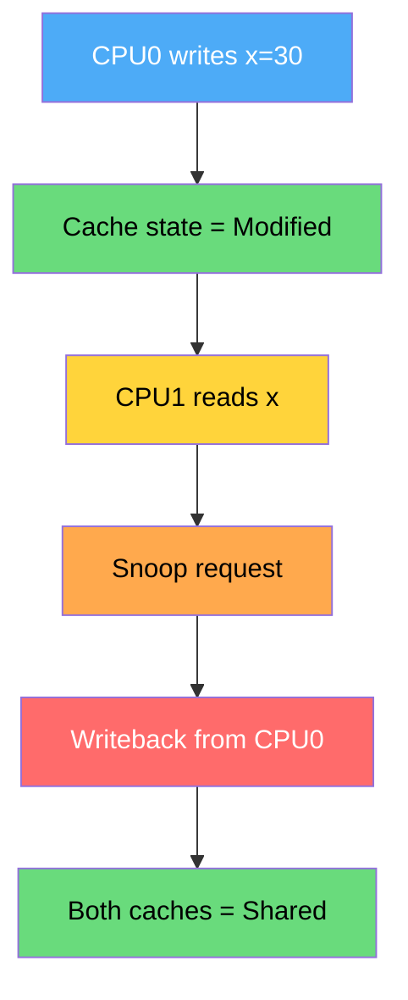
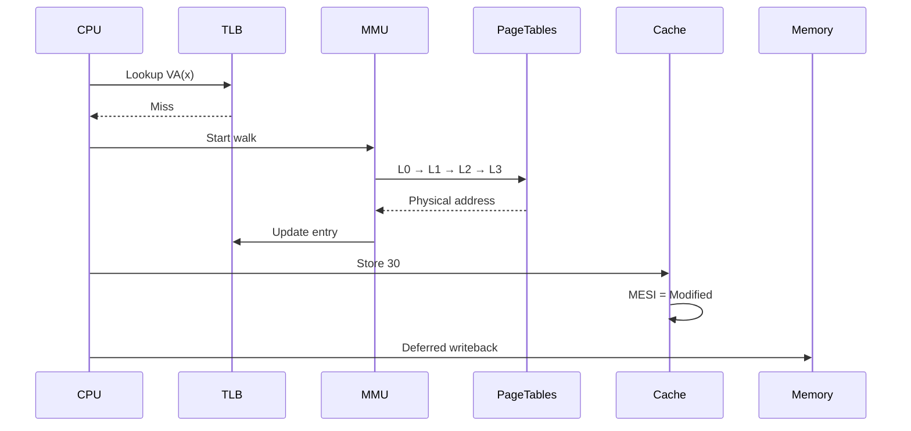

# **Q: From where is the Virtual Address size (e.g., 48-bit VA) decided in ARMv8? Where is it defined?**

---

# **01. Short Answer (Core Idea)**

The **virtual address size (like 48-bit)** is determined by:

👉 **Hardware capability (CPU design)**
👉 **Configured by software using a register called `TCR_EL1`**
👉 **Used by Linux kernel during early boot**

---

# **02. Who Decides VA Size? (Hierarchy)**

| Level                           | Role                                                     |
| ------------------------------- | -------------------------------------------------------- |
| **ARM CPU (Hardware)**          | Defines maximum VA size supported (e.g., 48-bit, 52-bit) |
| **System Register (`TCR_EL1`)** | Configures actual VA size used                           |
| **Linux Kernel**                | Programs `TCR_EL1` during boot                           |

---

# **03. Key Register: `TCR_EL1` (Translation Control Register)**

This is the **main place where VA size is defined at runtime**.

### Important fields:

```text
TCR_EL1:
  T0SZ → Size of VA for TTBR0 (user space)
  T1SZ → Size of VA for TTBR1 (kernel space)
```

---

## **Formula**

```text
VA size = 64 - TnSZ
```

### Example:

* If `T0SZ = 16`
  👉 VA size = **64 - 16 = 48 bits**

---

# **04. Visual Flow (How VA Size is Decided)**



---

# **05. Where in Linux Kernel It Happens**

## **File Location**

```text
arch/arm64/mm/proc.S
arch/arm64/include/asm/pgtable-hwdef.h
```

---

## **Important Code Path**

### **During Boot**

```text
start_kernel()
  → setup_arch()
      → paging_init()
          → __cpu_setup()
```

---

## **Actual Register Programming**

### In `__cpu_setup` (assembly)

```asm
msr tcr_el1, x0   // Write TCR_EL1
```

---

## **Kernel Macros Defining VA Size**

### Example:

```c
#define VA_BITS        48
#define VA_START       (UL(0xffffffffffffffff) << VA_BITS)
```

---

# **06. Why 48-bit is Common?**

### Reasons:

* Balance between:

  * Address space size
  * Page table size
* 48-bit gives:

  * **256 TB virtual address space**

---

# **07. ARMv8 Address Range Types**

| VA Bits | Address Space   |
| ------- | --------------- |
| 39-bit  | 512 GB          |
| 42-bit  | 4 TB            |
| 48-bit  | 256 TB          |
| 52-bit  | 4 PB (ARMv8.2+) |

---

# **08. Page Table Levels Depend on VA Size**

| VA Size | Levels  |
| ------- | ------- |
| 39-bit  | 3-level |
| 48-bit  | 4-level |
| 52-bit  | 5-level |

---

## **Flow Mapping**



---

# **09. Deep Insight (Important for Interviews)**

### **Key Understanding**

* CPU supports **maximum VA size**
* OS chooses **actual usable VA size**
* Configured via **TCR_EL1**
* Affects:

  * Page table depth
  * Memory overhead
  * Performance

---

# **10. Final Summary**

* VA size is **NOT fixed** → configurable
* Defined by:

  * **Hardware capability**
  * **TCR_EL1 register**
  * **Linux kernel boot code**
* 48-bit is standard because it provides:

  * Large address space
  * Efficient page tables

---

# **Q: Where and when is VA size decided in Linux (ARMv8), and how does page table access (L0–L3) actually happen?**

You’re asking the **core truth**:
👉 *Linux doesn’t initially “know memory layout”, so how does it decide VA size and page tables?*

Let’s walk this **exactly as it happens in real boot + hardware execution**.

---

# **01. Ground Reality (Very Important)**

* **CPU already supports VA sizes (e.g., 48-bit)**
* **Linux chooses one during early boot**
* Decision happens **VERY early (before normal C code runs)**

---

# **02. WHEN exactly VA size is decided**

### **Timeline**

```mermaid
flowchart TD
    A[CPU Reset]:::red --> B[Firmware runs (TF-A / U-Boot)]:::blue
    B --> C[Jump to Linux kernel entry]:::yellow
    C --> D[head.S executes]:::orange
    D --> E[__cpu_setup()]:::orange
    E --> F[Set TCR_EL1 (VA size decided)]:::green
    F --> G[Enable MMU]:::green
    G --> H[Paging + Kernel memory ready]:::green

classDef red fill:#ff6b6b,color:#fff
classDef blue fill:#4dabf7,color:#fff
classDef yellow fill:#ffd43b,color:#000
classDef orange fill:#ffa94d,color:#000
classDef green fill:#69db7c,color:#000
```

👉 **Final Answer:**
✔ VA size is decided in **`__cpu_setup()` before MMU is enabled**

---

# **03. WHERE exactly in kernel code**

## **Step 1: Entry point**

📄 `arch/arm64/kernel/head.S`

```asm
ENTRY(_start)
    bl  __cpu_setup       // 🔥 VA size decided here
    bl  __enable_mmu      // MMU enabled after config
```

---

## **Step 2: Core Logic – `__cpu_setup()`**

📄 `arch/arm64/mm/proc.S`

This function programs **TCR_EL1**

---

### **Key Logic**

```asm
// Simplified logic
mov x0, #TCR_VALUE
msr tcr_el1, x0   // 🔥 This decides VA size
```

---

## **Step 3: Where TCR_VALUE comes from**

📄 `arch/arm64/include/asm/pgtable-hwdef.h`

```c
#define VA_BITS        48
#define TCR_T0SZ(x)    ((64 - (x)) << 0)

#define TCR_VALUE (TCR_T0SZ(VA_BITS) | other_flags)
```

---

### ✅ **FINAL DECISION POINT**

```text
VA_BITS = 48  → TCR_EL1.T0SZ = 16 → VA = 48-bit
```

---

# **04. How Linux decides VA_BITS (Important Insight)**

Linux chooses based on:

* CPU capability (via ID registers)
* Kernel configuration

### Example:

```c
#define VA_BITS CONFIG_ARM64_VA_BITS
```

👉 Typically:

* 48-bit for server/desktop
* 39-bit for embedded

---

# **05. HOW L0–L3 page table access happens**

## **Important Truth**

👉 Linux does NOT manually walk L0–L3
👉 **Hardware MMU does it automatically**

---

## **Instruction-Level Flow**



---

# **06. How MMU knows where L0 is**

👉 From **TTBR registers**

| Register    | Purpose            |
| ----------- | ------------------ |
| `TTBR0_EL1` | User page tables   |
| `TTBR1_EL1` | Kernel page tables |

---

### During boot:

```asm
msr ttbr1_el1, x0   // kernel page table base
```

---

# **07. Practical Scenario (End-to-End)**

## **Code**

```c
int x = 30;
```

---

## **Step-by-step REAL FLOW**



---

# **08. If Another Core Accesses**



---

# **09. Key Deep Insights**

## ✅ **1. Linux doesn’t “discover” VA dynamically**

* It **chooses a fixed VA_BITS at compile time**
* Then programs hardware

---

## ✅ **2. MMU does all heavy work**

* Page walk = hardware
* Linux only:

  * builds page tables
  * handles faults

---

## ✅ **3. Instruction triggers everything**

* `LDR/STR` → triggers:

  * TLB lookup
  * MMU walk (if miss)
  * Cache access

---

## ✅ **4. Order of events**

1. Set VA size (`TCR_EL1`)
2. Set page table base (`TTBR`)
3. Enable MMU
4. Start using virtual memory

---

# **10. Final Summary**

* **Where decided?** → `__cpu_setup()`
* **When?** → Before MMU enable during early boot
* **How?** → By programming `TCR_EL1` using `VA_BITS`
* **Who walks L0–L3?** → Hardware MMU
* **Linux role?**

  * Setup page tables
  * Handle faults

---

Below is a **deep, kernel-level + bit-level** explanation for all four parts you asked.

---

# **Q1. Exact Binary Value of `TCR_EL1` + Bit Decode (ARMv8)**

## **1. Typical Linux Configuration (48-bit VA)**

Linux (ARM64, 4KB pages, 48-bit VA) typically programs something like:

```text
TCR_EL1 = 0x00000000B5103510   (representative common value)
```

> Exact value varies slightly by kernel config (ASID bits, IPS, etc.), but structure remains same.

---

## **2. Binary Representation**

```text
0000 0000 0000 0000 0000 0000 0000 0000
1011 0101 0001 0000 0011 0101 0001 0000
```

---

## **3. Field-by-Field Decode**

| Bits    | Field    | Meaning               |
| ------- | -------- | --------------------- |
| [0–5]   | **T0SZ** | Size offset for TTBR0 |
| [6]     | EPD0     | Disable TTBR0 walk    |
| [7]     | IRGN0    | Inner cacheability    |
| [8]     | ORGN0    | Outer cacheability    |
| [9]     | SH0      | Shareability          |
| [10–11] | TG0      | Granule size (4KB)    |
| [12–13] | T1SZ     | Size offset TTBR1     |
| [14–15] | A1       | ASID select           |
| [16–17] | TG1      | Granule size          |
| [18–19] | SH1      | Shareability          |
| [20–21] | ORGN1    | Cache policy          |
| [22–23] | IRGN1    | Cache policy          |
| [24–27] | IPS      | Physical address size |
| [28]    | AS       | ASID size             |
| [29–31] | TBI      | Top byte ignore       |

---

## **4. Important Fields Explained**

### **(A) T0SZ / T1SZ**

```text
VA size = 64 - TnSZ
```

Example:

```text
T0SZ = 16 → VA = 48-bit
```

---

### **(B) TG0 (Granule size)**

| Value | Meaning |
| ----- | ------- |
| 00    | 4KB     |
| 01    | 64KB    |
| 10    | 16KB    |

Linux usually uses **4KB**

---

### **(C) IPS (Physical Address Size)**

| Value | PA Size |
| ----- | ------- |
| 000   | 32-bit  |
| 101   | 48-bit  |
| 110   | 52-bit  |

---

### **(D) Shareability**

* Inner Shareable → MESI works across cores

---

---

# **Q2. Real Linux Source Code (with Comments)**

## **File: `arch/arm64/mm/proc.S`**

### **Actual Logic (simplified + commented)**

```asm
__cpu_setup:
    // Configure Memory Attribute Indirection Register
    ldr x0, =MAIR_VALUE
    msr mair_el1, x0

    // Configure Translation Control Register
    ldr x0, =TCR_VALUE
    msr tcr_el1, x0   // 🔥 VA size decided here

    // Set Translation Table Base Register
    ldr x0, =swapper_pg_dir
    msr ttbr1_el1, x0 // Kernel page table

    ret
```

---

## **Where `TCR_VALUE` is defined**

### File: `arch/arm64/include/asm/pgtable-hwdef.h`

```c
#define VA_BITS        48

#define TCR_T0SZ(x)    ((64 - (x)) << 0)
#define TCR_T1SZ(x)    ((64 - (x)) << 16)

#define TCR_VALUE ( \
    TCR_T0SZ(VA_BITS) | \
    TCR_T1SZ(VA_BITS) | \
    TCR_IRGN0_WBWA | \
    TCR_ORGN0_WBWA | \
    TCR_SHARED | \
    TCR_TG0_4K )
```

---

# **Q3. How Page Tables Are Allocated in RAM (Step-by-Step)**

## **Key Idea**

Linux builds page tables **before enabling MMU**

---

## **Step-by-Step Flow**

```mermaid
flowchart TD
    A[Kernel starts]:::blue --> B[Reserve memory for page tables]:::yellow
    B --> C[Create swapper_pg_dir (L0)]:::orange
    C --> D[Allocate L1 tables]:::orange
    D --> E[Allocate L2 tables]:::orange
    E --> F[Allocate L3 tables]:::orange
    F --> G[Fill entries (VA→PA)]:::green
    G --> H[Set TTBR1_EL1]:::green
    H --> I[Enable MMU]:::green

classDef blue fill:#4dabf7,color:#fff
classDef yellow fill:#ffd43b,color:#000
classDef orange fill:#ffa94d,color:#000
classDef green fill:#69db7c,color:#000
```

---

## **Actual Kernel Functions**

### **1. `paging_init()`**

* Initializes memory management

---

### **2. `map_kernel()`**

* Maps kernel VA → PA

---

### **3. `create_pgd_mapping()`**

```c
create_pgd_mapping(pgd, va, pa, size, prot);
```

➡️ Builds multi-level page tables

---

## **Memory Layout Example**

```text
RAM:
+----------------------+
| Kernel Code          |
| Page Tables (L0–L3)  |
| Stack                |
+----------------------+
```

---

# **Q4. User vs Kernel VA Split**

## **48-bit VA Space Layout**

```mermaid
flowchart TD
    A[48-bit VA Space]:::blue --> B[Lower Half (User Space)]:::green
    A --> C[Upper Half (Kernel Space)]:::red

    B --> D[0x0000... → 0x0000FFFFFFFFFFFF]
    C --> E[0xFFFF000000000000 → 0xFFFFFFFFFFFFFFFF]

classDef blue fill:#4dabf7,color:#fff
classDef green fill:#69db7c,color:#000
classDef red fill:#ff6b6b,color:#fff
```

---

## **Split Logic**

| Region   | Used by    | Register    |
| -------- | ---------- | ----------- |
| Lower VA | User space | `TTBR0_EL1` |
| Upper VA | Kernel     | `TTBR1_EL1` |

---

## **Why split?**

* Isolation (security)
* Faster context switching
* Kernel always mapped

---

# **Q5. Practical End-to-End Scenario**

## **Code**

```c
int x = 30;
```

---

## **Full Internal Flow**



---

# **Q6. Key Deep Insights**

## ✅ 1. VA size is NOT dynamic

* Fixed at boot via `TCR_EL1`

---

## ✅ 2. Page tables exist before MMU ON

* Built using physical addressing

---

## ✅ 3. MMU is fully hardware-driven

* Linux just configures

---

## ✅ 4. TCR_EL1 is the “master switch”

Controls:

* VA size
* Page size
* Cacheability
* Address split

---

# **Final Summary**

* **TCR_EL1** defines VA size (via T0SZ/T1SZ)
* Linux sets it in **`__cpu_setup()`**
* Page tables are:

  * Allocated early
  * Built before MMU
* MMU:

  * Walks L0–L3 automatically
* VA split:

  * Lower → user
  * Upper → kernel

---


