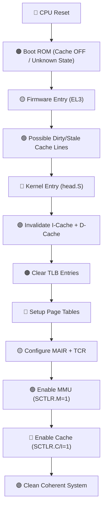
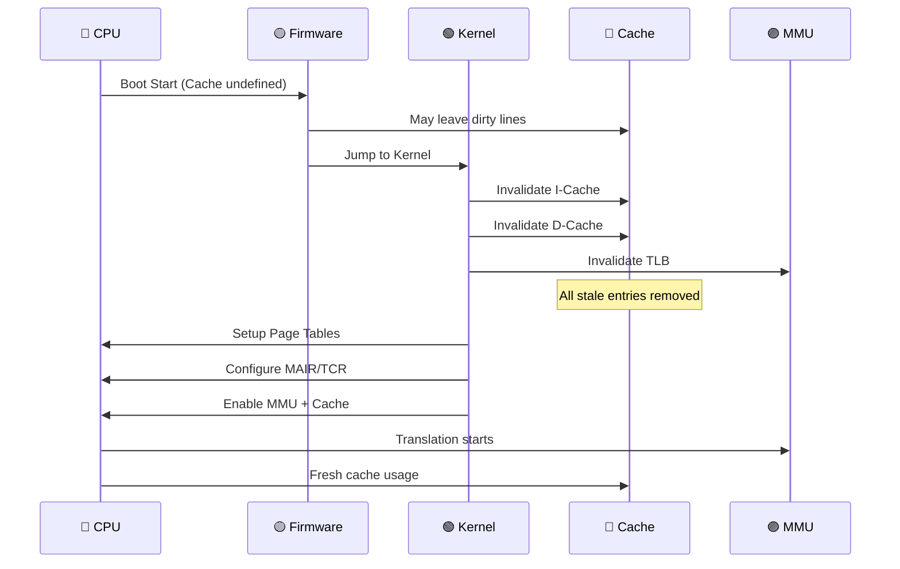
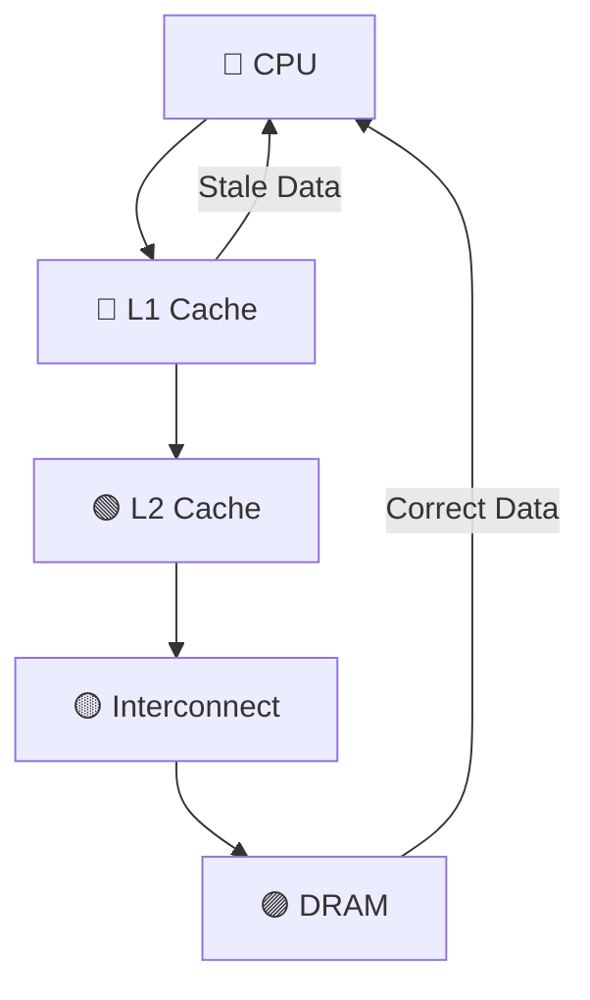
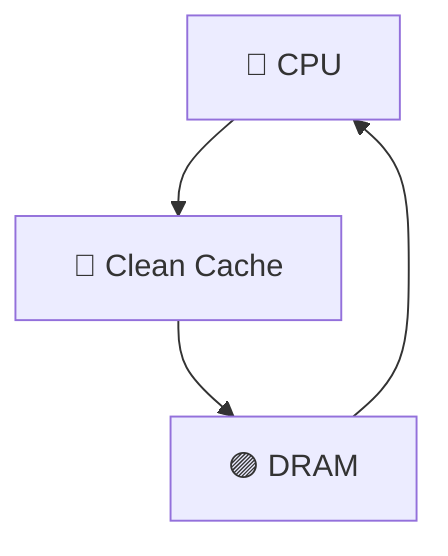
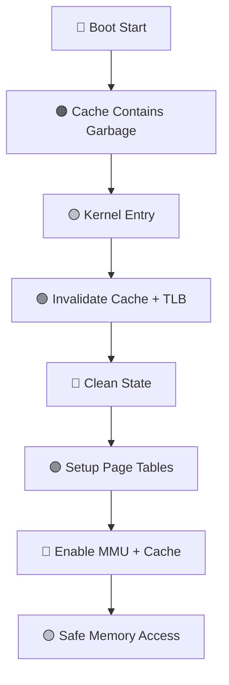

## 🧠 **Q: Why must caches be invalidated before enabling? (ARMv8 Deep Answer)**

**A:** Because before MMU and cache are properly configured, cache contents may contain **stale, inconsistent, or incorrectly attributed data**. Enabling cache without invalidation can cause **data corruption, wrong instruction execution, and coherency violations**.

---

# 01️⃣ 🔴 **Mermaid Flow — Boot to Cache Enable (Why Invalidate First)**



👉 **Key Insight:**
Invalidation ensures **no garbage state survives into the new MMU/cache regime**

---

# 02️⃣ 🔁 **Sequence Diagram — What Actually Happens**



---

# 03️⃣ 🧩 **Kernel Code Walkthrough — Where Invalidation + MMU Happens**

---

## 📍 File: `arch/arm64/kernel/head.S`

```asm id="xqv0xk"
stext:
    bl  preserve_boot_args
    bl  el2_setup
    bl  __create_page_tables
    bl  __cpu_setup
    bl  __enable_mmu
```

---

## 🔹 Cache Invalidation Happens Here:

### 📍 `__cpu_setup`

```asm id="l2t3cn"
__cpu_setup:
    ic  iallu        // 🔴 Invalidate entire instruction cache
    dsb nsh

    tlbi vmalle1     // 🟡 Invalidate TLB
    dsb nsh
    isb
```

👉 Removes:

* Old instructions
* Old translations

---

## 🔹 Data Cache Invalidation (conceptual)

```asm id="w9v0q7"
dc  ivac, x0   // Invalidate data cache line
```

---

## 🔥 MMU Enable Happens Here:

```asm id="w2qgsy"
__enable_mmu:
    mrs x0, sctlr_el1
    orr x0, x0, #(1 << 0)   // M = MMU
    orr x0, x0, #(1 << 2)   // C = D-cache
    orr x0, x0, #(1 << 12)  // I = I-cache
    msr sctlr_el1, x0
    isb
```

---

# 04️⃣ ⚙️ **Function-Level Deep Walkthrough**

---

## 🔹 `__cpu_setup` ⭐ CRITICAL FOR INVALIDATION

Responsibilities:

* Invalidate instruction cache
* Invalidate TLB
* Ensure no stale execution

---

## 🔹 Why this is needed:

Without it:

❌ Old instructions may execute
❌ Wrong address translations
❌ Memory corruption

---

## 🔹 `__create_page_tables`

* Builds clean mappings
* Ensures:

  * Correct attributes
  * Correct permissions

---

## 🔹 `__enable_mmu`

* Activates:

  * MMU
  * Cache
* After invalidation ensures:

  * Clean state

---

## 🔹 Barrier Instructions

```asm id="1u8k4n"
dsb sy   // Complete all memory ops
isb      // Flush pipeline
```

👉 Guarantees:

* No reordering issues
* Correct execution order

---

# 05️⃣ 🧠 **ARMv8 Registers — Deep + Why Invalidation Matters**

---

## 🔴 1. `SCTLR_EL1`

| Bit | Meaning                  |
| --- | ------------------------ |
| M   | MMU enable               |
| C   | Data cache enable        |
| I   | Instruction cache enable |

👉 If enabled without invalidation:

* Cache may use **invalid old data**

---

## 🟡 2. `TLBI` (TLB Invalidate Instructions)

| Instruction    | Purpose                |
| -------------- | ---------------------- |
| `tlbi vmalle1` | Invalidate all EL1 TLB |

👉 Prevents:

* Wrong VA → PA mapping

---

## 🟢 3. Cache Maintenance Instructions

| Instruction | Purpose                      |
| ----------- | ---------------------------- |
| `ic iallu`  | Invalidate instruction cache |
| `dc ivac`   | Invalidate data cache        |

---

## 🔵 4. `MAIR_EL1`

* Defines memory types
* If cache has old data:

  * Attributes mismatch → undefined behavior

---

## 🟣 5. `TCR_EL1`

* Controls translation
* Without invalidation:

  * Old translations conflict

---

# 🏗️ 06️⃣ **SoC-Level View — Why It’s Dangerous Without Invalidation**



---

## ❌ Problem Without Invalidation:

* Cache ≠ Memory
* CPU reads wrong value

---

## ✅ After Invalidation:



---

# 🔥 07️⃣ **Deep Root Cause (Interview GOLD)**

---

## ❓ Why stale data exists?

* Bootloader may:

  * Use cache differently
  * Leave dirty lines
* No guarantee of:

  * Coherency
  * Attribute correctness

---

## ❓ Why undefined behavior?

Because:

* Cache line tagged with:

  * Old physical address
  * Old memory type
* After MMU enable:

  * Same VA maps differently

💥 Result:

* Data corruption

---

# 🎯 08️⃣ **End-to-End Flow**



---

# 🧠 Final Takeaways

✔ Cache may contain **stale/dirty/incorrect data** from boot stages
✔ MMU changes memory view → old cache becomes invalid
✔ Invalidation ensures:

* Correct execution
* No corruption
* Proper coherency

✔ Done in **`__cpu_setup` before `__enable_mmu`**

---

# 🚀 If You Want Even Deeper

I can go into:

* Cache aliasing problems
* Real ARM errata related to cache enable
* Debugging cache corruption issues
* DMA vs cache coherency

Just tell me 👍
