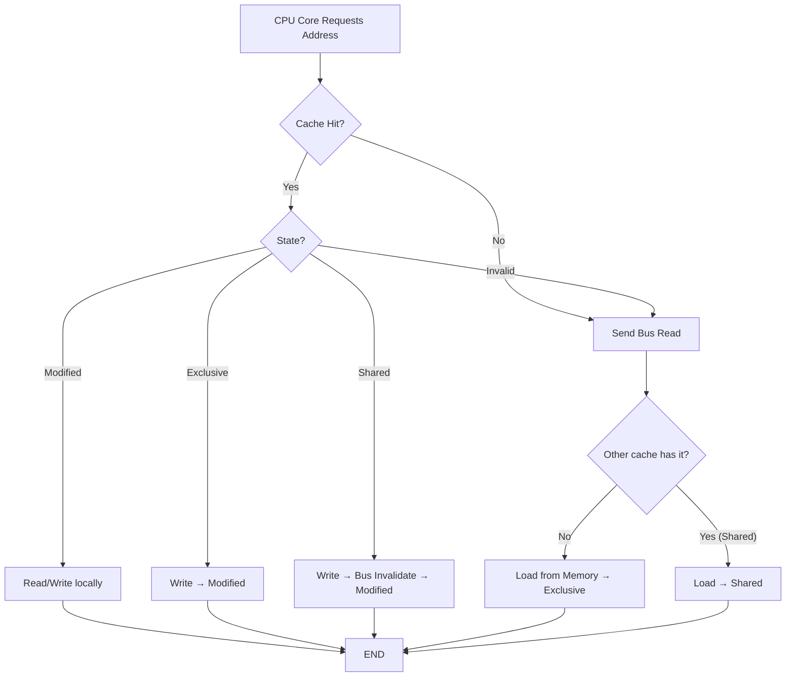
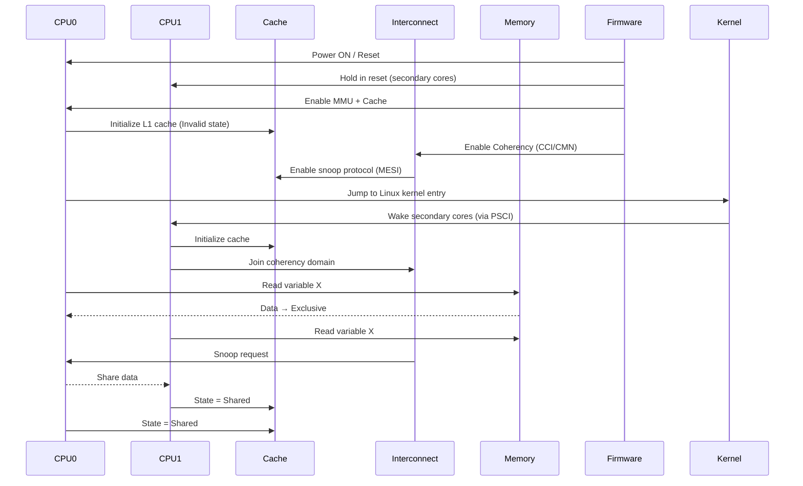
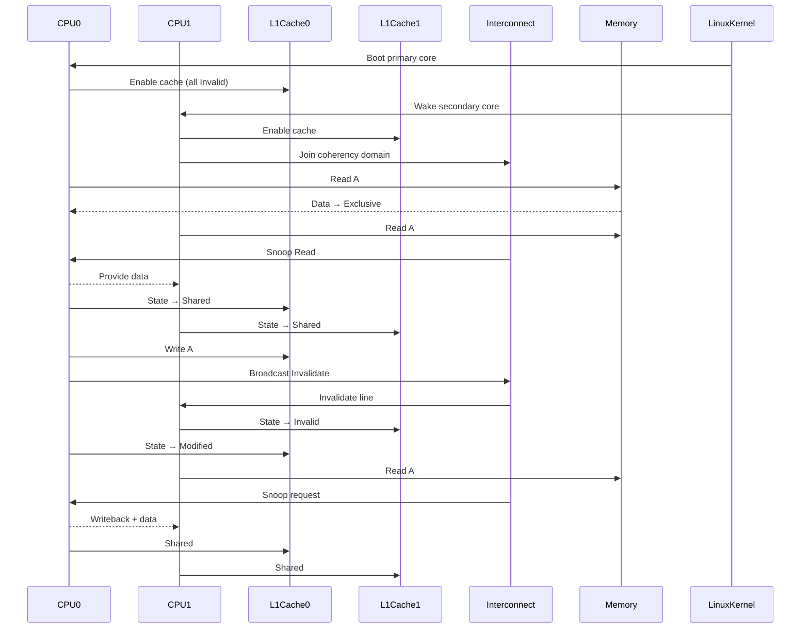
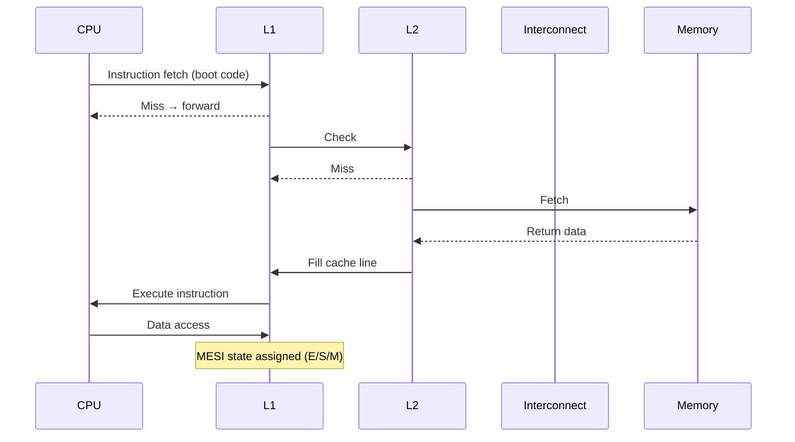
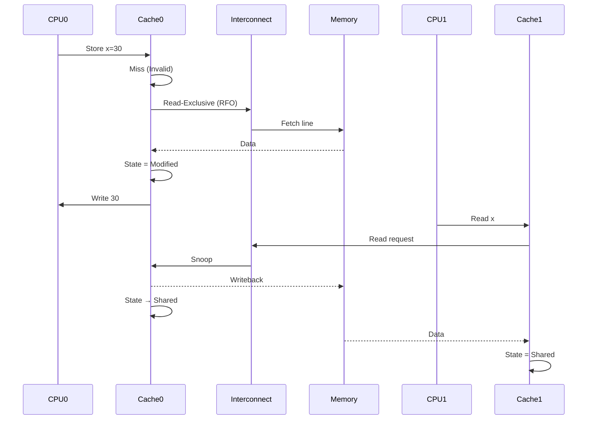
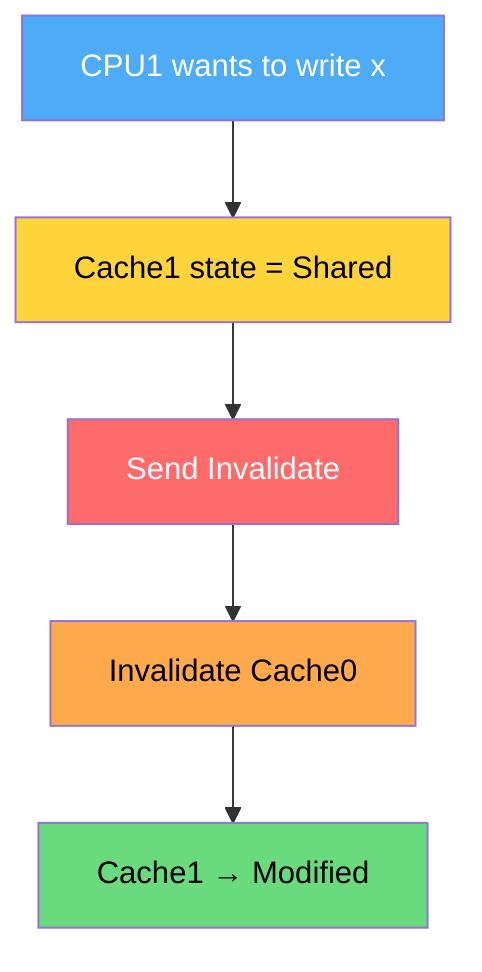
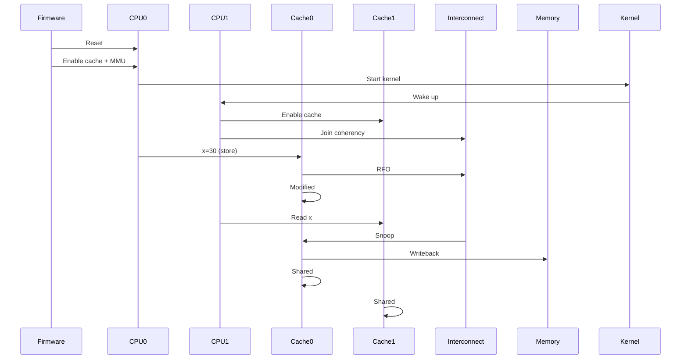

# **Q: Explain the MESI Protocol deeply (Variant 1)**

---

## **0. Overview of MESI Protocol**

The **MESI cache coherence protocol** is used in multiprocessor systems to maintain **data consistency across multiple CPU caches**.

It defines **4 states** for each cache line:

* **M (Modified)** → Dirty, only copy, must be written back to memory
* **E (Exclusive)** → Clean, single copy
* **S (Shared)** → Clean, multiple copies
* **I (Invalid)** → Not present / stale

---

# **01. MESI Working – Mermaid Flow**



### **Key Logic**

* Read miss → Bus transaction
* Write → Invalidate others
* Only one **Modified owner exists globally**

---

# **02. Sequence Diagram – MESI During Boot (Linux / ARMv8)**



---

## **Who initializes MESI?**

* **Hardware (not Linux kernel)**
* Controlled by:

  * ARM **cache controller**
  * Interconnect like:

    * **CCI (Cache Coherent Interconnect)**
    * **CMN (Coherent Mesh Network)**
* Linux only **enables coherency**, not implements MESI

---

# **03. Kernel Flow – Where MESI is “Used” (Not Implemented)**

MESI is **not implemented in software**. Instead, Linux interacts with it via:

### **Key phases**

1. **Boot stage**
2. **SMP bring-up**
3. **Memory access & barriers**
4. **Cache maintenance operations**

---

### **Boot Flow (ARMv8 Linux)**

```text
start_kernel()
  → setup_arch()
      → paging_init()
      → cache initialization (indirect)
  → smp_init()
      → bring_up_secondary_cpus()
```

---

### **Where MESI gets triggered**

| Operation         | MESI Impact            |
| ----------------- | ---------------------- |
| Load instruction  | May trigger Read → E/S |
| Store instruction | Causes invalidate → M  |
| Spinlock          | Cache line bouncing    |
| DMA               | Cache clean/invalidate |
| Memory barrier    | Ordering, not state    |

---

# **04. Kernel Code Walkthrough (Important Functions)**

Below are **critical Linux kernel functions interacting with MESI indirectly**:

---

## **(A) CPU Boot & Cache Enable**

### `arch/arm64/kernel/head.S`

* Enables:

  * MMU
  * Caches (I-cache, D-cache)
* MESI begins **after caches are enabled**

---

## **(B) Secondary CPU Bring-up**

### `secondary_start_kernel()`

* Each CPU:

  * Enables cache
  * Joins coherency domain

---

## **(C) SMP Initialization**

### `smp_init()`

* Calls:

  * `__cpu_up()`
  * `psci_ops.cpu_on()`

➡️ Ensures all cores participate in MESI

---

## **(D) Cache Maintenance APIs**

### `flush_dcache_page()`

* Ensures coherence with devices

### `__flush_cache_all()`

* Invalidates cache lines

---

## **(E) Memory Barriers**

### `smp_mb()`, `dsb()`, `dmb()`

* Do NOT change MESI state
* Ensure ordering of operations

---

## **(F) Spinlocks (Critical for MESI)**

### `spin_lock()`

* Causes:

  * Cache line ping-pong
  * Transition:

    ```
    S → I (other cores)
    → M (owner core)
    ```

---

## **(G) Page Table Updates**

### `set_pte()`

* Triggers:

  * TLB + cache interactions
  * MESI ensures visibility across cores

---

# **05. Full ARMv8 + Linux + MESI Sequence Diagram**



---

# **Key Deep Insights**

## **1. MESI is Hardware-Driven**

* Linux **does not implement MESI**
* CPU + interconnect handle it automatically

---

## **2. Cache Line Granularity**

* MESI works at **cache-line level (e.g., 64 bytes)**

---

## **3. Performance Bottleneck**

* False sharing → frequent:

  * S ↔ M transitions
* Seen in:

  * Spinlocks
  * Shared counters

---

## **4. ARMv8 Specific**

* Uses:

  * ACE (AXI Coherency Extensions)
  * CHI (Coherent Hub Interface)
* Supports MESI-like protocols

---

## **5. Real Trigger Points**

MESI transitions happen on:

* Load/store instructions
* Atomic operations
* Cache maintenance ops

---

# **Final Summary**

* MESI ensures **coherent memory view across cores**
* Linux:

  * Enables caches
  * Brings CPUs into coherency domain
  * Uses barriers & flushes
* Hardware:

  * Handles MESI transitions transparently

---

# **Q: How are caches initialized, who initializes them, and how do they work (with MESI) on ARMv8 + Linux?**

---

# **0. Big Picture (Important Truth)**

* **Caches are initialized by hardware + firmware first**
* Then **Linux kernel enables and configures them**
* MESI is **always hardware-controlled**
* Kernel only **triggers behavior via instructions**

---

# **01. Who Initializes Cache?**

### **Stage-wise Responsibility**

| Stage                       | Who                           | What happens                   |
| --------------------------- | ----------------------------- | ------------------------------ |
| Reset                       | CPU hardware                  | Caches = OFF, Invalid state    |
| Firmware (Bootloader / EL3) | Trusted Firmware (e.g., TF-A) | Enables caches, MMU            |
| Kernel Early Boot           | Linux (`head.S`)              | Reconfigures + enables         |
| SMP Bring-up                | Linux                         | Secondary cores join coherency |

---

# **02. Cache Initialization Flow (ARMv8 Boot)**

```mermaid
flowchart TD
    A[Power ON Reset]:::red --> B[CPU starts at EL3]:::yellow
    B --> C[Firmware (TF-A / U-Boot)]:::blue

    C --> D[Invalidate all caches]:::orange
    C --> E[Enable MMU]:::orange
    C --> F[Enable I-Cache + D-Cache]:::orange

    F --> G[Enable Coherency Interconnect]:::green

    G --> H[Jump to Linux Kernel]:::blue

    H --> I[head.S execution]:::yellow
    I --> J[Re-enable caches + setup page tables]:::orange

    J --> K[start_kernel()]:::blue
    K --> L[smp_init()]:::yellow
    L --> M[Bring up secondary CPUs]:::green

    M --> N[All cores join MESI domain]:::green

classDef red fill:#ff6b6b,color:#fff
classDef blue fill:#4dabf7,color:#fff
classDef yellow fill:#ffd43b,color:#000
classDef green fill:#69db7c,color:#000
classDef orange fill:#ffa94d,color:#000
```

---

# **03. Kernel Code Walkthrough (Exact Locations)**

## **(A) Entry Point**

### `arch/arm64/kernel/head.S`

```asm
reset:
    bl  __cpu_setup        // CPU config
    bl  __enable_mmu       // Enable MMU + cache
```

---

## **(B) CPU Setup**

### `__cpu_setup()`

* Configures:

  * SCTLR_EL1 (System Control Register)

    * M → MMU enable
    * C → Data cache enable
    * I → Instruction cache enable

---

## **(C) Enable MMU + Cache**

### `__enable_mmu()`

* Turns ON:

  * Virtual memory
  * Cache hierarchy

---

## **(D) Secondary CPU**

### `secondary_start_kernel()`

```c
void secondary_start_kernel(void)
{
    cpu_setup();
    enable_cache();
    join_coherency();
}
```

---

## **(E) SMP Init**

### `smp_init()`

* Calls:

  * `__cpu_up()`
  * PSCI firmware

---

# **04. How Cache Works From Boot (Lifecycle)**



---

# **05. Practical Example**

## **Code**

```c
int x;
x = 30;
```

---

# **06. Instruction-Level Breakdown**

### Compiler → Assembly (ARMv8)

```asm
MOV W0, #30        // Load immediate
STR W0, [X1]       // Store to memory (x)
```

---

# **07. MESI Flow for `x = 30`**



---

# **08. If Another Core Writes**



---

# **09. Instruction-Level Cache Behavior**

### **Load (LDR)**

* If miss:

  * Fetch → E or S
* If hit:

  * Read directly

---

### **Store (STR)**

* If state = I:

  * Send **Read-For-Ownership**
* If state = S:

  * Invalidate others → M
* If state = E:

  * Upgrade → M

---

# **10. Full End-to-End Flow (Boot → Write → Share)**



---

# **11. Deep Internal Insight (ARMv8 Specific)**

## **Cache Levels**

* L1 (per core)
* L2 (shared or per cluster)
* L3 (optional)

---

## **Coherency Fabric**

* ARM uses:

  * **ACE protocol**
  * **CHI protocol**
* Handles:

  * Snoop
  * Invalidate
  * Writeback

---

## **Registers Controlling Cache**

* `SCTLR_EL1` → Enable cache
* `CLIDR_EL1` → Cache levels
* `CCSIDR_EL1` → Cache size

---

# **12. Important Kernel Functions Summary**

| Function                 | Purpose                 |
| ------------------------ | ----------------------- |
| `__cpu_setup`            | Configure CPU registers |
| `__enable_mmu`           | Enable cache + MMU      |
| `start_kernel`           | Main kernel entry       |
| `smp_init`               | Multi-core init         |
| `secondary_start_kernel` | Secondary CPU setup     |
| `flush_dcache_*`         | Cache maintenance       |
| `spin_lock`              | Causes MESI transitions |

---

# **Final Understanding**

* **Initialization**

  * Hardware reset → invalid
  * Firmware → enable cache
  * Kernel → refine & enable SMP

* **Execution**

  * Instructions trigger cache access
  * MESI transitions happen automatically

* **Coherency**

  * Managed by hardware interconnect
  * Kernel only **participates indirectly**

---


