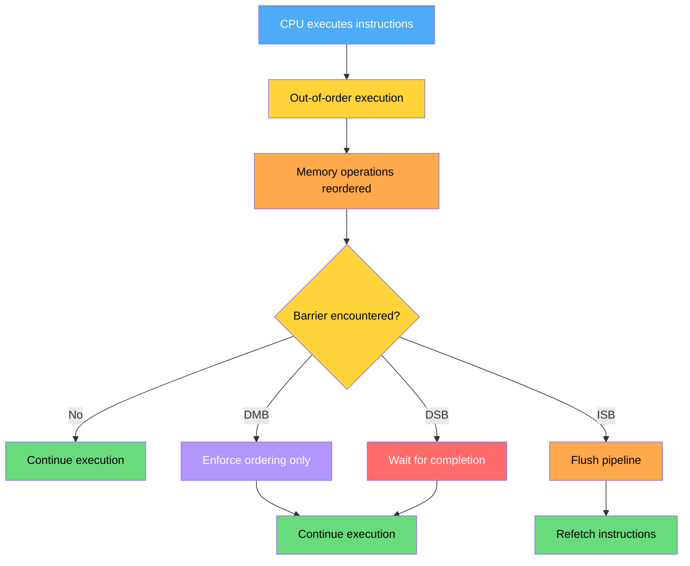
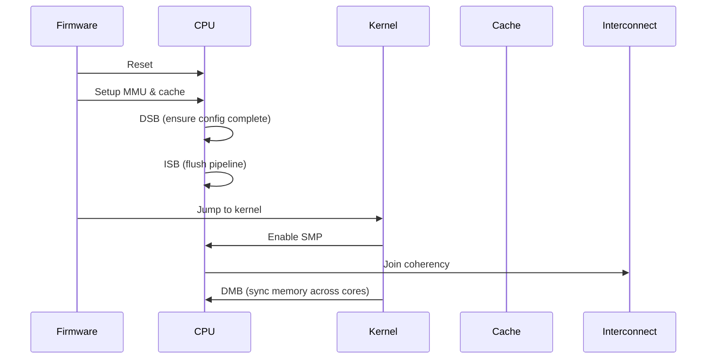
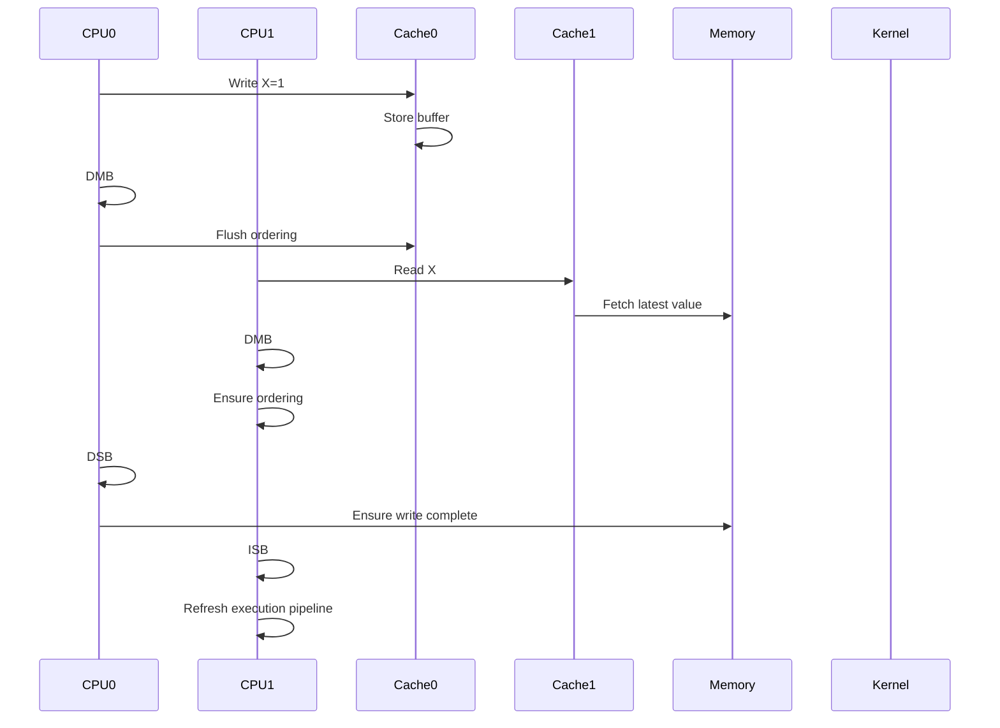
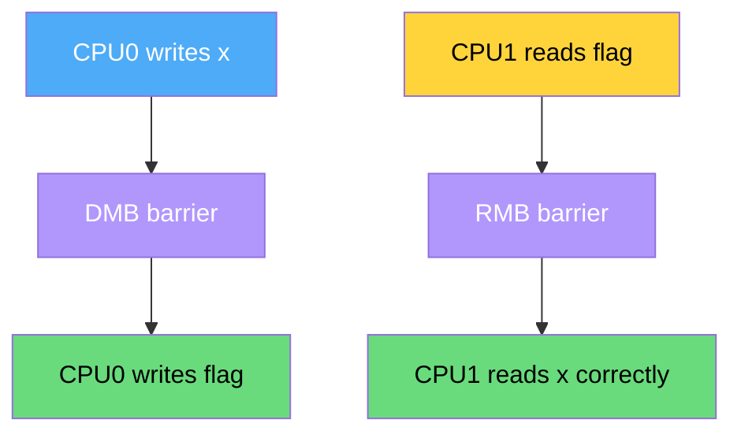
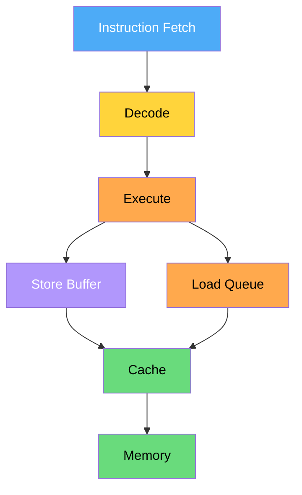
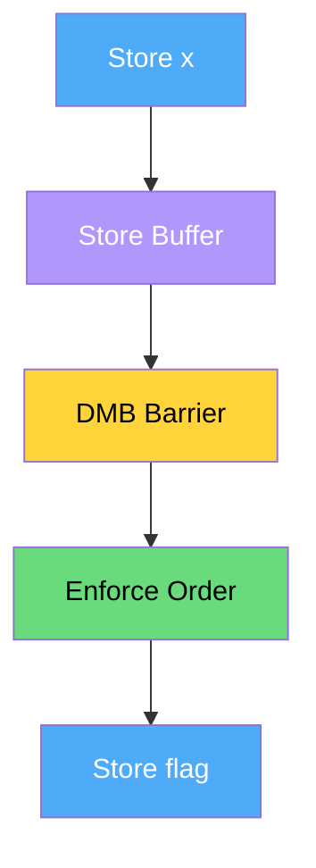
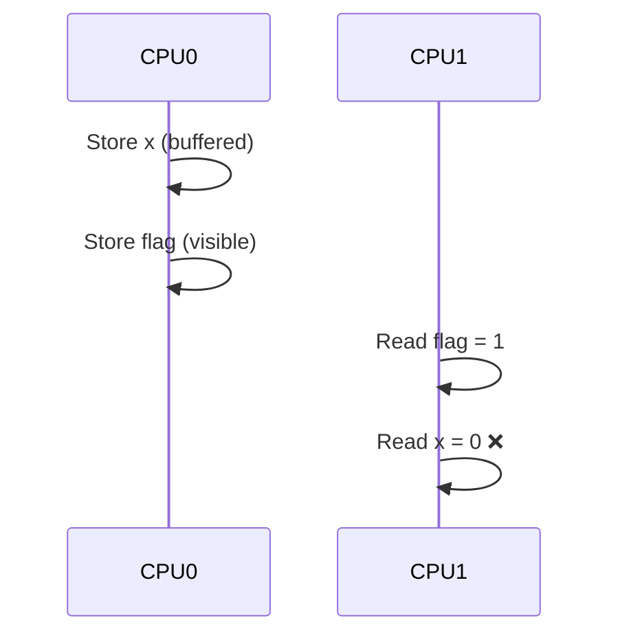
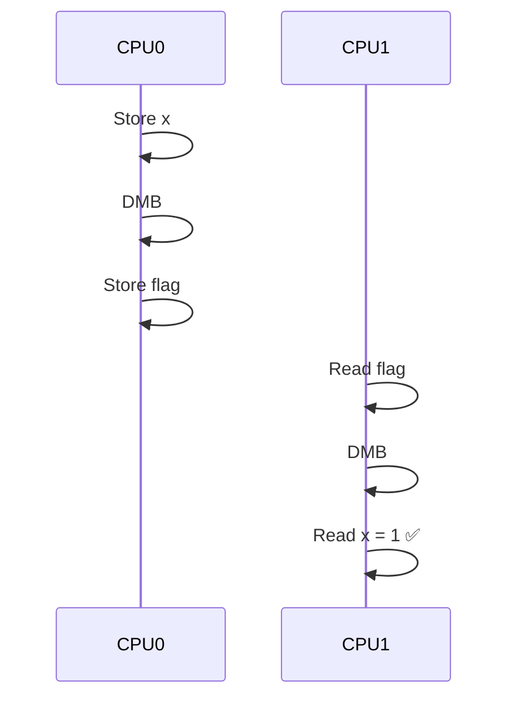

# **Q: Explain Memory Barriers in ARM (Variant 1)**

**A:**

* **DMB (Data Memory Barrier)** → Ensures ordering of memory accesses
* **DSB (Data Synchronization Barrier)** → Ensures completion of memory accesses
* **ISB (Instruction Synchronization Barrier)** → Flushes pipeline & ensures new instructions are fetched

---

# **00. Core Idea (Deep Understanding)**

Modern ARM CPUs:

* Execute instructions **out-of-order**
* Use **store buffers, caches, speculation**

👉 Memory barriers **control visibility and ordering across cores**

---

# **01. Mermaid Flow – How Memory Barriers Work**



---

# **02. Sequence Diagram – During Boot (Who initializes?)**

👉 Important:

* Memory barriers are **CPU instructions**, not initialized like MESI
* Used by:

  * Firmware
  * Kernel
  * Drivers

---



---

# **03. Kernel Flow – Where Memory Barriers Are Used**

👉 Barriers are used **everywhere in kernel critical paths**

---

## **Boot Flow**

```text id="3dz4k6"
start_kernel()
  → setup_arch()
  → smp_init()
  → scheduler start
```

---

## **Barrier Usage Points**

| Stage              | Barrier   |
| ------------------ | --------- |
| MMU enable         | ISB + DSB |
| Cache enable       | DSB       |
| SMP bring-up       | DMB       |
| Spinlocks          | DMB       |
| Interrupt handling | DSB       |
| Device drivers     | DMB/DSB   |

---

# **04. Kernel Code Walkthrough (Actual Implementation)**

---

## **(A) Barrier Macros**

📄 `arch/arm64/include/asm/barrier.h`

```c
#define dmb(opt)   asm volatile("dmb " #opt : : : "memory")
#define dsb(opt)   asm volatile("dsb " #opt : : : "memory")
#define isb()      asm volatile("isb" : : : "memory")
```

---

## **(B) High-Level APIs**

```c
#define smp_mb()   dmb(ish)
#define smp_rmb()  dmb(ishld)
#define smp_wmb()  dmb(ishst)
```

---

## **(C) Boot Code Usage**

📄 `arch/arm64/kernel/head.S`

```asm
dsb sy     // ensure memory complete
isb        // flush pipeline
```

---

## **(D) Spinlock Example**

📄 `kernel/locking/spinlock.c`

```c
spin_lock()
{
    smp_mb();  // memory ordering enforced
}
```

---

## **(E) Page Table Updates**

```c
set_pte()
{
    dsb(ishst);   // ensure write complete
}
```

---

# **05. Important Kernel Functions Using Barriers**

| Function             | Purpose             |
| -------------------- | ------------------- |
| `smp_mb()`           | Full memory barrier |
| `smp_rmb()`          | Read barrier        |
| `smp_wmb()`          | Write barrier       |
| `spin_lock()`        | Synchronization     |
| `set_pte()`          | Page table update   |
| `flush_tlb_all()`    | TLB consistency     |
| `cpu_do_switch_mm()` | Context switch      |

---

# **06. Multi-Core ARMv8 Complete Sequence**



---

# **07. Practical Example (Critical)**

## **Code**

```c
x = 1;
flag = 1;
```

### Without barrier:

* CPU may reorder → flag visible before x

---

## **Correct Version**

```c
x = 1;
smp_wmb();   // DMB
flag = 1;
```

---

## **Reader Side**

```c
if (flag) {
    smp_rmb();
    print(x);
}
```

---

## **Flow**



---

# **08. Deep Insights (ARM Internals)**

## **Why barriers needed?**

* Store buffer delays writes
* Cache coherence latency
* Speculative execution

---

## **Barrier Scope Types**

| Type  | Meaning                      |
| ----- | ---------------------------- |
| `sy`  | Full system                  |
| `ish` | Inner shareable (multi-core) |
| `osh` | Outer shareable              |

---

## **Real ARM Behavior**

* DMB → reorder prevention
* DSB → pipeline stall until completion
* ISB → instruction refetch

---

# **09. Final 5-Line Deep Answer**

1. ARM CPUs execute memory operations out-of-order, requiring barriers to enforce correctness.
2. **DMB** ensures ordering, **DSB** ensures completion, and **ISB** ensures pipeline synchronization.
3. Linux uses barriers via macros like `smp_mb()` in spinlocks, page tables, and SMP operations.
4. Barriers are critical in multi-core systems to maintain cache coherence visibility.
5. They are inserted at key points like MMU setup, context switch, and shared data synchronization.

---

If you want even deeper:

* I can show **store buffer + pipeline microarchitecture**
* Real **ARM assembly traces**
* Debugging race conditions using barriers

Alright—now we go **below kernel level into microarchitecture + real execution behavior**. This is the level where interviewers and kernel engineers differentiate.

---

# **Q: Deep Dive – Store Buffer, Pipeline, Assembly Traces & Debugging with Memory Barriers (ARMv8)**

---

# **01. Store Buffer + Pipeline Microarchitecture**

## **Core Reality**

ARM cores are:

* **Out-of-order**
* **Speculative**
* Use **store buffers + load queues**

---

## **What is a Store Buffer?**

👉 When CPU executes:

```asm
STR W0, [X1]
```

It does **NOT immediately write to cache/memory**

Instead:

```text
Store → Store Buffer → Cache → Memory
```

---

## **Why Store Buffer Exists?**

* Avoid CPU stall
* Improve performance
* Allow instruction parallelism

---

## **Pipeline + Store Buffer Flow**



---

## **Critical Problem**

👉 Store buffer causes **visibility delay**

Example:

```c
x = 1;
flag = 1;
```

Actual execution:

```text
flag visible BEFORE x
```

---

# **02. How Barriers Fix This (Micro-level)**

---

## **DMB (Data Memory Barrier)**

```text
Ensures:
Store(x) happens before Store(flag)
```

But:

* Does NOT force write to memory
* Only enforces order

---

## **DSB (Data Sync Barrier)**

```text
Ensures:
Store(x) is globally visible (completed)
```

👉 Drains store buffer completely

---

## **ISB (Instruction Sync Barrier)**

```text
Flush pipeline → refetch instructions
```

Used after:

* MMU enable
* Page table change

---

## **Flow with Barrier**



---

# **03. Real ARM Assembly Traces**

---

## **Example 1: Without Barrier**

```asm
STR W0, [X1]     // x = 1
STR W2, [X3]     // flag = 1
```

👉 CPU may reorder internally:

```text
flag written first
x written later
```

---

## **Example 2: With DMB**

```asm
STR W0, [X1]     // x = 1
DMB ISH          // enforce ordering
STR W2, [X3]     // flag = 1
```

---

## **Example 3: Page Table Update**

```asm
STR X0, [PTE]    // update page table
DSB ISHST        // ensure write completes
TLBI VMALLE1     // invalidate TLB
DSB ISH
ISB
```

👉 This sequence is **real Linux kernel pattern**

---

# **04. Real Kernel Pattern (Very Important)**

## **TLB Update Sequence**

```c
set_pte(pte, val);

dsb(ishst);      // ensure page table write visible
flush_tlb();     // invalidate stale entries
dsb(ish);        // ensure completion
isb();           // refetch instructions
```

---

## **Why this order?**

| Step      | Reason                      |
| --------- | --------------------------- |
| Write PTE | Update mapping              |
| DSB       | Ensure memory visible       |
| TLBI      | Remove stale entries        |
| ISB       | Ensure CPU uses new mapping |

---

# **05. Multi-Core Race Condition Example**

---

## **Code (Classic Bug)**

```c
// CPU0
x = 1;
flag = 1;

// CPU1
if (flag)
    print(x);
```

---

## **Bug Flow**



---

## **Fixed Version**

```c
// CPU0
x = 1;
smp_wmb();
flag = 1;

// CPU1
if (flag) {
    smp_rmb();
    print(x);
}
```

---

## **Correct Flow**



---

# **06. Debugging Race Conditions (Real Techniques)**

---

## **1. Using `trace-cmd` / `ftrace`**

* Track memory ordering issues
* Observe execution timing

---

## **2. Using `perf`**

```bash
perf stat -e memory_barrier
```

---

## **3. Using Kernel Debugging**

* Add:

```c
smp_mb();
```

* Check if bug disappears

---

## **4. Lockless Debugging Rule**

👉 If bug disappears after adding barrier → **ordering issue**

---

## **5. Static Analysis**

Look for:

* Shared variables
* Missing barriers
* Lock-free code

---

# **07. Deep Insight (Most Important)**

## **What actually happens inside CPU**

Without barrier:

```text
Store buffer allows:
flag → visible early
x → delayed
```

With barrier:

```text
CPU enforces:
x → globally ordered before flag
```

---

# **08. Final Deep 5-Line Answer**

1. ARM uses store buffers and out-of-order execution, causing memory reordering across cores.
2. **DMB** enforces ordering, **DSB** ensures completion by draining buffers, and **ISB** synchronizes instruction pipeline.
3. Linux uses these via `smp_mb()` and related APIs in spinlocks, page tables, and TLB operations.
4. Race conditions occur when store visibility differs across cores due to buffering.
5. Barriers enforce global memory visibility and correctness in multi-core systems.

---


