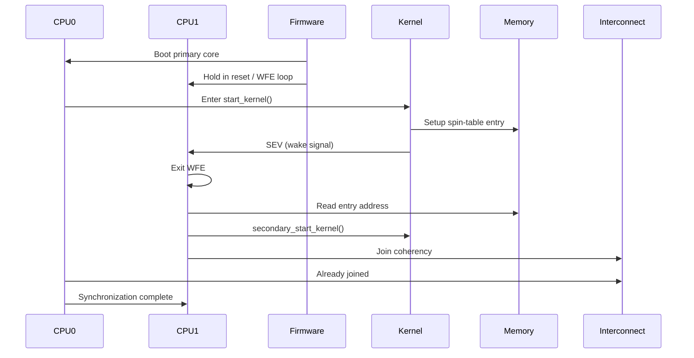
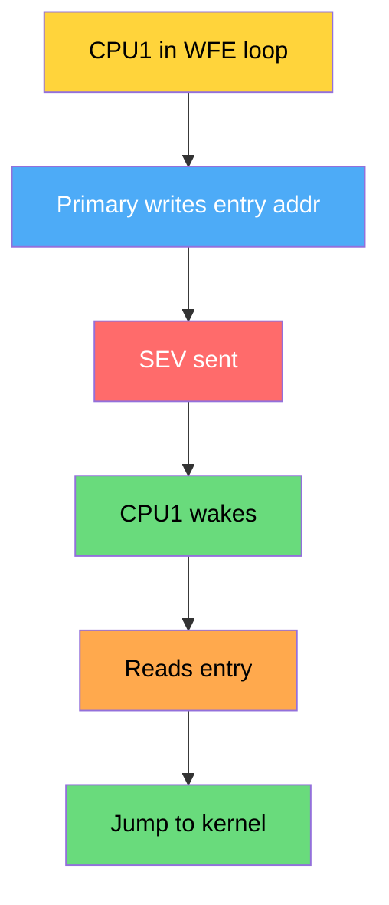
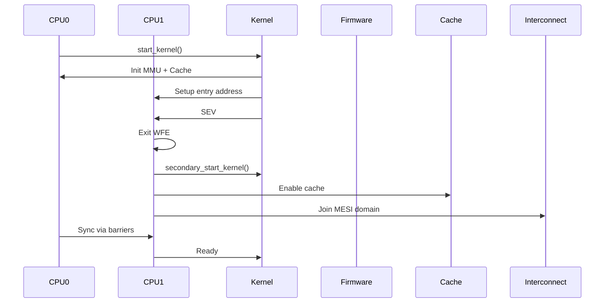

# **Q: How SMP is initialized in Linux (ARMv8)? (Variant 1)**

**A:** Primary core boots first, sets up system state, then **secondary cores are released via spin-table or PSCI using SEV/WFE**, and all CPUs join the coherency domain.

---

# **00. Core Idea (Deep Understanding)**

* **CPU0 (Primary core)**:

  * Boots system
  * Initializes MMU, caches, kernel
* **Secondary CPUs**:

  * Held in reset or waiting loop (spin-table / firmware)
* **Linux releases them**:

  * Writes entry address
  * Sends **SEV (Send Event)**
* All cores:

  * Join **SMP + MESI coherency domain**

---

# **01. Mermaid Flow – SMP Initialization**

```mermaid
flowchart TD
    A[Power ON]:::red --> B[CPU0 starts execution]:::blue
    B --> C[Initialize MMU, Cache]:::orange
    C --> D[start_kernel()]:::yellow

    D --> E[smp_init()]:::purple
    E --> F[Prepare secondary CPUs]:::orange

    F --> G[Write entry address (spin-table)]:::green
    G --> H[Send SEV instruction]:::blue

    H --> I[Secondary CPUs wake (WFE exit)]:::yellow
    I --> J[secondary_start_kernel()]:::purple

    J --> K[Enable MMU + Cache]:::orange
    K --> L[Join coherency domain]:::green

    L --> M[SMP system ready]:::green

classDef red fill:#ff6b6b,color:#fff
classDef blue fill:#4dabf7,color:#fff
classDef yellow fill:#ffd43b,color:#000
classDef purple fill:#b197fc,color:#fff
classDef orange fill:#ffa94d,color:#000
classDef green fill:#69db7c,color:#000
```

---

# **02. Sequence Diagram – Actual Boot Behavior**



---

# **03. Kernel Code Flow (Exact Walkthrough)**

## **Boot Flow**

```text
start_kernel()
  → setup_arch()
  → smp_init()
      → bringup_nonboot_cpus()
          → __cpu_up()
              → psci_cpu_on() OR spin-table
```

---

## **Where SMP is triggered**

👉 **Main function**

```c
smp_init();
```

📄 File: `kernel/smp.c`

---

## **ARM64 Specific Path**

📄 `arch/arm64/kernel/smp.c`

```text
smp_init()
  → smp_prepare_cpus()
  → smp_prepare_boot_cpu()
  → bringup_nonboot_cpus()
```

---

# **04. Important Kernel Functions (Deep Walkthrough)**

---

## **(A) `smp_init()`**

* Entry point for SMP
* Initializes CPU maps

---

## **(B) `smp_prepare_cpus()`**

* Prepares CPU structures
* Sets possible CPUs

---

## **(C) `bringup_nonboot_cpus()`**

* Core logic to start secondary CPUs

---

## **(D) `__cpu_up(cpu)`**

```c
__cpu_up(cpu)
{
    boot_secondary(cpu);
}
```

---

## **(E) `boot_secondary()`**

Two methods:

---

### **1. PSCI Method (Modern ARM)**

```c
psci_ops.cpu_on(cpu, entry_point);
```

👉 Firmware powers on CPU

---

### **2. Spin-table Method**

```c
write_pen_release(cpu);
sev();   // wake CPU
```

---

## **(F) Secondary CPU Entry**

📄 `arch/arm64/kernel/head.S`

```asm
secondary_entry:
    bl secondary_start_kernel
```

---

## **(G) `secondary_start_kernel()`**

```c
void secondary_start_kernel(void)
{
    cpu_setup();
    enable_cache();
    notify_cpu_starting();
}
```

---

# **05. Spin-Table Mechanism (Deep Insight)**

---

## **How it works**

Secondary CPUs run:

```asm
loop:
    wfe                 // wait for event
    ldr x0, [release_addr]
    cbz x0, loop
    br x0               // jump to kernel
```

---

## **Primary CPU does**

```asm
str entry_addr, [release_addr]
sev   // wake all CPUs
```

---

## **Flow**



---

# **06. Full ARMv8 SMP + Kernel Sequence**



---

# **07. ARMv8 Deep Behavior**

---

## **Instructions Used**

| Instruction | Purpose               |
| ----------- | --------------------- |
| `WFE`       | Wait for event        |
| `SEV`       | Send event            |
| `DSB`       | Ensure memory visible |
| `ISB`       | Sync pipeline         |

---

## **Why SEV/WFE?**

* Low power waiting
* Fast wakeup
* Hardware-level synchronization

---

## **Coherency Join**

* Done via interconnect (CCI/CMN)
* Ensures MESI works across cores

---

# **08. Synchronization After Boot**

* `cpu_online_mask` updated
* Scheduler sees all CPUs
* Load balancing begins

---

# **09. Key Deep Insights**

---

## ✅ 1. Linux does NOT power CPUs directly

* Uses firmware (PSCI)

---

## ✅ 2. Spin-table is fallback method

* Used in simple systems

---

## ✅ 3. Memory barriers are critical

* Ensure entry address visible before SEV

---

## ✅ 4. Secondary CPUs start in minimal state

* No MMU, no cache initially

---

## ✅ 5. Final state

* All CPUs:

  * Running kernel
  * Coherent
  * Scheduled

---

# **10. Final Deep 5-Line Answer**

1. SMP initialization starts with CPU0 booting and configuring the system before bringing up other cores.
2. Secondary CPUs are released via **PSCI (firmware)** or **spin-table using SEV/WFE**.
3. Linux uses functions like `smp_init()`, `__cpu_up()`, and `secondary_start_kernel()` to manage bring-up.
4. Memory barriers ensure correct visibility of shared data during CPU startup.
5. Once initialized, all cores join the coherency domain and participate in scheduling.

---

