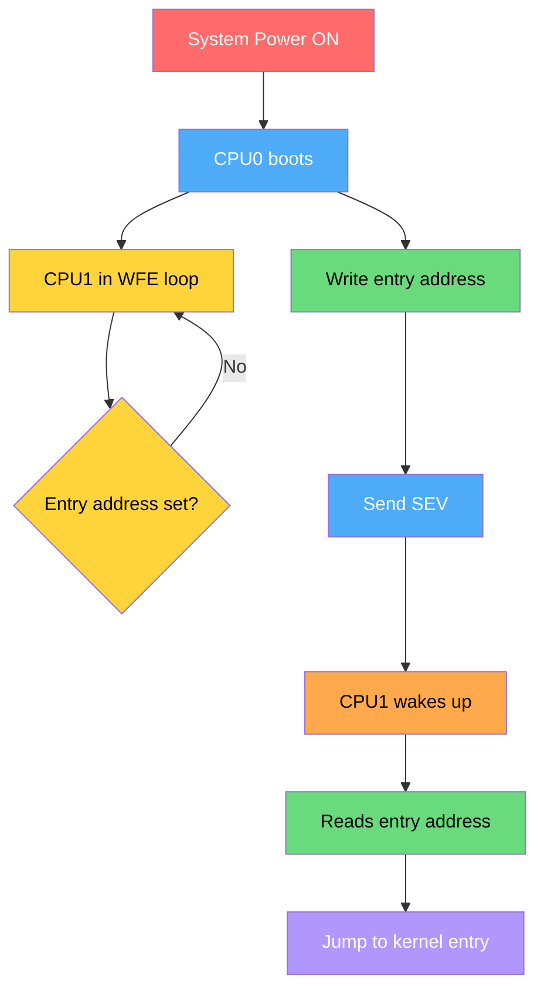
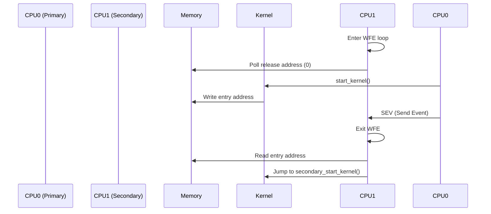
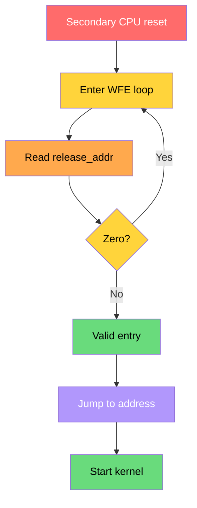
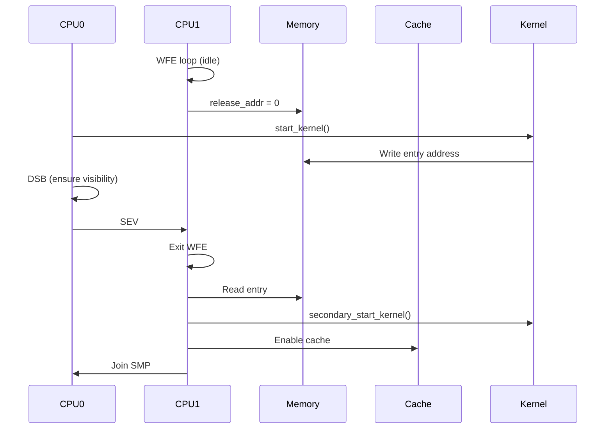

# **Q: Explain Spin-Table Mechanism in ARM/Linux SMP (Variant 1)**

**A:** Secondary cores stay in a loop waiting for an entry address; once the primary core writes the entry and sends an event (SEV), they wake up and jump to the kernel.

---

# **00. Core Idea (Deep Understanding)**

* Secondary CPUs are **not immediately started**
* They:

  * Sit in a **low-power loop (WFE)**
  * Poll a **shared memory location (spin-table)**
* Primary CPU:

  * Writes **entry address**
  * Sends **SEV (wake signal)**
* Secondary CPUs:

  * Wake → read address → jump → start kernel

---

# **01. Mermaid Flow – How Spin-Table Works**



---

# **02. Sequence Diagram – Actual Boot Behavior**



---

# **03. Kernel Code Flow – Where Spin-Table is Implemented**

## **Boot Flow**

```text
start_kernel()
  → smp_init()
      → bringup_nonboot_cpus()
          → __cpu_up()
              → boot_secondary()
```

---

## **Spin-table Path (ARM64)**

📄 `arch/arm64/kernel/smp_spin_table.c`

```text
boot_secondary()
  → write_pen_release(cpu)
  → sev()
```

---

# **04. Important Kernel Functions (Deep Walkthrough)**

---

## **(A) `write_pen_release(cpu)`**

* Writes CPU ID / entry info to shared memory
* This is what secondary CPU is polling

---

## **(B) `sev()`**

```c
asm volatile("sev");
```

* Sends event to all CPUs
* Wakes CPUs in `WFE`

---

## **(C) Secondary CPU Loop (Assembly)**

📄 Firmware / early boot code:

```asm
secondary_loop:
    wfe                     // wait for event
    ldr x0, [release_addr]  // check entry
    cbz x0, secondary_loop
    br x0                   // jump to kernel
```

---

## **(D) `secondary_start_kernel()`**

* Entry point for secondary CPUs
* Initializes:

  * MMU
  * Cache
  * SMP state

---

# **05. Detailed Spin-Table Flow**



---

# **06. Full ARMv8 SMP + Spin-Table Sequence**



---

# **07. Important ARM Instructions**

| Instruction | Role                        |
| ----------- | --------------------------- |
| `WFE`       | Wait for event (low power)  |
| `SEV`       | Wake CPUs                   |
| `DSB`       | Ensure memory write visible |
| `ISB`       | Sync execution              |

---

# **08. Why Memory Barriers Are Critical Here**

Before sending SEV:

```asm
STR entry_addr, [release_addr]
DSB SY       // ensure write visible
SEV
```

👉 Without DSB:

* Secondary CPU may wake
* But read **old value (0)** → bug

---

# **09. Practical Example**

## Scenario:

* CPU1 waiting
* CPU0 releases it

---

### Without Barrier (Bug)

```text
CPU0:
  write entry
  SEV

CPU1:
  wakes → sees 0 → loops again ❌
```

---

### With Barrier (Correct)

```text
CPU0:
  write entry
  DSB
  SEV

CPU1:
  wakes → sees correct entry → jumps ✅
```

---

# **10. Deep Insights**

---

## ✅ 1. Spin-table = simplest SMP bring-up

* No firmware needed

---

## ✅ 2. Uses shared memory polling

* Very low-level mechanism

---

## ✅ 3. WFE/SEV = hardware synchronization

* Efficient and low power

---

## ✅ 4. Requires strict memory ordering

* Barriers are mandatory

---

## ✅ 5. Mostly replaced by PSCI

* But still used in embedded systems

---

# **11. Final Deep 5-Line Answer**

1. In the spin-table mechanism, secondary CPUs wait in a WFE loop polling a shared memory location for an entry address.
2. The primary CPU writes the entry point into this memory and issues a SEV instruction to wake the waiting CPUs.
3. Memory barriers like DSB ensure the entry address is visible before wake-up.
4. Secondary CPUs read the address and jump to `secondary_start_kernel()` to join the system.
5. This mechanism provides a simple, hardware-assisted way to bring up multiple cores without firmware.

---

If you want deeper next step, I can show:

* PSCI vs spin-table comparison (real systems)
* CPU hotplug using similar mechanism
* How QEMU simulates spin-table
* Real device tree (`cpu-release-addr`) usage

Just tell me 🚀
