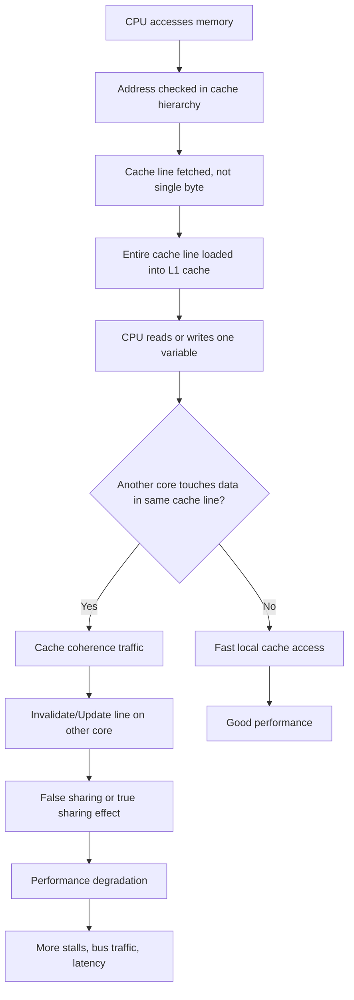
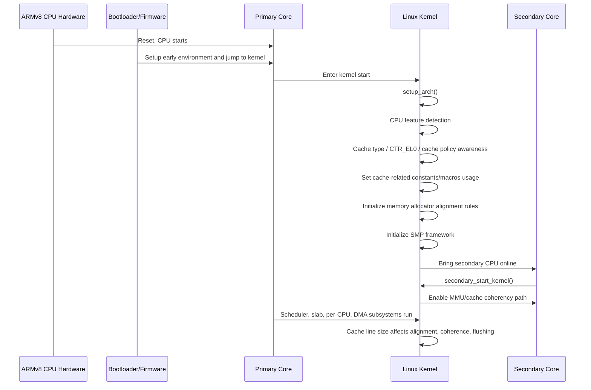
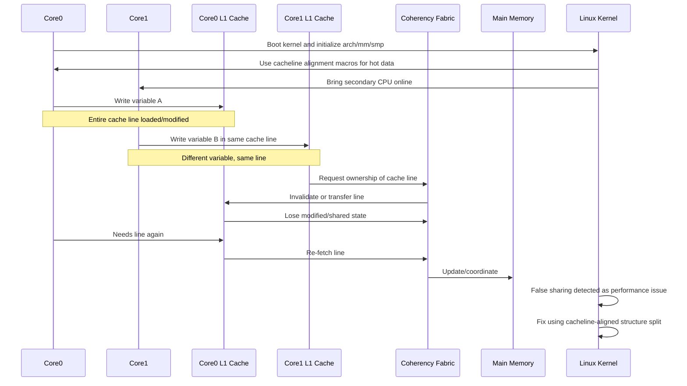

# **What is cache line size impact? (Variant 1)**

**A: Cache line size affects false sharing, memory alignment, DMA/cache maintenance granularity, and overall memory performance.**

---

# **Index**

## **01. Mermaid flow — how cache line impact works**

## **02. Sequence diagram — what actually happens in ARMv8/Linux boot and who initializes cache-related behavior**

## **03. Kernel code flow walkthrough — where cache line handling is implemented and when it is used**

## **04. Important kernel functions/macros/data paths — what they mean and why they matter**

## **05. Complete ARMv8 multi-core + Linux view — cache line impact in SMP systems**

## **Final deep 5-line answer**

---

# **01. Mermaid flow — How cache line impact works**



---

## **What this means**

A CPU does not usually fetch only the exact variable. It fetches an entire **cache line**.
If cache line size is **64 bytes**, then even if your code accesses only a 4-byte integer, the CPU may bring the whole 64-byte block into cache.

That has deep impact on:

* **false sharing**
* **alignment**
* **atomic operations**
* **DMA sync granularity**
* **cache flush/invalidate range**
* **multi-core coherence traffic**
* **slab allocator alignment**
* **per-CPU variable placement**
* **network/storage buffer tuning**

---

# **02. Sequence diagram — what actually happens during boot / Linux side / who initializes**

The user asked for boot-side detail. For cache line size, Linux usually does **not invent** cache line size.
The **hardware architecture defines it**, and Linux learns or uses it via architecture-specific definitions, CPU feature discovery, and cache maintenance logic.



---

## **Important truth**

Cache line size is **not a standalone subsystem initialized like a driver**.
Instead, it affects many Linux kernel decisions from very early boot onward.

### **Who initializes it?**

Better wording:

* **Hardware implements cache line structure**
* **ARM64 exposes cache-related properties through system registers**
* **Linux arch code reads/features them**
* **Kernel subsystems use cache line alignment and cache maintenance routines based on that architecture knowledge**

---

# **03. Flow of kernel code walkthrough — where cache line impact is implemented and when used**

Now let us connect this to Linux kernel flow in a realistic way.

---

## **High-level boot flow**

```text
start_kernel()
  -> setup_arch()
  -> arm64 CPU feature setup
  -> mm init
  -> slab/slub init
  -> SMP init
  -> scheduler init
  -> driver init
```

Cache line impact appears across all these stages.

---

## **A. Early architecture setup**

### **`start_kernel()`**

This is the generic kernel entry point.

It triggers early system initialization:

* architecture setup
* memory management
* scheduler
* IRQ
* SMP
* driver framework

Cache line size impact starts mattering from here because:

* alignment requirements begin
* boot-time memory structures must be cache-safe
* SMP coherence assumptions matter

---

### **`setup_arch()`**

Architecture-specific setup happens here.

For ARM64:

* CPU/SoC setup
* memory layout setup
* early CPU feature awareness
* cache-related architecture rules become active

This is where Linux starts behaving according to ARM64 cache architecture.

---

## **B. ARM64 cache-related architectural awareness**

On ARMv8/AArch64, cache-related behavior is tied to architecture registers and cache maintenance model.

### Important hardware register concept:

* **CTR_EL0** = Cache Type Register

This register contains information such as:

* minimum instruction cache line size
* minimum data cache line size
* cache writeback granule hints
* cache policy related bits

Linux uses this kind of information to understand:

* how cache maintenance should be done
* alignment granularity
* what flush/invalidate operations must assume

---

## **C. Where cache line size affects kernel design**

Cache line size is not “implemented” in one place.
It affects multiple areas:

### **1. Alignment macros**

Used to align kernel objects to cache boundaries.

Examples:

* `L1_CACHE_BYTES`
* `SMP_CACHE_BYTES`
* `____cacheline_aligned`
* `____cacheline_internodealigned_in_smp`

These are very important.

---

### **2. Slab/SLUB allocator**

Allocator may align objects to cache lines to:

* reduce false sharing
* avoid hot-field contention
* improve locality

---

### **3. Per-CPU variables**

Per-CPU data is often cacheline aligned to prevent different CPUs from bouncing the same line.

---

### **4. DMA and cache maintenance**

Cache invalidate/clean operations usually work at cache-line granularity.

If a driver gives an unaligned DMA buffer, flushing one field may flush more bytes than expected because hardware works per line.

---

### **5. SMP and coherence**

If two different variables used by two different CPUs land in the same cache line, even unrelated writes can cause coherence storms.

That is false sharing.

---

### **6. Lock and atomic data placement**

Spinlocks, refcounts, queue heads, hot counters, runqueues, per-CPU stats — all are sensitive to cache line placement.

---

# **04. Walkthrough of important functions/macros in kernel code**

Now the most important section.

I will be honest here: for cache line size, Linux uses a mix of:

* architecture constants/macros
* inline helpers
* allocator logic
* cache maintenance routines

It is not a single “cache line init function”.

---

## **4.1 `start_kernel()`**

### **Why important**

This is where all kernel subsystems begin.

### **Cache line relevance**

At this stage:

* early memory structures are built
* architecture rules are applied
* future allocations and SMP structures depend on alignment rules

---

## **4.2 `setup_arch()`**

### **Why important**

Per-architecture setup, including ARM64 platform behavior.

### **Cache line relevance**

This is where:

* ARM64 CPU setup starts
* cache-aware behavior becomes architecture-correct
* low-level CPU and MM assumptions are established

---

## **4.3 ARM64 CPU feature setup**

Exact internal function names vary by kernel version, but conceptually Linux does:

* detect CPU capabilities
* inspect architectural system registers
* configure cache/TLB maintenance assumptions
* expose derived properties to the rest of the kernel

### **Why important**

Without this, Linux cannot safely do:

* instruction/data cache sync
* DMA cache maintenance
* multi-core coherence-sensitive behavior

---

## **4.4 `L1_CACHE_BYTES`**

### **What it is**

A compile-time or arch-defined macro representing the L1 cache line size used by the kernel for alignment purposes.

### **Why important**

Many kernel structures are aligned using this value.

### **Impact**

If object is aligned to `L1_CACHE_BYTES`, it is less likely to share a line with unrelated hot data.

---

## **4.5 `SMP_CACHE_BYTES`**

### **What it is**

Cache line alignment value particularly relevant in SMP systems.

### **Why important**

Used so frequently updated data used on different CPUs does not collide into same line.

### **Impact**

Reduces false sharing and cache line bouncing.

---

## **4.6 `____cacheline_aligned`**

### **What it does**

This macro forces a variable or structure to be aligned to cache line boundary.

### **Used for**

* hot counters
* runqueues
* lock-heavy structures
* per-CPU critical data
* stats structures

### **Why important**

Without proper alignment:

* two hot variables may land on same line
* performance drops on multi-core systems

---

## **4.7 `____cacheline_internodealigned_in_smp`**

### **What it does**

Stronger alignment macro for SMP/NUMA-sensitive cases.

### **Why important**

Avoids inter-node/inter-core contention for shared hot structures.

---

## **4.8 `cache_line_size()` / arch helpers**

Some arch code or drivers may use helpers/macros to obtain effective line size or use architecture-defined values.

### **Why important**

Needed when:

* performing manual cache maintenance
* tuning buffer boundaries
* dealing with DMA mapping edge cases

---

## **4.9 DMA mapping APIs**

Examples conceptually:

* `dma_map_single()`
* `dma_unmap_single()`
* `dma_sync_single_for_cpu()`
* `dma_sync_single_for_device()`

### **Why important**

These functions often imply cache maintenance at cache-line granularity on non-coherent or partially coherent systems.

### **Deep impact**

If your DMA buffer is not cache-line aligned:

* neighboring bytes in same line may be accidentally involved in clean/invalidate
* data corruption risk can occur if software assumptions are wrong

This is very important in ARM embedded systems.

---

## **4.10 Cache maintenance routines**

Architecture-specific routines do things like:

* clean D-cache line
* invalidate D-cache line
* flush range
* sync I-cache after code modification

Examples conceptually on ARM64:

* clean/invalidate by virtual address to point of coherency
* instruction cache sync after text patching or module load

### **Why important**

These operations work on **cache line ranges**, not arbitrary bytes.

So if line size is 64 bytes and user flushes 4 bytes:
actual maintenance may apply to the whole line covering that address.

---

## **4.11 SLAB / SLUB allocator initialization**

Examples conceptually:

* `kmem_cache_init()`
* SLUB setup
* per-CPU slab structures

### **Why important**

Allocator often takes cache alignment into account for:

* object placement
* per-CPU freelists
* performance locality

### **Impact**

Wrong alignment can increase:

* false sharing
* cache misses
* lock contention

---

## **4.12 Per-CPU subsystem**

Per-CPU data allocation and alignment are designed to reduce cross-core cache contention.

### **Why important**

If CPU0 and CPU1 update different counters but same cache line, coherence traffic occurs.

### **How kernel avoids it**

It often separates per-CPU hot data and aligns it carefully.

---

# **05. Complete sequence diagram — ARMv8 multiple cores and Linux kernel**

Now let us tie cache line impact specifically to **ARMv8 multi-core Linux**.



---

# **ARMv8 deep explanation — how cache line impact works in Linux SMP**

---

## **1. What is a cache line in ARMv8 context**

In ARMv8, cache is organized in lines.
A line is the smallest unit of:

* allocation into cache
* coherence tracking
* invalidation/clean in many maintenance paths

Common size is often **64 bytes**, though architecture/platform details matter.

So if one core writes 8 bytes inside a 64-byte line, the coherence machinery still tracks that whole 64-byte line.

---

## **2. True sharing vs false sharing**

### **True sharing**

Two cores access same variable and same cache line for a real reason.

Example:

* both cores update same lock or same counter

This is unavoidable sharing.

---

### **False sharing**

Two cores access different variables, but those variables sit in the same cache line.

Example:

```c
struct stats {
    int cpu0_counter;
    int cpu1_counter;
};
```

If both counters sit in one line and different CPUs update them, the line bounces even though logically data is unrelated.

That is false sharing.

---

## **3. Why false sharing is bad**

Because coherence protocol works at line granularity.

So:

* Core0 modifies one field
* Core1 modifies another field in same line
* ownership transfers between caches
* invalidation traffic increases
* pipeline stalls increase
* throughput drops

On many-core systems this becomes severe.

---

## **4. ARMv8 cache coherence**

In coherent SMP ARMv8 systems:

* each core has private L1
* maybe shared or private L2 depending on design
* coherence interconnect ensures consistency

When one core writes a line:

* it may need exclusive/modified ownership
* other cores’ copies must be invalidated or downgraded

So line size directly affects the amount of “collateral damage”.

Larger line size:

* better spatial locality sometimes
* but can worsen false sharing

Smaller line size:

* reduces false sharing
* but may increase tag overhead and miss cost tradeoffs

---

## **5. Alignment impact**

Cache line size also matters for **alignment**.

### Good alignment helps:

* hot fields stay isolated
* DMA buffers are safe
* lock variables do not share lines with unrelated data
* per-CPU counters stay per-CPU in practice

### Bad alignment causes:

* two independent hot fields land in one line
* more coherence traffic
* worse load/store latency
* possible DMA sync problems

---

## **6. Cache line impact in DMA**

This is a major ARM/Linux interview topic.

Suppose device DMA writes to memory, and CPU caches same area.

If buffer is not aligned to cache line:

* invalidating the line for DMA may affect nearby unrelated data
* CPU dirty bytes in same line may be lost
* stale data problems may occur

That is why DMA APIs, alignment, and cache sync are critical.

---

## **7. Cache line impact in Linux structures**

Kernel developers often do this:

* align spinlocks to separate lines
* isolate hot counters
* pad per-CPU variables
* separate read-mostly and write-heavy fields
* split producer/consumer indices when needed

Example:

```c
struct queue_stats {
    u64 packets ____cacheline_aligned;
    u64 drops;
};
```

Or separate structures entirely when multiple CPUs update them.

---

## **8. Impact on boot and initialization**

The user asked specifically “during boot who initializes”.

The correct deep answer is:

During boot, Linux does not usually “set cache line size” as software configuration.
Instead:

* CPU hardware already has a cache architecture
* ARM64 kernel learns architecture capabilities
* memory allocators and arch code begin using cache-aligned rules
* SMP and DMA subsystems later depend on those rules

So cache line impact begins early but becomes visible throughout runtime.

---

## **9. Impact on ARMv8 multi-core scheduling and runqueues**

Scheduler data is very hot.

If scheduler runqueue fields for different CPUs share a line:

* every scheduler tick / enqueue / dequeue causes bouncing
* context switch overhead rises

So the kernel strongly aligns such hot structures.

This is why cache line alignment is not a micro-optimization.
In SMP kernel code, it is a correctness-of-performance design principle.

---

## **10. Impact on lock design**

Suppose spinlock and frequently updated stats are in same line:

* taking lock invalidates line
* updating stat also invalidates line
* unnecessary lock-adjacent contention happens

So Linux often isolates locks and hot fields.

---

## **11. Impact on memory allocator**

Allocator may choose object boundaries influenced by cache line size.

Why?

To reduce:

* cross-object false sharing
* cache coloring issues
* allocator hot-path contention

This matters in:

* networking
* block layer
* scheduler
* filesystem caches
* per-CPU slabs

---

## **12. Real ARM embedded example**

Suppose you have a driver with:

* IRQ updates status counter
* worker thread updates completion counter
* user read path updates stats
* all counters in same struct

On multi-core ARM:

* IRQ may run on CPU0
* worker on CPU1
* read path on CPU2

If counters share one 64-byte line:

* constant bouncing
* higher interrupt handling latency
* worse throughput

Fix:

* split counters by cache line
* use per-CPU counters
* aggregate later

---

# **Practical kernel-style example**

## **Bad**

```c
struct driver_stats {
    u64 irq_cnt;
    u64 tx_cnt;
    u64 rx_cnt;
    spinlock_t lock;
};
```

If different CPUs touch these fields, this may become hot-line contention.

---

## **Better**

```c
struct driver_stats {
    u64 irq_cnt ____cacheline_aligned;
    u64 tx_cnt ____cacheline_aligned;
    u64 rx_cnt ____cacheline_aligned;
    spinlock_t lock ____cacheline_aligned;
};
```

Or even better, use **per-CPU stats** and aggregate only when needed.

---

# **Interview-ready answer**

If interviewer asks:

## **“What is cache line size impact?”**

You can answer:

“Cache line size determines the granularity of cache fill, coherence, and many cache maintenance operations. In Linux on ARMv8 SMP systems, it strongly affects false sharing, structure alignment, per-CPU data placement, DMA safety, and multi-core performance. If unrelated hot variables share the same cache line, one core’s write can invalidate another core’s copy, creating heavy coherence traffic. The kernel handles this using cacheline alignment macros, per-CPU structures, allocator alignment, and careful cache-maintenance APIs.”

---

# **Very deep short summary by topic**

## **Performance**

Larger line helps spatial locality but may worsen false sharing.

## **SMP**

Coherence works on whole lines, not single variables.

## **Alignment**

Hot data should be separated onto distinct lines.

## **DMA**

Cache maintenance happens at line granularity, so unaligned buffers are dangerous.

## **Linux kernel**

Uses alignment macros, per-CPU data, and allocator design to reduce cache-line contention.

---

# **Deep 5-line answer**

1. Cache line size defines the smallest block moved into cache and often the smallest unit of coherence and cache maintenance in ARMv8/Linux systems.
2. Its biggest system-level impact is **false sharing**, where different CPUs modify different variables that accidentally occupy the same cache line.
3. In Linux, cache line size influences **structure alignment, per-CPU data placement, slab allocation, lock placement, and DMA buffer safety**.
4. During boot, Linux does not create cache line size; the **ARMv8 hardware defines it**, and the kernel’s arch/mm/SMP code uses that knowledge from early initialization onward.
5. On multi-core ARM systems, proper cacheline-aware design is essential for reducing coherence traffic, avoiding stalls, and achieving stable kernel and driver performance.
