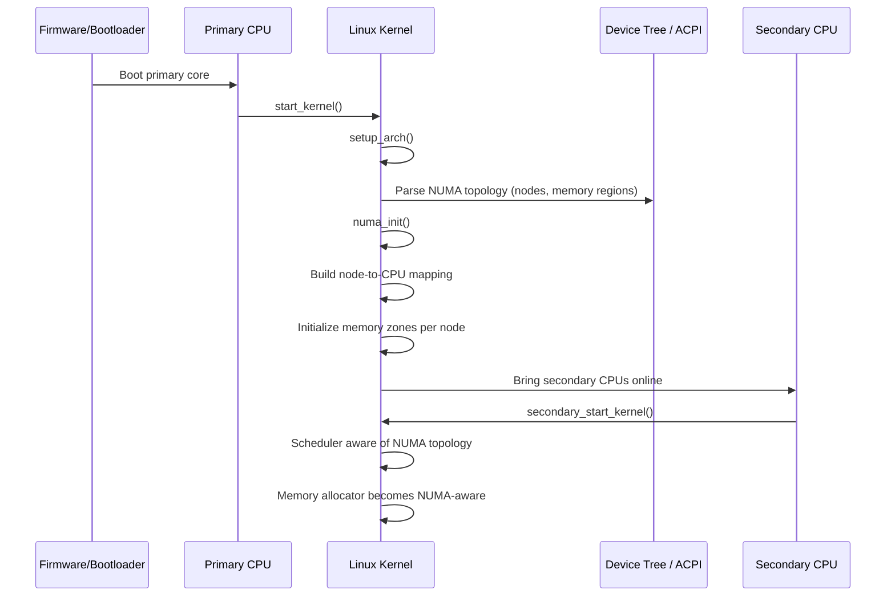
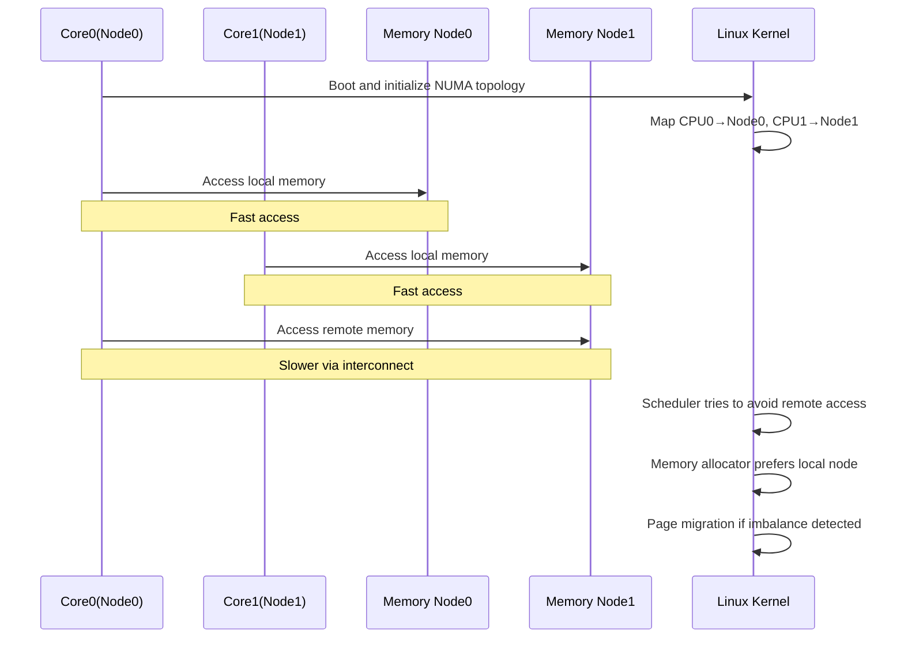

# **Explain NUMA (Variant 4)**

**A: NUMA (Non-Uniform Memory Access) means memory access latency depends on which CPU/node the memory resides in.**

---

# **Index**

## **01. Mermaid flow — How NUMA works**

## **02. Sequence diagram — NUMA behavior during Linux boot & initialization**

## **03. Kernel code flow — where NUMA is implemented and when it is used**

## **04. Important kernel functions & data structures — deep walkthrough**

## **05. Complete ARMv8 multi-core + Linux NUMA behavior**

## **Final deep 5-line answer**

---

# **01. Mermaid flow — How NUMA works**

```mermaid
flowchart TD
    A[CPU wants memory access] --> B{Is memory local to CPU node?}
    B -- Yes --> C[Access local memory]
    C --> D[Low latency, high bandwidth]

    B -- No --> E[Access remote node memory]
    E --> F[Interconnect (CCN/NoC)]
    F --> G[Remote memory access]
    G --> H[Higher latency, lower bandwidth]

    D --> I[Better performance]
    H --> J[Performance penalty]

    I --> K[NUMA-aware scheduling helps]
    J --> K
```

---

## **Core idea**

In NUMA systems:

* Each CPU (or group of CPUs) has **local memory**
* Access to **local memory is fast**
* Access to **remote memory is slower**

---

# **02. Sequence diagram — Linux boot & NUMA initialization**



---

## **What actually happens**

During boot:

* Firmware/DT describes memory regions
* Linux identifies:

  * NUMA nodes
  * CPUs belonging to nodes
  * memory ranges per node
* Kernel builds:

  * node maps
  * memory zones per node
  * scheduler domains

---

# **03. Kernel code flow — where NUMA is implemented and when called**

---

## **High-level flow**

```text
start_kernel()
  → setup_arch()
      → parse DT / ACPI
      → numa_init()
  → mm_init()
      → build memory zones per node
  → sched_init()
      → NUMA-aware scheduler domains
  → smp_init()
      → bring CPUs online
```

---

## **Where NUMA becomes active**

NUMA affects multiple subsystems:

### **1. Memory allocator**

* `alloc_pages_node()`
* `kmalloc_node()`

### **2. Scheduler**

* NUMA-aware task placement
* tries to keep task near its memory

### **3. Page migration**

* move pages closer to CPU

### **4. Per-node data**

* each node has its own memory pools

---

# **04. Important kernel functions & data structures**

---

## **4.1 `start_kernel()`**

### Role

* Entry point of kernel

### NUMA relevance

* Triggers architecture setup
* Leads to NUMA initialization

---

## **4.2 `setup_arch()`**

### Role

* Parse hardware topology

### NUMA relevance

* Detect NUMA nodes via:

  * Device Tree (ARM)
  * ACPI tables

---

## **4.3 `numa_init()`**

### Role

* Core NUMA initialization

### What it does

* Identify nodes
* Assign CPUs to nodes
* Assign memory regions to nodes

---

## **4.4 `struct pglist_data` (Node structure)**

### Represents a NUMA node

Contains:

* memory zones
* free lists
* node-specific statistics

### Why important

Each NUMA node has its own memory management structure.

---

## **4.5 `node_data[]`**

### Array of all NUMA nodes

Example:

```c
node_data[0] → Node 0
node_data[1] → Node 1
```

---

## **4.6 `alloc_pages_node(node, ...)`**

### Role

* Allocate memory from a specific NUMA node

### Why important

Used when:

* driver wants local memory
* scheduler wants locality

---

## **4.7 `kmalloc_node()`**

### Role

* Allocate kernel memory from a node

---

## **4.8 Scheduler NUMA awareness**

Scheduler tries to:

* run task on CPU near its memory
* avoid remote memory access

### Important concept

**NUMA balancing**

Kernel may:

* migrate tasks OR
* migrate memory pages

---

## **4.9 Page migration**

Kernel can move pages:

* from remote node → local node

### Why

Reduce latency for frequently accessed memory

---

## **4.10 `numa_distance[]`**

### Role

Stores distance between nodes

Example:

```text
Node0 → Node0 = 10 (local)
Node0 → Node1 = 30 (remote)
```

### Used by:

* scheduler
* memory policies

---

## **4.11 Memory policies**

Linux supports:

* local allocation
* interleave policy
* bind policy

---

# **05. Complete sequence diagram — ARMv8 multi-core + Linux NUMA**



---

# **ARMv8 + NUMA deep explanation**

---

## **1. NUMA vs UMA**

| Feature            | UMA     | NUMA                |
| ------------------ | ------- | ------------------- |
| Memory access time | Uniform | Depends on location |
| Scalability        | Limited | High                |
| Complexity         | Low     | High                |

---

## **2. Why NUMA exists**

As core count increases:

* Single shared memory becomes bottleneck
* NUMA distributes memory across nodes

---

## **3. ARMv8 NUMA systems**

In high-end ARM servers:

* multiple clusters
* each cluster has local memory
* connected via interconnect (CCN/CMN/NoC)

---

## **4. NUMA problem**

If CPU frequently accesses remote memory:

* higher latency
* lower bandwidth
* more interconnect traffic

---

## **5. Linux NUMA solution**

Linux optimizes:

### **A. CPU placement**

Run process near its memory

### **B. Memory allocation**

Allocate from local node

### **C. Migration**

Move memory or task dynamically

---

## **6. Example scenario**

* Task runs on CPU0 (Node0)
* Memory allocated on Node1

Result:

* every access is remote
* performance drop

Linux may:

* move task → Node1 OR
* move memory → Node0

---

## **7. NUMA balancing**

Automatic feature:

* tracks memory access patterns
* migrates pages if needed

---

## **8. NUMA and drivers**

Drivers should:

* prefer local memory
* use NUMA-aware allocation APIs
* avoid heavy cross-node traffic

---

## **9. NUMA impact on performance**

### Good case:

* CPU + memory local → optimal performance

### Bad case:

* CPU + memory remote → latency penalty

---

## **10. NUMA and cache interaction**

NUMA + cache works together:

* Local node → fewer cache misses
* Remote node → more latency + coherence overhead

---

# **Interview-ready answer**

“NUMA is a memory architecture where memory access latency depends on the CPU’s proximity to that memory. Each CPU or group of CPUs has local memory, and accessing remote memory involves higher latency due to interconnect traversal. In Linux, NUMA is handled by building node-to-CPU mappings during boot, and the kernel optimizes performance using NUMA-aware memory allocation, scheduling, and page migration to keep computation close to data.”

---

# **Deep 5-line answer**

1. NUMA means memory is physically distributed across nodes, and access time depends on whether memory is local or remote.
2. During Linux boot, the kernel parses hardware topology and builds NUMA node mappings for CPUs and memory.
3. The kernel memory allocator and scheduler become NUMA-aware, preferring local memory and CPU placement.
4. Linux dynamically optimizes performance using page migration and NUMA balancing.
5. In ARMv8 multi-core systems, NUMA reduces scalability bottlenecks but requires careful design to avoid remote memory penalties.
