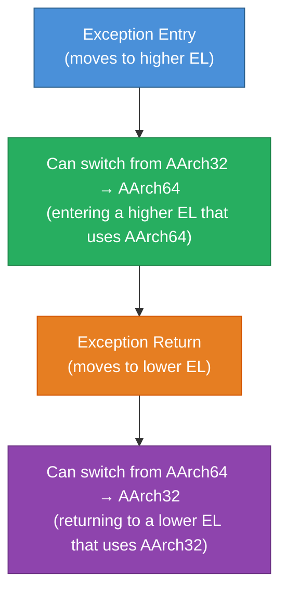
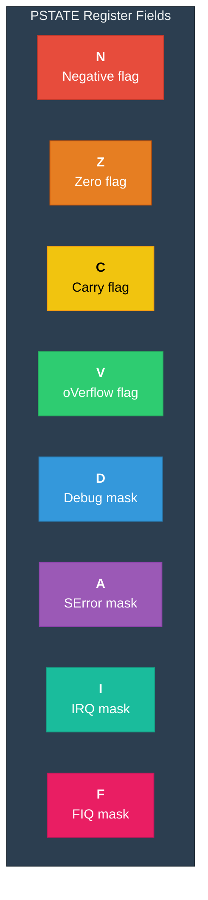
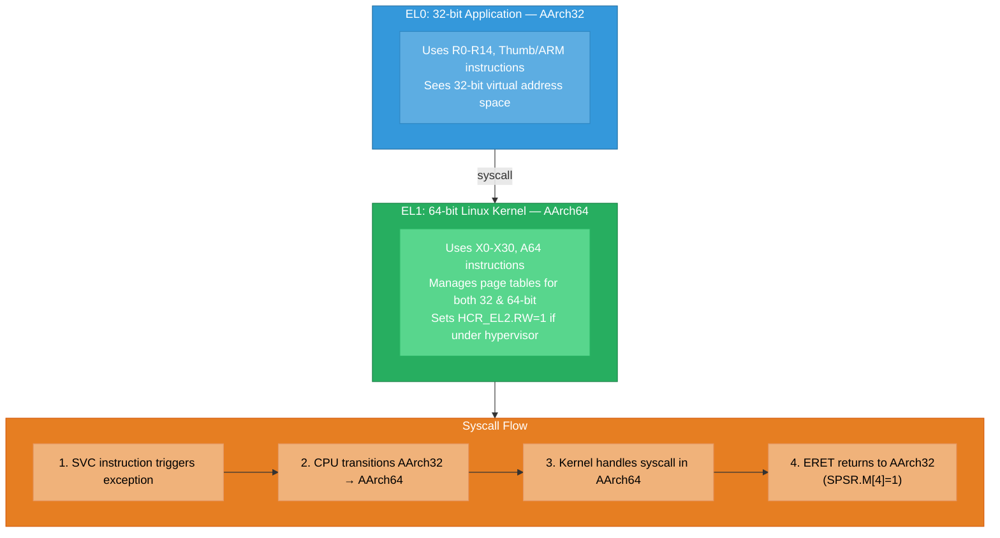

# Execution States — AArch64 & AArch32

## 1. What are Execution States?

ARMv8 defines two **execution states** — they determine the register width,
instruction set, and overall operating mode of the processor.

| Property          | AArch64                      | AArch32                         |
|-------------------|------------------------------|---------------------------------|
| Register width    | 64-bit                       | 32-bit                          |
| Instruction sets  | A64                          | A32 (ARM) + T32 (Thumb/Thumb2) |
| GP Registers      | 31 × 64-bit (X0–X30)        | 15 × 32-bit (R0–R14)           |
| PC access         | Not a GPR (implicit)         | R15 is the PC                   |
| Address size      | 48-bit (or 52-bit with ext)  | 32-bit (or 40-bit LPAE)        |
| Exception model   | EL0–EL3                      | USR/SVC/IRQ/FIQ/ABT/UND/SYS   |
| FP/SIMD regs      | 32 × 128-bit (V0–V31)       | 32 × 64-bit (D0–D31)           |

---

## 2. Execution State Transitions

**Critical Rule**: The execution state can ONLY change during an exception level change
(exception entry or exception return). You cannot switch states at the same EL.



### Rules for State Transitions

1. **A higher EL cannot be in a narrower state than a lower EL**
   - If EL1 is AArch64, EL0 can be AArch64 OR AArch32
   - If EL1 is AArch32, EL0 MUST be AArch32 (cannot be AArch64)

2. **EL3 controls EL2's state, EL2 controls EL1's state, EL1 controls EL0's state**

**Example valid configurations:**

| EL3 | EL2 | EL1 | EL0 | Valid | Description |
|---------|---------|---------|---------|-------|------------------------------------|
| AArch64 | AArch64 | AArch64 | AArch64 | ✓ | All 64-bit |
| AArch64 | AArch64 | AArch64 | AArch32 | ✓ | 32-bit app on 64-bit OS |
| AArch64 | AArch64 | AArch32 | AArch32 | ✓ | 32-bit OS + app |
| AArch64 | AArch32 | AArch32 | AArch32 | ✓ | 32-bit hypervisor + OS |
| AArch32 | AArch32 | AArch32 | AArch32 | ✓ | All 32-bit (legacy) |
| AArch64 | AArch32 | AArch64 | AArch64 | ✗ | INVALID: EL1 wider than EL2 |
| AArch32 | AArch64 | AArch64 | AArch64 | ✗ | INVALID: EL2 wider than EL3 |

---

## 3. How State Transitions Work

### AArch32 → AArch64 (on Exception Entry to Higher EL)

When an exception occurs in AArch32 and is taken to an EL running AArch64:

```
Before exception (AArch32 mode):
  R0-R14  → 32-bit registers
  CPSR    → Current program status
  
Transition:
  Hardware automatically:
  1. R0–R14 values are zero-extended into X0–X14
  2. SPSR_ELn captures the full AArch32 state (CPSR)
  3. ELR_ELn captures the return address
  4. PC jumps to the AArch64 exception vector
  
After exception (AArch64 mode):
  X0-X30  → 64-bit registers (upper bits of X0-X14 are zero)
  PSTATE  → AArch64 process state
```

### AArch64 → AArch32 (on Exception Return to Lower EL)

```
ERET instruction:
  1. CPU reads SPSR_ELn to determine target state
  2. If SPSR.M[4] == 1 → target is AArch32
  3. X0–X14 lower 32 bits become R0–R14
  4. PC set to ELR_ELn value
  5. CPSR restored from SPSR_ELn
```

---

## 4. Controlling Execution States

System registers control which execution states are used at each level:

| Register | Bit | Controls |
|----------------|------|-------------------------------|
| SCR_EL3.RW | [10] | EL2 state (1=AArch64) |
| HCR_EL2.RW | [31] | EL1 state (1=AArch64) |
| SPSR_ELn.M[4] | [4] | Return state (0=AArch64) |
| PSTATE (CPSR) | - | Current state indicator |

```asm
Example: Setting EL1 to AArch64 from EL2:
  MSR HCR_EL2, X0     // Where X0 has bit[31] = 1
```

---

## 5. PSTATE — Process State

In AArch64, the traditional CPSR is replaced by **PSTATE**, which is a collection of
individually accessible fields:



**Additional PSTATE fields:**

| Field | Description |
|--------------|------------------------------------------|
| PSTATE.EL | Current exception level (0-3) |
| PSTATE.SP | Stack pointer select (SP_EL0 or SP_ELn) |
| PSTATE.nRW | Execution state (0 = AArch64) |
| PSTATE.PAN | Privileged Access Never |
| PSTATE.UAO | User Access Override |
| PSTATE.BTYPE | Branch Type (for BTI) |
| PSTATE.SSBS | Speculative Store Bypass Safe |

---

## 6. Practical Scenario: Running a 32-bit App on 64-bit Linux



---

Next: [Exception Levels →](./02_Exception_Levels.md)
