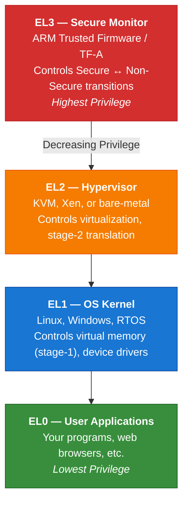
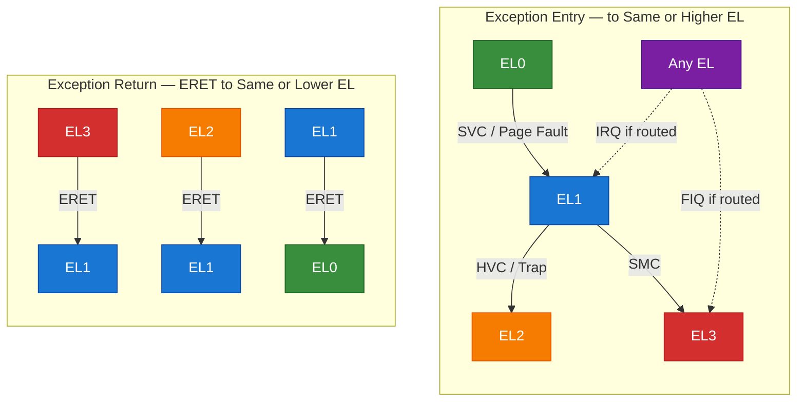
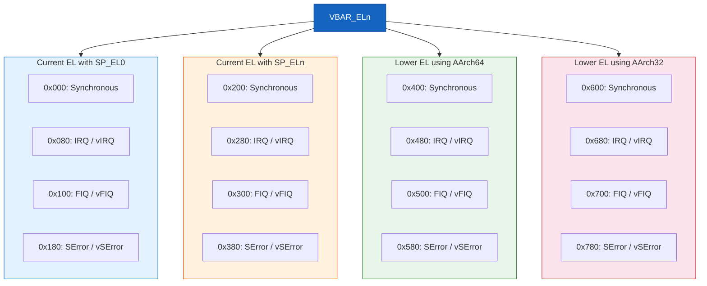
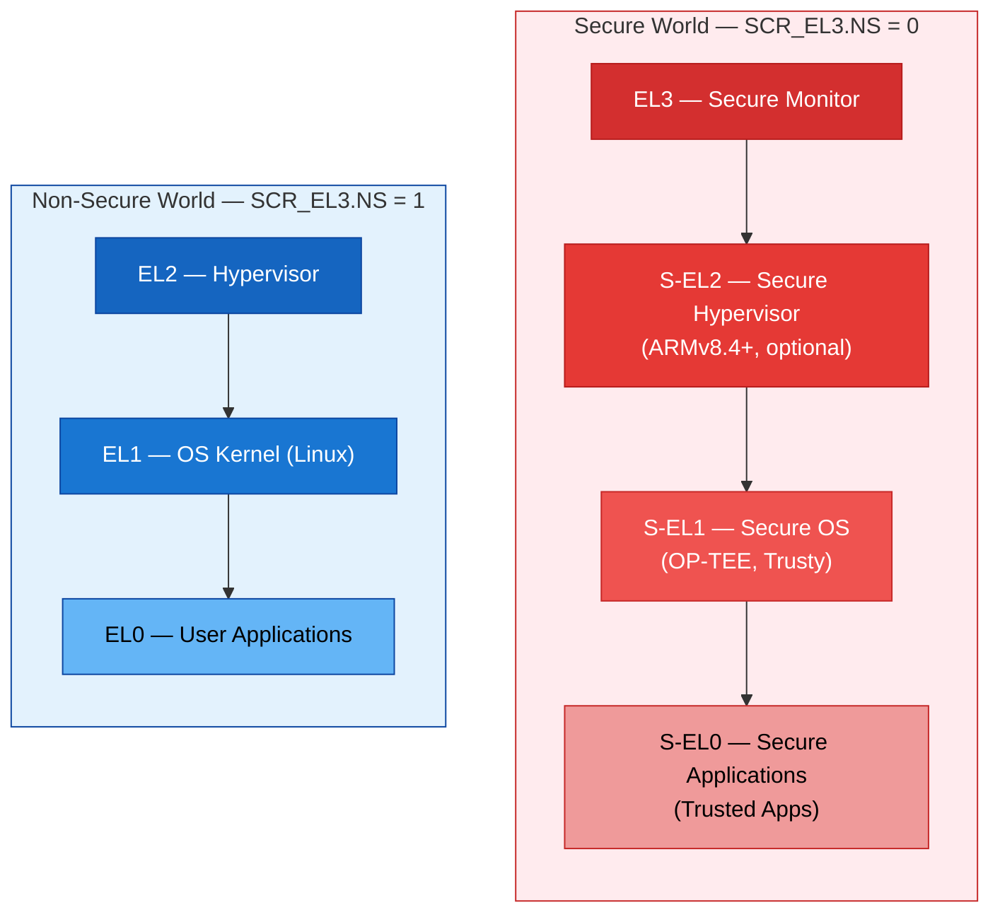
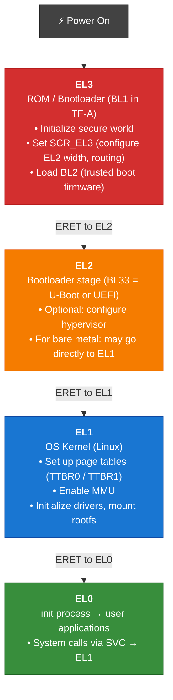

# Exception Levels — EL0 to EL3

## 1. What are Exception Levels?

Exception Levels (ELs) are **privilege levels** in ARMv8. They control what the software
can access — higher ELs have more privilege (access to more system registers, memory
regions, and hardware features).



---

## 2. Detailed Role of Each Exception Level

### EL0 — User/Application Level

- **What runs here**: User applications (ls, vim, Chrome, your code)
- **Privileges**: Minimal
  - Can access unprivileged system registers only
  - Cannot directly access hardware or change page tables
  - Cannot disable interrupts
  - Must use `SVC` (supervisor call) to request OS services
- **Key registers accessible**: General-purpose registers, NZCV flags, some timers

### EL1 — Kernel/Supervisor Level

- **What runs here**: Operating system kernel
- **Privileges**: Controls the application environment
  - Configures virtual memory (page tables, MMU)
  - Handles exceptions from EL0 (syscalls, page faults, etc.)
  - Manages interrupts (with GIC programming)
  - Access to `SCTLR_EL1`, `TCR_EL1`, `TTBR0_EL1`, `TTBR1_EL1`, etc.
- **Key system registers**:
  ```
  SCTLR_EL1   — System Control Register (MMU enable, caches, alignment)
  TCR_EL1      — Translation Control Register
  TTBR0_EL1    — Translation Table Base Register 0 (user space)
  TTBR1_EL1    — Translation Table Base Register 1 (kernel space)
  VBAR_EL1     — Vector Base Address Register (exception vectors)
  ESR_EL1      — Exception Syndrome Register (exception cause)
  FAR_EL1      — Fault Address Register
  MAIR_EL1     — Memory Attribute Indirection Register
  ```

### EL2 — Hypervisor Level

- **What runs here**: Hypervisor (virtual machine manager)
- **Privileges**: Controls guest OS environments 
  - Stage-2 address translation (guest physical → physical)
  - Trap-and-emulate guest OS register accesses
  - Virtual interrupt injection
  - Controls what EL1 can see/do
- **Key system registers**:
  ```
  HCR_EL2     — Hypervisor Configuration Register
  VTTBR_EL2   — Virtualization Translation Table Base
  VTCR_EL2    — Virtualization Translation Control
  VMPIDR_EL2  — Virtualized Multiprocessor Affinity Register
  VPIDR_EL2   — Virtualized Processor ID Register
  ```
- **VHE (Virtualization Host Extensions)** — ARMv8.1:
  Allows the host OS kernel to run at EL2 directly, avoiding EL2→EL1 overhead

### EL3 — Secure Monitor Level

- **What runs here**: Secure monitor firmware (ARM Trusted Firmware / TF-A)
- **Privileges**: Absolute — controls security state
  - Manages Secure ↔ Non-Secure world transitions
  - Controls which EL2/EL1 configurations are possible
  - Cannot be bypassed by any other level
- **Key system registers**:
  ```
  SCR_EL3     — Secure Configuration Register
  SCTLR_EL3   — System Control Register for EL3
  ```

---

## 3. Exception Level Transitions

Software can only change ELs through **exceptions** (going up) and **exception returns** (going down):



### Exception Entry Process (Hardware)

When an exception is taken to target ELn:

```
Step 1: Save the return address
        ELR_ELn = address to return to

Step 2: Save the processor state
        SPSR_ELn = PSTATE (condition flags, masks, EL, etc.)

Step 3: Set the new PSTATE
        PSTATE.EL = n (target exception level)
        PSTATE.SP = 1 (use SP_ELn by default)
        PSTATE.{D,A,I,F} = 1 (mask all interrupts/debug)
        PSTATE.nRW = 0 (AArch64 if target is AArch64)

Step 4: Jump to the exception vector
        PC = VBAR_ELn + offset (based on exception type)
```

### Exception Return Process (Software)

```
ERET instruction:
  Step 1: PC = ELR_ELn     (restore saved return address)
  Step 2: PSTATE = SPSR_ELn (restore saved processor state)
  Step 3: Continue execution at old EL
```

---

## 4. Exception Vectors (VBAR)

Each exception level has its own vector table, pointed to by `VBAR_ELn`.
The vector table has 16 entries, organized by the source of the exception:



> Each vector entry has 128 bytes (32 instructions) of space.
> Typically, the handler saves context and branches to a full handler.

---

## 5. Exception Types

### 5.1 Synchronous Exceptions

Generated by the executing instruction, deterministic:

| Exception            | Cause                                    | ESR.EC Code |
|----------------------|------------------------------------------|-------------|
| SVC                  | Supervisor Call from EL0                 | 0x15        |
| HVC                  | Hypervisor Call from EL1                 | 0x16        |
| SMC                  | Secure Monitor Call                      | 0x17        |
| Instruction Abort    | Failed instruction fetch (page fault)    | 0x20/0x21   |
| Data Abort           | Failed data access (page fault)          | 0x24/0x25   |
| SP Alignment Fault   | Unaligned stack pointer                  | 0x26        |
| PC Alignment Fault   | Unaligned PC                             | 0x22        |
| Illegal Execution    | Illegal instruction execution state      | 0x0E        |
| Trapped instruction  | Access to trapped system register/insn   | Various     |
| Breakpoint           | Software breakpoint (BRK)                | 0x3C        |
| Watchpoint           | Data watchpoint hit                      | 0x34/0x35   |

### 5.2 Asynchronous Exceptions

Events from outside the instruction stream:

| Exception | Source                         | Typical Routing      |
|-----------|--------------------------------|----------------------|
| IRQ       | Normal interrupts (GIC)        | EL1 (OS kernel)      |
| FIQ       | Fast/secure interrupts         | EL3 (Secure Monitor) |
| SError    | Asynchronous system errors     | Configurable         |

---

## 6. Exception Syndrome Register (ESR_ELn)

When a synchronous exception occurs, the hardware writes the **cause** into ESR_ELn:

**ESR_ELn** (64-bit in ARMv8.2+, 32-bit prior):

| Field | Bits | Size | Description |
|-------|------|------|-------------|
| **EC** (Exception Class) | [31:26] | 6 bits | What kind of exception |
| **IL** (Instruction Length) | [25] | 1 bit | 0 = 16-bit instruction, 1 = 32-bit instruction |
| **ISS** (Instruction Specific Syndrome) | [24:0] | 25 bits | Additional details depending on EC (e.g., read/write, access size) |

### Reading Exception Cause Example

```
MRS X0, ESR_EL1         // Read exception syndrome
LSR X1, X0, #26         // Extract EC field (bits 31:26)

// X1 now contains the exception class:
//   0x15 = SVC from AArch64
//   0x24 = Data Abort from lower EL
//   0x25 = Data Abort from same EL
```

---

## 7. Security States

ARMv8 defines two security states, controlled by EL3:



---

## 8. Practical: Boot Flow Through Exception Levels



---

Next: [Registers →](./03_Registers.md)
