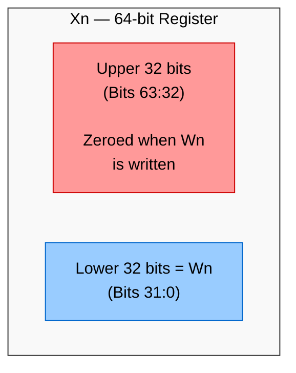
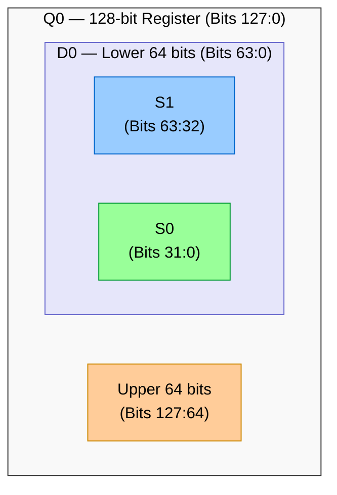

# ARMv8 Registers — Complete Reference

## 1. General-Purpose Registers (AArch64)

ARMv8 AArch64 has **31 general-purpose registers**, each 64 bits wide.

| 64-bit name | 32-bit view | Usage / Convention |
|---|---|---|
| X0 | W0 | Argument / Return value #1 |
| X1 | W1 | Argument / Return value #2 |
| X2 | W2 | Argument #3 |
| X3 | W3 | Argument #4 |
| X4 | W4 | Argument #5 |
| X5 | W5 | Argument #6 |
| X6 | W6 | Argument #7 |
| X7 | W7 | Argument #8 |
| X8 | W8 | Indirect result / syscall # |
| X9 | W9 | Temporary (caller-saved) |
| X10 | W10 | Temporary (caller-saved) |
| X11 | W11 | Temporary (caller-saved) |
| X12 | W12 | Temporary (caller-saved) |
| X13 | W13 | Temporary (caller-saved) |
| X14 | W14 | Temporary (caller-saved) |
| X15 | W15 | Temporary (caller-saved) |
| X16 (IP0) | W16 | Intra-procedure-call scratch |
| X17 (IP1) | W17 | Intra-procedure-call scratch |
| X18 | W18 | Platform register (TLS/etc) |
| X19 | W19 | Callee-saved |
| X20 | W20 | Callee-saved |
| X21 | W21 | Callee-saved |
| X22 | W22 | Callee-saved |
| X23 | W23 | Callee-saved |
| X24 | W24 | Callee-saved |
| X25 | W25 | Callee-saved |
| X26 | W26 | Callee-saved |
| X27 | W27 | Callee-saved |
| X28 | W28 | Callee-saved |
| X29 (FP) | W29 | Frame Pointer |
| X30 (LR) | W30 | Link Register (return addr) |
| **SP** | **WSP** | **Stack Pointer (per-EL)** |
| **PC** | **—** | **Program Counter (implicit)** |
| **XZR** | **WZR** | **Zero Register (hardwired 0)** |

### Key Points

- **Wn** is the lower 32 bits of **Xn**. Writing to Wn **zeros** the upper 32 bits.
- **XZR/WZR** always reads as zero; writes are discarded. Used for efficient code generation.
- **PC** is NOT a general-purpose register in AArch64 (unlike AArch32 where R15 = PC).
- **SP** has one per exception level: SP_EL0, SP_EL1, SP_EL2, SP_EL3.

**Register width views:**



---

## 2. Calling Convention (AAPCS64)

The ARM Architecture Procedure Call Standard defines register usage:

| Category | Registers | Saved by | Notes |
|---|---|---|---|
| Arguments/Return | X0–X7 | Caller | Up to 8 args |
| Syscall number | X8 | Caller | Linux syscall # |
| Temporaries | X9–X15 | Caller | Scratch regs |
| IP (linker) | X16–X17 | Caller | PLT/veneer use |
| Platform | X18 | Special | OS-specific |
| Callee-saved | X19–X28 | Callee | Must preserve |
| Frame pointer | X29 | Callee | Stack frame ptr |
| Link register | X30 | Caller | BL writes here |
| Stack pointer | SP | — | 16-byte aligned |

**Function call example:**

```asm
caller:
    MOV X0, #42          // First argument
    MOV X1, #10          // Second argument
    BL  my_function      // Branch & Link (X30 = return addr)
    // X0 now has return value

my_function:
    STP X29, X30, [SP, #-16]!  // Save FP and LR
    MOV X29, SP                 // Set up frame pointer
    ADD X0, X0, X1              // X0 = 42 + 10 = 52
    LDP X29, X30, [SP], #16    // Restore FP and LR
    RET                         // Branch to X30
```

---

## 3. Special Registers

### 3.1 Stack Pointer (SP)

Each exception level has its own stack pointer:

| Register | Description |
|---|---|
| SP_EL0 | EL0 stack pointer (also usable at EL1+) |
| SP_EL1 | EL1 stack pointer |
| SP_EL2 | EL2 stack pointer |
| SP_EL3 | EL3 stack pointer |

**PSTATE.SP** bit selects which SP is used:
- `SP = 0` → Use SP_EL0 (thread stack)
- `SP = 1` → Use SP_ELn (handler stack)

```asm
// Kernel can use SP_EL0 for per-thread stacks:
MSR SPSel, #0    // Select SP_EL0 (for thread-level stack)
MSR SPSel, #1    // Select SP_EL1 (for exception stack)
```

### 3.2 Program Counter (PC)

- Cannot be read/written directly as a register
- Read indirectly via `ADR`, `ADRP`, or by computing it
- Written indirectly via branch instructions (`B`, `BL`, `BR`, `BLR`, `RET`)

### 3.3 Link Register (X30/LR)

- `BL` (Branch with Link) stores return address in X30
- `RET` branches to X30
- Each EL also has ELR_ELn for exception return addresses

### 3.4 Saved Program Status Register (SPSR_ELn)

- Saves PSTATE on exception entry
- Restored on `ERET`
- One per exception level: SPSR_EL1, SPSR_EL2, SPSR_EL3

---

## 4. System Registers

System registers are accessed via `MRS` (read) and `MSR` (write) instructions.
They are named with the pattern: `NAME_ELn` where `n` is the lowest EL that can access them.

### 4.1 Key System Register Categories

| Category | Example Registers |
|---|---|
| Identification | MIDR_EL1, MPIDR_EL1, ID_AA64PFR0_EL1 |
| System Control | SCTLR_EL1, SCTLR_EL2, SCTLR_EL3 |
| MMU Configuration | TCR_ELn, TTBR0_ELn, TTBR1_EL1 |
| Memory Attributes | MAIR_EL1 |
| Exception Handling | VBAR_ELn, ESR_ELn, ELR_ELn, FAR_ELn |
| Cache Control | CSSELR_EL1, CCSIDR_EL1, CTR_EL0 |
| Timer | CNTPCT_EL0, CNTP_CTL_EL0 |
| Debug | MDSCR_EL1, DBGBCR\<n\>_EL1 |
| Performance Monitor | PMCCNTR_EL0, PMCR_EL0 |
| Security | SCR_EL3 |
| Virtualization | HCR_EL2, VTTBR_EL2 |
| TLB Maintenance | TLBI instructions (not registers) |
| Generic Timer | CNTKCTL_EL1, CNTFRQ_EL0 |

### 4.2 Important System Registers Explained

#### SCTLR_EL1 — System Control Register

```
Key bits:
  [0]  M   — MMU enable (0=off, 1=on)
  [1]  A   — Alignment check enable
  [2]  C   — Data cache enable
  [3]  SA  — Stack alignment check
  [12] I   — Instruction cache enable
  [19] WXN — Write implies Execute Never
  [25] EE  — Exception endianness (0=LE, 1=BE)

Example: Enable MMU and caches
  MRS X0, SCTLR_EL1
  ORR X0, X0, #(1 << 0)    // M bit: enable MMU
  ORR X0, X0, #(1 << 2)    // C bit: enable D-cache
  ORR X0, X0, #(1 << 12)   // I bit: enable I-cache
  MSR SCTLR_EL1, X0
  ISB                        // Barrier: ensure changes take effect
```

#### MPIDR_EL1 — Multiprocessor Affinity Register

Identifies which core is executing:

| Bits | Field | Description |
|---|---|---|
| [39:32] | Aff3 | Highest level affinity |
| [23:16] | Aff2 | Cluster level affinity |
| [15:8] | Aff1 | Group/cluster within Aff2 |
| [7:0] | Aff0 | Core within cluster |

**Example: 4-core single cluster**

| Core | Aff2 | Aff1 | Aff0 | MPIDR |
|---|---|---|---|---|
| Core 0 | 0 | 0 | 0 | 0x00000000 |
| Core 1 | 0 | 0 | 1 | 0x00000001 |
| Core 2 | 0 | 0 | 2 | 0x00000002 |
| Core 3 | 0 | 0 | 3 | 0x00000003 |

**Example: big.LITTLE (2 clusters × 4 cores)**
- Little cluster (Aff1=0): Aff0 = 0, 1, 2, 3
- Big cluster (Aff1=1): Aff0 = 0, 1, 2, 3

---

## 5. Floating-Point and SIMD Registers

| 128-bit | 64-bit | 32-bit | 16-bit | 8-bit |
|---|---|---|---|---|
| Q0 | D0 | S0 | H0 | B0 |
| Q1 | D1 | S1 | H1 | B1 |
| ... | ... | ... | ... | ... |
| Q31 | D31 | S31 | H31 | B31 |

> Total: 32 × 128-bit registers



SIMD operations work on vectors within these registers:
- Example: `FADD V0.4S, V1.4S, V2.4S` → Adds four 32-bit floats in parallel
- **FPCR** — Floating-Point Control Register (rounding mode, exceptions)
- **FPSR** — Floating-Point Status Register (exception flags)

---

## 6. EL0 Accessible Registers Summary

At EL0 (user mode), only these registers are directly accessible:

```
✓ X0–X30, SP, XZR          — General purpose
✓ V0–V31, FPCR, FPSR       — FP/SIMD
✓ NZCV                      — Condition flags
✓ CNTPCT_EL0                — Physical timer count (if allowed)
✓ CNTVCT_EL0                — Virtual timer count
✓ TPIDR_EL0                 — Thread ID (TLS pointer)
✓ CTR_EL0                   — Cache Type Register (if trapped: no)
✓ DCZID_EL0                 — Data Cache Zero ID

✗ SCTLR_EL1, TCR_EL1, etc.  — Kernel registers: trap to EL1
✗ TTBR0/1_EL1               — Page table bases: trap to EL1
✗ All EL2/EL3 registers      — Higher privilege: trap or UNDEF
```

---

Next: [Instruction Set →](./04_Instruction_Set.md)
