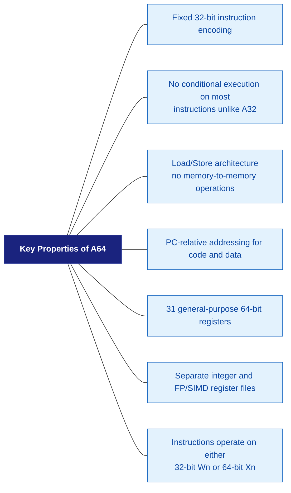

# ARMv8 Instruction Set — A64

## 1. Overview

The A64 instruction set is the **AArch64-only** instruction set introduced with ARMv8.
All instructions are **fixed-length 32 bits** (4 bytes), making decoding simpler and faster.



---

## 2. Instruction Categories

### 2.1 Data Processing — Register

| Instruction | Example | Description |
|-------------|---------|-------------|
| ADD | `ADD X0, X1, X2` | X0 = X1 + X2 |
| SUB | `SUB X0, X1, X2` | X0 = X1 - X2 |
| ADDS | `ADDS X0, X1, X2` | ADD + set flags |
| AND | `AND X0, X1, X2` | X0 = X1 & X2 |
| ORR | `ORR X0, X1, X2` | X0 = X1 \| X2 |
| EOR | `EOR X0, X1, X2` | X0 = X1 ^ X2 |
| LSL | `LSL X0, X1, #3` | X0 = X1 << 3 |
| LSR | `LSR X0, X1, #3` | X0 = X1 >> 3 (unsigned) |
| ASR | `ASR X0, X1, #3` | X0 = X1 >> 3 (signed) |
| MUL | `MUL X0, X1, X2` | X0 = X1 * X2 |
| SDIV | `SDIV X0, X1, X2` | X0 = X1 / X2 (signed) |
| UDIV | `UDIV X0, X1, X2` | X0 = X1 / X2 (unsigned) |
| MADD | `MADD X0,X1,X2,X3` | X0 = X3 + (X1 * X2) |
| MVN | `MVN X0, X1` | X0 = ~X1 |
| NEG | `NEG X0, X1` | X0 = 0 - X1 |
| CLZ | `CLZ X0, X1` | Count leading zeros |
| REV | `REV X0, X1` | Reverse bytes |
| RBIT | `RBIT X0, X1` | Reverse bits |

### 2.2 Data Processing — Immediate

| Instruction | Example | Description |
|-------------|---------|-------------|
| MOV | `MOV X0, #0xFF` | X0 = 255 |
| MOVZ | `MOVZ X0, #0x1234` | X0 = 0x1234 (zero others) |
| MOVK | `MOVK X0,#0x5678,LSL#16` | Insert into bits |
| MOVN | `MOVN X0, #0` | X0 = ~0 = 0xFFFF... |
| ADD | `ADD X0, X1, #100` | X0 = X1 + 100 |
| SUB | `SUB X0, X1, #100` | X0 = X1 - 100 |
| CMP | `CMP X0, #42` | Set flags: X0 - 42 |
| CMN | `CMN X0, #42` | Set flags: X0 + 42 |
| TST | `TST X0, #0xFF` | Set flags: X0 & 0xFF |

Building a 64-bit immediate (cannot fit in one instruction):

```asm
  MOVZ X0, #0x1234, LSL #48     // X0 = 0x1234_0000_0000_0000
  MOVK X0, #0x5678, LSL #32     // X0 = 0x1234_5678_0000_0000
  MOVK X0, #0x9ABC, LSL #16     // X0 = 0x1234_5678_9ABC_0000
  MOVK X0, #0xDEF0              // X0 = 0x1234_5678_9ABC_DEF0
```

### 2.3 Load and Store Instructions

ARM is a **Load/Store architecture** — all data processing is done on registers.
Data must be loaded from memory into registers and stored back.

| Instruction | Example | Description |
|-------------|---------|-------------|
| LDR | `LDR X0, [X1]` | Load 64-bit |
| LDRB | `LDRB W0, [X1]` | Load byte (8-bit) |
| LDRH | `LDRH W0, [X1]` | Load halfword (16) |
| LDRSB | `LDRSB X0, [X1]` | Load signed byte |
| LDRSH | `LDRSH X0, [X1]` | Load signed halfword |
| LDRSW | `LDRSW X0, [X1]` | Load signed word |
| STR | `STR X0, [X1]` | Store 64-bit |
| STRB | `STRB W0, [X1]` | Store byte |
| STRH | `STRH W0, [X1]` | Store halfword |
| LDP | `LDP X0, X1, [X2]` | Load pair |
| STP | `STP X0, X1, [X2]` | Store pair |
| LDR (literal) | `LDR X0, =label` | PC-relative load |
| LDAR | `LDAR X0, [X1]` | Load-Acquire |
| STLR | `STLR X0, [X1]` | Store-Release |
| LDXR | `LDXR X0, [X1]` | Load Exclusive |
| STXR | `STXR W2, X0, [X1]` | Store Exclusive |
| CAS | `CAS X0, X1, [X2]` | Compare & Swap (LSE) |

Addressing Modes:

```
  [X1]                   — Base register
  [X1, #8]               — Base + immediate offset
  [X1, #8]!              — Pre-indexed: X1 += 8, then access
  [X1], #8               — Post-indexed: access, then X1 += 8
  [X1, X2]               — Register offset
  [X1, X2, LSL #3]       — Scaled register offset
  [X1, W2, SXTW]         — Sign-extended 32-bit offset
```

### 2.4 Branch Instructions

| Instruction | Example | Description |
|-------------|---------|-------------|
| B | `B label` | Unconditional branch |
| BL | `BL function` | Branch & Link (call) |
| BR | `BR X0` | Branch to register |
| BLR | `BLR X0` | Branch & Link to register |
| RET | `RET` | Return (branch to X30) |
| B.cond | `B.EQ label` | Conditional branch |
| CBZ | `CBZ X0, label` | Branch if zero |
| CBNZ | `CBNZ X0, label` | Branch if not zero |
| TBZ | `TBZ X0, #5, label` | Branch if bit 5 is zero |
| TBNZ | `TBNZ X0, #5, label` | Branch if bit 5 is set |

Condition codes (for B.cond):

```
  EQ (Equal, Z=1)          NE (Not Equal, Z=0)
  CS/HS (Carry Set, C=1)   CC/LO (Carry Clear, C=0)
  MI (Minus/Negative, N=1) PL (Plus/Positive, N=0)
  VS (Overflow, V=1)       VC (No Overflow, V=0)
  HI (Unsigned Higher)     LS (Unsigned Lower or Same)
  GE (Signed ≥)            LT (Signed <)
  GT (Signed >)            LE (Signed ≤)
  AL (Always)              NV (Never — reserved)
```

### 2.5 System Instructions

| Instruction | Example | Description |
|-------------|---------|-------------|
| MRS | `MRS X0, SCTLR_EL1` | Read system register |
| MSR | `MSR SCTLR_EL1, X0` | Write system register |
| SVC | `SVC #0` | Supervisor call (syscall) |
| HVC | `HVC #0` | Hypervisor call |
| SMC | `SMC #0` | Secure monitor call |
| ERET | `ERET` | Exception return |
| NOP | `NOP` | No operation |
| WFI | `WFI` | Wait For Interrupt |
| WFE | `WFE` | Wait For Event |
| SEV | `SEV` | Send Event |
| ISB | `ISB` | Instruction Sync Barrier |
| DSB | `DSB SY` | Data Sync Barrier |
| DMB | `DMB SY` | Data Memory Barrier |
| DC | `DC CIVAC, X0` | Data Cache operation |
| IC | `IC IALLU` | Instruction Cache op |
| TLBI | `TLBI ALLE1` | TLB Invalidate |
| AT | `AT S1E1R, X0` | Address Translation |

---

## 3. Instruction Encoding

All A64 instructions are 32 bits, encoded as:

Bits [28:25] (`op0`) determine the major instruction group:

| op0 Value | Instruction Group |
|-----------|-------------------|
| `0b1000` / `0b1001` | Data Processing (Immediate) |
| `0b0101` | Data Processing (Register) |
| `0b0100` / `0b0110` | Loads and Stores |
| `0b1010` / `0b1011` | Branches |
| `0b0111` / `0b1100` | Data Processing (SIMD & FP) |
| `0b1110` / `0b1111` | Data Processing (SIMD & FP) |

### Example Encoding: ADD X0, X1, X2

Instruction: `ADD X0, X1, X2` (64-bit add, register)

Binary encoding: `1 00 01011 00 0 00010 000000 00001 00000` → Hex: `0x8B020020`

| Field | Bit(s) | Value | Description |
|-------|--------|-------|-------------|
| sf | [31] | `1` | 64-bit (0 would mean 32-bit/Wn) |
| S | [30] | `0` | No flag set (ADDS would be 1) |
| opc | [29:28] | `00` | ADD, not SUB |
| opcode | [27:21] | `01011 00` | ADD (shifted reg) |
| shift | [23:22] | `00` | shift type = LSL |
| Rm | [20:16] | `00010` | X2 |
| imm6 | [15:10] | `000000` | 0 (no shift) |
| Rn | [9:5] | `00001` | X1 |
| Rd | [4:0] | `00000` | X0 |

---

## 4. Conditional Operations (Without Branching)

A64 replaces conditional execution (IT blocks in Thumb) with conditional select:

| Instruction | Example | Description |
|-------------|---------|-------------|
| CSEL | `CSEL X0, X1, X2, EQ` | X0 = EQ?X1:X2 |
| CSINC | `CSINC X0, X1, X2, NE` | X0 = NE?X1:X2+1 |
| CSINV | `CSINV X0, X1, X2, LT` | X0 = LT?X1:~X2 |
| CSNEG | `CSNEG X0, X1, X2, GE` | X0 = GE?X1:-X2 |
| CSET | `CSET X0, EQ` | X0 = EQ ? 1 : 0 |
| CINC | `CINC X0, X1, GT` | X0 = GT?X1+1:X1 |
| CCMP | `CCMP X0, #5, #0, EQ` | Cond compare |

Example: abs(x) without branching

```asm
  CMP  X0, #0
  CSNEG X0, X0, X0, GE    // If X0 >= 0, keep X0; else X0 = -X0
```

---

## 5. Atomic Instructions (LSE — ARMv8.1)

Large System Extensions add hardware atomics to replace LL/SC loops:

| Instruction | Example | Description |
|-------------|---------|-------------|
| LDADD | `LDADD X0, X1, [X2]` | *X2 += X0 |
| LDCLR | `LDCLR X0, X1, [X2]` | *X2 &= ~X0 |
| LDSET | `LDSET X0, X1, [X2]` | *X2 \|= X0 |
| LDEOR | `LDEOR X0, X1, [X2]` | *X2 ^= X0 |
| SWP | `SWP X0, X1, [X2]` | Swap X0 ↔ *X2 |
| CAS | `CAS X0, X1, [X2]` | Compare and Swap |
| CASP | `CASP X0,X1,X2,X3,[X4]` | CAS pair |

Ordering variants:

```
  LDADD   — relaxed
  LDADDA  — acquire
  LDADDL  — release
  LDADDAL — acquire+release (sequential consistency)
```

Before LSE (using exclusive load/store loop):

```asm
  retry:
    LDXR  X1, [X2]         // Load exclusive
    ADD   X1, X1, X0       // Modify
    STXR  W3, X1, [X2]     // Store exclusive
    CBNZ  W3, retry        // Retry if failed
```

After LSE:

```asm
    LDADD X0, X1, [X2]     // Atomic add in one instruction
```

---

## 6. Memory Barrier Instructions

Critical for multi-core correctness:

| Instruction | Description |
|-------------|-------------|
| DMB | Data Memory Barrier — Ensures memory accesses before DMB are observed before memory accesses after DMB |
| DSB | Data Synchronization Barrier — Like DMB but also ensures completion (used before cache/TLB maintenance, ISB) |
| ISB | Instruction Synchronization Barrier — Flushes pipeline; ensures system register changes take effect for subsequent instructions |

**Shareability domains:**

| Domain | Description |
|--------|-------------|
| SY | Full system |
| ISH | Inner Shareable (same cluster) |
| OSH | Outer Shareable (across clusters) |
| NSH | Non-Shareable (local core only) |

**Access type qualifiers:**

| Qualifier | Description |
|-----------|-------------|
| LD | Only affects loads |
| ST | Only affects stores |
| (none) | Affects both loads and stores |

**Examples:**

| Instruction | Description |
|-------------|-------------|
| `DMB ISH` | Inner shareable barrier (all accesses) |
| `DMB ISHLD` | Inner shareable barrier (loads only) |
| `DSB SY` | Full system synchronization barrier |
| `DMB OSHST` | Outer shareable barrier (stores only) |

---

Next: [Pipeline Architecture →](./05_Pipeline.md)
