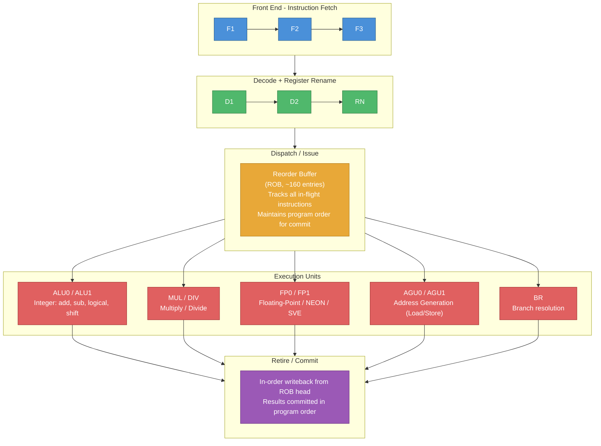
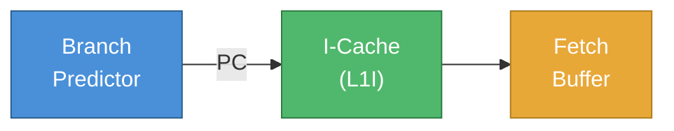

# Pipeline Architecture

## 1. What is a Pipeline?

A **pipeline** breaks instruction execution into stages that operate in parallel,
like an assembly line. While one instruction is being executed, the next is being
decoded, and the one after that is being fetched.

**Without pipeline (sequential):**


**With 5-stage pipeline:**

| Cycle | 1 | 2 | 3 | 4 | 5 | 6 | 7 | 8 |
|-------|---|---|---|---|---|---|---|---|
| Instr 1 | F | D | E | M | W | | | |
| Instr 2 | | F | D | E | M | W | | |
| Instr 3 | | | F | D | E | M | W | |
| Instr 4 | | | | F | D | E | M | W |

> After pipeline fills, one instruction completes **EVERY** cycle!

---

## 2. In-Order vs Out-of-Order Pipelines

ARMv8 microarchitectures use both approaches:

### In-Order Pipeline (e.g., Cortex-A53, Cortex-A55)

**Cortex-A53: 8-stage in-order dual-issue pipeline**


**Properties:**
- Instructions execute in program order
- Dual-issue: up to 2 instructions per cycle
- Simple hardware, low power
- If instruction stalls (cache miss), everything behind it stalls too
- Used in: efficiency/LITTLE cores

### Out-of-Order (OoO) Pipeline (e.g., Cortex-A72, A78, X1-X4)

**Cortex-A78: ~13 stage out-of-order, 4-wide decode/dispatch**



**Properties:**
- Instructions can execute out of program order
- Register renaming eliminates false dependencies (WAR, WAW)
- ROB ensures correct in-order retirement
- Higher IPC (Instructions Per Cycle) but more power/area
- Used in: performance/big cores

---

## 3. Pipeline Stages Explained

### Stage 1-3: Instruction Fetch

**Process:**
1. Branch predictor supplies predicted PC
2. I-Cache lookup using predicted PC
3. Fetch up to 4-8 instructions per cycle (fetch width)
4. If I-Cache miss → stall, fetch from L2/L3



### Stage 4-5: Decode & Rename

```
Decode:
  • Parse 32-bit instruction encoding
  • Determine operation type, source/destination registers
  • Handle macro-fusion (combine CMP + B.cond into one μop)

Register Rename:
  • Map architectural registers (X0-X30) to physical registers
  • Eliminates false dependencies:
    
    Program:              After Rename:
    ADD X1, X2, X3       ADD P10, P2, P3      ← True dependency
    SUB X1, X4, X5       SUB P11, P4, P5      ← Now independent!
    MUL X6, X1, X7       MUL P12, P11, P7     ← Uses renamed result

    Without rename: SUB must wait for ADD (WAW on X1)
    With rename: SUB can issue immediately (P10 ≠ P11)
```

### Stage 6: Dispatch / Issue

- Instructions placed into Issue Queues (reservation stations)
- When all operands are ready → issue to execution unit
- Can issue multiple instructions per cycle (width = IPC potential)
- OoO: instructions issued based on operand readiness, not order

**Issue Queue:**

| μop | Src1 Rdy | Src2 Rdy | Age | Status |
|-----|----------|----------|-----|--------|
| ADD | ✓ | ✓ | 3 | → Issue! (both ready) |
| MUL | ✓ | ✗ | 2 | Wait for Src2 |
| LDR | ✓ | — | 1 | → Issue! |

### Stage 7-9: Execute

**Execution latencies (typical):**

| Operation | Latency (cycles) |
|-----------|------------------|
| Integer ADD/SUB | 1 |
| Integer MUL | 3 |
| Integer DIV | 4-12 |
| FP ADD | 2-3 |
| FP MUL | 3-5 |
| FP DIV | 7-14 |
| L1 Cache hit | 4 |
| L2 Cache hit | ~12 |
| L3 Cache hit | ~30-40 |
| DRAM access | ~100-200 |

### Stage 10+: Retire / Commit

- Reorder Buffer (ROB) tracks all in-flight instructions
- Instructions retire in ORDER, even if executed out of order
- On retire: update architectural register state
- On exception: flush all younger instructions from ROB

**ROB (conceptual):**

| Seq | μop | Status | Result | Note |
|-----|---------|----------|--------|------|
| 1 | ADD X0 | Complete | 42 | ← HEAD (retire next) |
| 2 | LDR X1 | Complete | 0xFF | |
| 3 | MUL X2 | Pending | — | ← Can't retire yet |
| 4 | SUB X3 | Complete | 10 | ← Must wait for #3 |

---

## 4. Pipeline Hazards

### Data Hazards

```
RAW (Read After Write) — True dependency:
  ADD X1, X2, X3     // Writes X1
  SUB X4, X1, X5     // Reads X1 — must wait for ADD result
  → Solved by: forwarding/bypassing

WAW (Write After Write) — Output dependency:
  ADD X1, X2, X3     // Writes X1
  MUL X1, X4, X5     // Also writes X1
  → Solved by: register renaming

WAR (Write After Read) — Anti-dependency:
  ADD X4, X1, X5     // Reads X1
  SUB X1, X2, X3     // Writes X1
  → Solved by: register renaming
```

### Control Hazards

```
Branch instructions create uncertainty about what to fetch next:

  CMP X0, #0
  B.EQ skip            // Branch taken or not? Don't know until EX stage
  ADD X1, X2, X3       // Fetch this? Or...
  skip:
  SUB X1, X4, X5       // ...this?

  → Solved by: Branch Prediction (see next document)
  → Penalty on misprediction: flush pipeline (10-20 cycles wasted)
```

### Structural Hazards

```
Multiple instructions competing for same execution unit:
  MUL X0, X1, X2       // Needs multiplier
  MUL X3, X4, X5       // Also needs multiplier
  → Solved by: multiple execution units, or stalling
```

---

## 5. Comparison: ARM Core Microarchitectures

| | Cortex-A53 | Cortex-A55 | Cortex-A72 | Cortex-A78 | Cortex-X4 |
|----------|-----------|-----------|-----------|-----------|----------|
| Type | In-order | In-order | OoO | OoO | OoO |
| Pipeline | 8 stage | 8 stage | 15 stage | 13 stage | 14 stage |
| Decode | 2-wide | 2-wide | 3-wide | 4-wide | 10-wide |
| Issue | — | — | 5-wide | 8-wide | 16-wide |
| ROB size | — | — | 128 | ~160 | ~320+ |
| L1I | 8-32 KB | 16-64 KB | 48 KB | 64 KB | 64 KB |
| L1D | 8-32 KB | 16-64 KB | 32 KB | 64 KB | 64 KB |
| L2 | 128K-2M | 64-256K | 0.5-4 MB | 256-512K | 2 MB |
| Profile | LITTLE | LITTLE | big | big | X (peak) |

---

Next: [Branch Prediction →](./06_Branch_Prediction.md)
