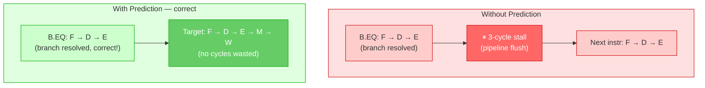
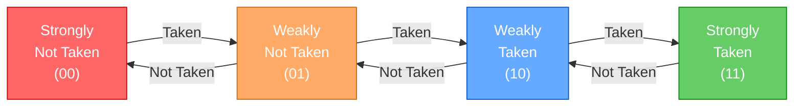
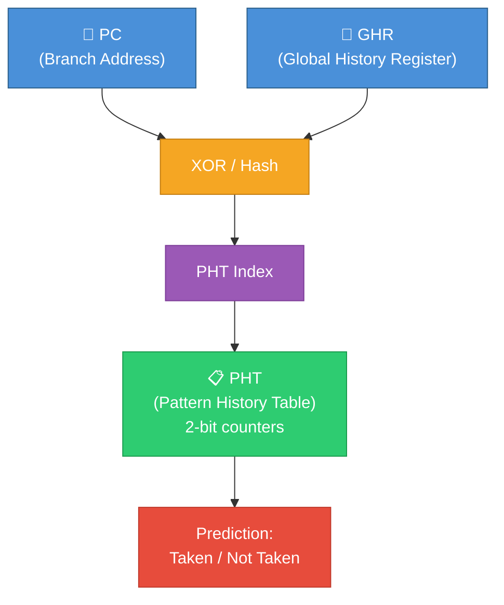
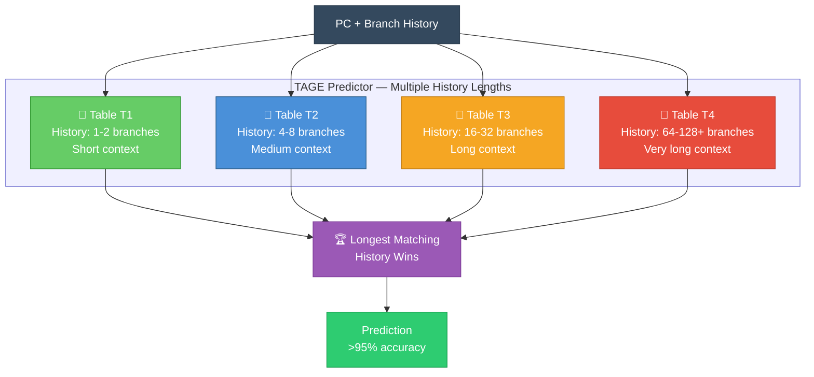
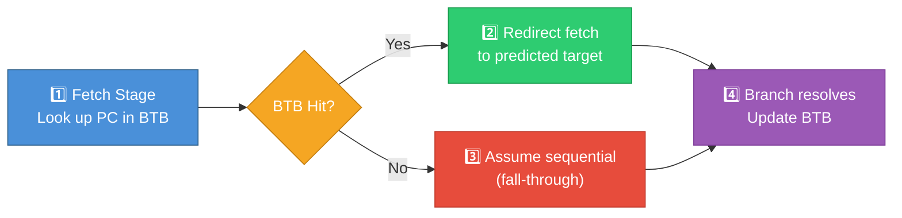
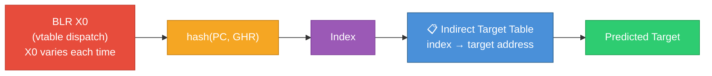
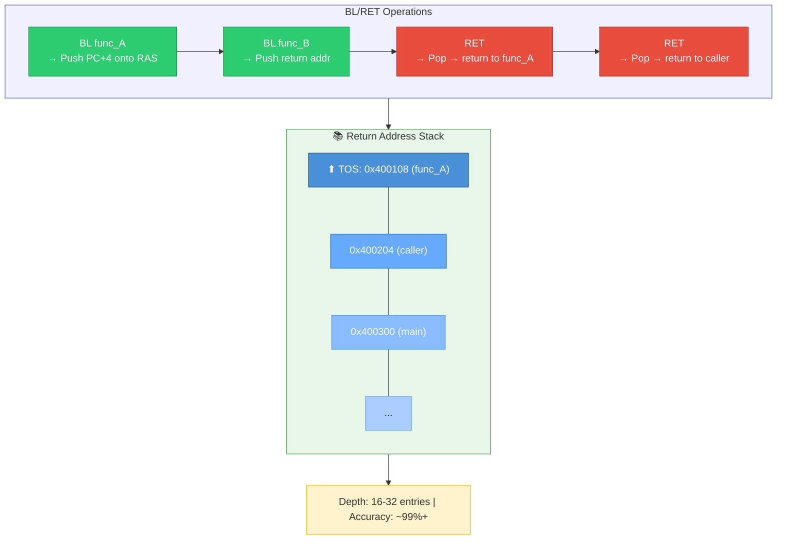
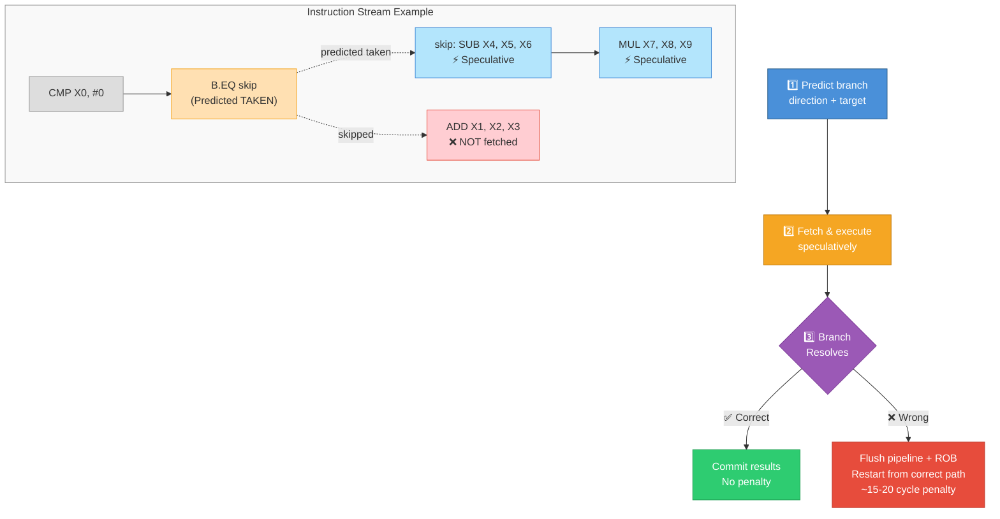

# Branch Prediction

## 1. Why Branch Prediction?

In a pipelined CPU, the next instruction must be fetched **before** the current branch
is resolved. Without prediction, the pipeline stalls at every branch (10-20% of all
instructions are branches).



**Misprediction penalty**: 10-20 cycles on modern OoO cores. All speculatively
executed instructions after the mispredicted branch must be flushed.

---

## 2. Types of Branch Prediction

### 2.1 Direction Prediction — "Taken or Not Taken?"

Predicts whether a conditional branch will be taken or fall through.

#### Bimodal Predictor (1-level)

Branch History Table (BHT): Index using lower bits of PC. Each entry is a 2-bit saturating counter.

**States:** `00` = Strongly Not Taken | `01` = Weakly Not Taken | `10` = Weakly Taken | `11` = Strongly Taken



> **Example:** Loop with 100 iterations — First: predict Not Taken (wrong on iteration 1), then predict Taken (correct for 99 iterations), last: predict Taken (wrong at loop exit). **Accuracy: 98/100 = 98%**

#### Correlating / Two-Level Predictor

Uses **global branch history** to predict based on patterns:

Global History Register (GHR): records last N branch outcomes (e.g., GHR = `10110` → T, NT, T, T, NT)

Pattern History Table (PHT): indexed by GHR (GHR `10110` → 2-bit counter for this specific pattern)



#### TAGE Predictor (Tagged Geometric History Length)

State-of-the-art predictor used in modern ARM cores:



> Each entry has a **TAG** to verify the match. Longest matching history wins — more context = better prediction. Achieves **>95% accuracy** on most workloads.

---

### 2.2 Target Prediction — "Where does it go?"

For indirect branches (BR X0, BLR X0), the target address is in a register
and must be predicted.

#### Branch Target Buffer (BTB)

**BTB:** Cache mapping branch PC → target address (Typical sizes: 2K - 8K entries)

| Branch PC | Target Address | Type |
|-----------|----------------|------|
| 0x400100  | 0x400500       | B    |
| 0x400200  | 0x401000       | BL   |
| 0x400300  | varies         | BR   |



#### Indirect Branch Predictor

For polymorphic dispatch (virtual function calls), targets change:



---

### 2.3 Return Address Stack (RAS)

Function returns are highly predictable — they go back to where BL was called from.



---

## 3. Speculative Execution

When a branch is predicted, the CPU **speculatively executes** instructions along
the predicted path before knowing if the prediction is correct.



### Security Implications: Spectre

Speculative execution can leak data through side channels:

```
  Spectre attack concept:
  1. Mistrain branch predictor
  2. Cause speculative access to secret data
  3. Secret data affects cache state
  4. Attacker observes cache timing to extract secret

  ARM mitigations:
  • SSBS (Speculative Store Bypass Safe) — PSTATE.SSBS
  • CSV2 (Cache Speculation Variant 2) — hardware fixes
  • BTI (Branch Target Identification) — restrict branch targets
  • Firmware patches (SMCCC workarounds)
```

---

## 4. Loop Prediction

Specialized prediction for loops:

```
  Loop Predictor:
  • Detects backward branches that form loops
  • Counts iterations to predict loop exit
  • Much more accurate than general predictor for loops

  Example:
    MOV X0, #100
  loop:
    SUBS X0, X0, #1
    B.NE loop            ← Loop predictor tracks this
    
    After a few iterations, predictor learns:
    → Predict TAKEN for ~99 iterations
    → Predict NOT TAKEN on the 100th
```

---

## 5. Branch Prediction in ARM Cores

```
┌──────────┬─────────────────────────────────────────────────┐
│  Core    │  Branch Prediction Details                       │
├──────────┼─────────────────────────────────────────────────┤
│ A53      │ Conditional: 2-level + loop detector            │
│          │ BTB: ~256 entries                                │
│          │ RAS: 8 entries                                   │
│          │ Misprediction penalty: ~8 cycles                 │
├──────────┼─────────────────────────────────────────────────┤
│ A55      │ Improved bimodal + loop predictor               │
│          │ BTB: 256-512 entries                             │
│          │ RAS: 16 entries                                  │
│          │ Misprediction penalty: ~8 cycles                 │
├──────────┼─────────────────────────────────────────────────┤
│ A72      │ Multi-level TAGE-like predictor                 │
│          │ BTB: 2K-4K entries                               │
│          │ RAS: 16 entries                                  │
│          │ Misprediction penalty: ~15 cycles                │
├──────────┼─────────────────────────────────────────────────┤
│ A78      │ Advanced TAGE + indirect predictor              │
│          │ BTB: 4K-8K entries                               │
│          │ RAS: 32 entries                                  │
│          │ Misprediction penalty: ~11 cycles                │
├──────────┼─────────────────────────────────────────────────┤
│ X4       │ TAGE + multi-component indirect predictor       │
│          │ BTB: 12K+ entries, multi-level                   │
│          │ RAS: 32+ entries                                 │
│          │ Misprediction penalty: ~13 cycles                │
└──────────┴─────────────────────────────────────────────────┘
```

---

## 6. BTI — Branch Target Identification (ARMv8.5)

A security feature that restricts indirect branch targets:

```
  Without BTI:
    BLR X0    → Can jump to ANY instruction
    BR  X0    → Can jump to ANY instruction
    → Attacker can redirect control flow (JOP/ROP attacks)

  With BTI enabled (SCTLR_EL1.BT = 1):
    BLR X0    → Target MUST start with BTI C or BTI JC
    BR  X0    → Target MUST start with BTI J or BTI JC
    B   label → No restriction (direct branch)
    
    If target doesn't have correct BTI → Branch Target Exception

  BTI instruction variants:
    BTI C    — Valid target for BLR (call)
    BTI J    — Valid target for BR (jump)
    BTI JC   — Valid target for both
    BTI      — Valid target for neither (compatibility NOP on non-BTI)
```

---

Next: Back to [CPU Subsystem Overview](./README.md) | Continue to [Memory Subsystem →](../02_Memory_Subsystem/)
