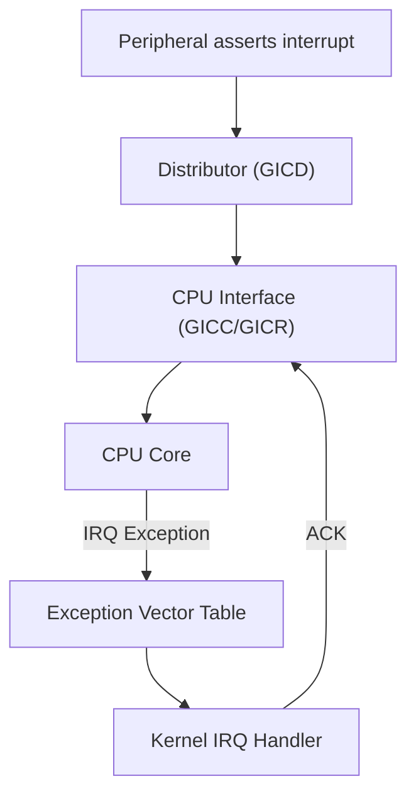
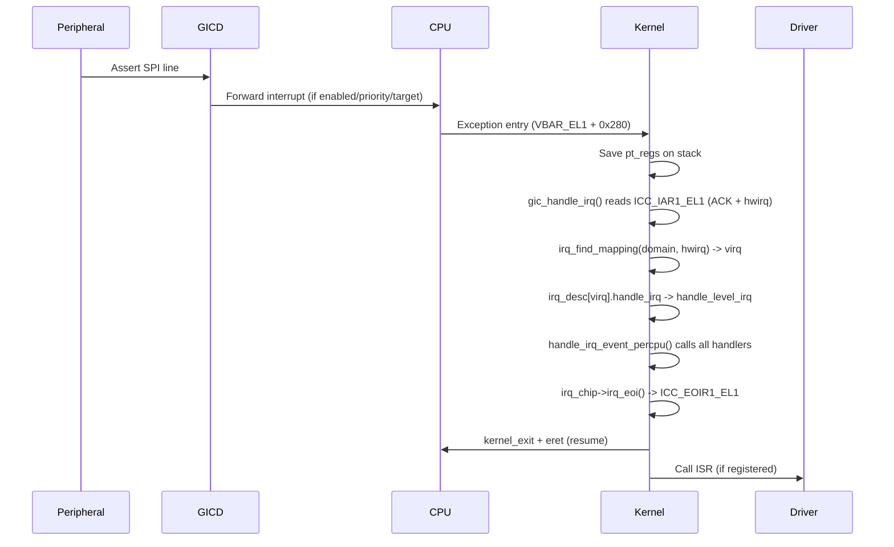
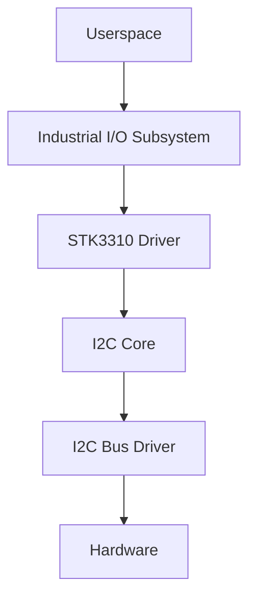

# ARM Interrupts & Linux Driver Internals: A Modern Technical Handbook

---

## Table of Contents

1. [Introduction](#introduction)
2. [ARM Exception & Interrupt Architecture](#arm-exception--interrupt-architecture)
3. [Generic Interrupt Controller (GIC)](#generic-interrupt-controller-gic)
4. [Linux IRQ Domains & irq_chip Abstraction](#linux-irq-domains--irq_chip-abstraction)
5. [Complete Interrupt Flow (ARM64/Linux)](#complete-interrupt-flow-arm64linux)
6. [Device Tree Integration](#device-tree-integration)
7. [Shared Interrupts & SPI Routing](#shared-interrupts--spi-routing)
8. [Threaded IRQs & Bottom Halves](#threaded-irqs--bottom-halves)
9. [I2C Driver Flow (STK3310 Example)](#i2c-driver-flow-stk3310-example)
10. [Tasklets, Workqueues, and Softirqs](#tasklets-workqueues-and-softirqs)
11. [IRQ/Hardirq Stack Handling](#irqhardirq-stack-handling)
12. [Quick Interview Reference](#quick-interview-reference)
13. [Key Kernel Files](#key-kernel-files)

---

## 1. Introduction

**Purpose:**  
This handbook provides a comprehensive, modern, and practical reference for ARM interrupt handling and Linux driver internals, focusing on GIC, IRQ domains, SPI interrupt flow, threaded IRQs, and I2C driver design.

---

## 2. ARM Exception & Interrupt Architecture

### Why Interrupts?

- **Efficiency:** CPU runs normal code; hardware signals when attention is needed.
- **Latency:** Fast response for critical events.
- **Priority:** Higher-priority events preempt lower ones.
- **SMP:** Interrupts can be routed to specific CPUs.

### ARM Exception Levels

| ARMv7 (ARM32) Modes | Purpose                |
|---------------------|------------------------|
| IRQ                 | Normal interrupts      |
| FIQ                 | Fast interrupts        |
| SVC                 | Supervisor (kernel)    |
| ABT                 | Abort (faults)         |
| UND                 | Undefined instruction  |
| SYS                 | System (privileged)    |
| USR                 | User mode              |

| ARMv8 (ARM64) EL | Purpose         |
|------------------|-----------------|
| EL0              | User space      |
| EL1              | Kernel (OS)     |
| EL2              | Hypervisor      |
| EL3              | Secure Monitor  |

**Exception Entry (ARM64):**
- Hardware saves PC → ELR_EL1, PSTATE → SPSR_EL1
- Jumps to vector table (VBAR_EL1 + offset)

---

## 3. Generic Interrupt Controller (GIC)

### GIC Versions

| Version | Usage         | Notes                        |
|---------|--------------|------------------------------|
| GICv1   | ARMv7        | Legacy                       |
| GICv2   | ARMv7/v8     | Cortex-A53/A57 era           |
| GICv3   | ARMv8/v9     | Modern, >8 CPUs, Redistributor|
| GICv4   | GICv3 + virt | Virtualization, KVM          |

### Interrupt Types

| Type | ID Range | Description                        |
|------|----------|------------------------------------|
| SGI  | 0–15     | Inter-processor interrupts (IPI)   |
| PPI  | 16–31    | Per-CPU (timers, PMU)              |
| SPI  | 32–1019  | Shared Peripheral Interrupts       |
| LPI  | ≥8192    | MSI-based (PCIe, GICv3+)           |

### GIC Flow Diagram



---

## 4. Linux IRQ Domains & irq_chip Abstraction

### Why IRQ Domains?

- Map hardware IRQs (hwirq) to Linux virtual IRQs (virq)
- Support for hierarchical interrupt controllers (GIC → GPIO → device)

### Key Structures

- **irq_domain:** Maps hwirq ↔ virq, supports linear/tree mapping.
- **irq_chip:** Hardware abstraction for mask/unmask/ack/EOI.

---

## 5. Complete Interrupt Flow (ARM64/Linux)

### 10-Step SPI Interrupt Flow



---

## 6. Device Tree Integration

**Example: GIC, UART, GPIO, and Device**

```dts
gic: interrupt-controller@fee00000 {
    compatible = "arm,gic-v3";
    #interrupt-cells = <3>;
    interrupt-controller;
    reg = <0x0 0xfee00000 0x0 0x10000>, <0x0 0xfef00000 0x0 0xc0000>;
};

uart0: serial@ff180000 {
    compatible = "snps,dw-apb-uart";
    reg = <0x0 0xff180000 0x0 0x100>;
    interrupts = <GIC_SPI 1 IRQ_TYPE_LEVEL_HIGH>;
    interrupt-parent = <&gic>;
};
```

---

## 7. Shared Interrupts & SPI Routing

- **IRQF_SHARED:** Multiple drivers can share a virq; all handlers called, each checks its own hardware.
- **Return values:**  
  - `IRQ_NONE`: Not my interrupt  
  - `IRQ_HANDLED`: Handled  
  - `IRQ_WAKE_THREAD`: Wake threaded handler

---

## 8. Threaded IRQs & Bottom Halves

### Why Threaded IRQs?

- Hardirq (top half): Fast, cannot sleep
- Thread (bottom half): Can sleep, acquire mutex, do I2C/SPI

**Always use `IRQF_ONESHOT` for level-triggered interrupts!**

**Flow:**

```mermaid
graph TD
    A[Hardirq handler] -- IRQ_WAKE_THREAD --> B[Threaded handler (kthread)]
    B --> C[IRQ unmasked after thread completes]
```

---

## 9. I2C Driver Flow (STK3310 Example)

### Stack Overview



### Key Functions

- `stk3310_probe()`: Allocates device, sets up regmap, verifies chip, sets up IRQ, registers device.
- `stk3310_setup_irq()`: Registers threaded IRQ.
- `stk3310_irq_handler()`: Top half, minimal work, returns `IRQ_WAKE_THREAD`.
- `stk3310_irq_event_handler()`: Bottom half, reads/clears status, pushes events.

---

## 10. Tasklets, Workqueues, and Softirqs

| Mechanism      | Context         | Can Sleep? | Use Case                |
|----------------|----------------|------------|-------------------------|
| Threaded IRQ   | kthread        | YES        | I2C/SPI, mutex, sleep   |
| Tasklet        | Softirq        | NO         | Fast, non-sleep work    |
| Workqueue      | kworker thread | YES        | Complex, multi-step     |

> **Note:** Tasklets are deprecated (Linux 5.9+). Use threaded IRQs or workqueues.

---

## 11. IRQ/Hardirq Stack Handling

- **ARM32:** IRQ mode stack (tiny), real work on SVC (task) stack (8KB)
- **ARM64:** No IRQ mode; with CONFIG_IRQ_STACKS, uses dedicated per-CPU 16KB IRQ stack via `call_on_irq_stack()`
- **Why:** Prevents stack overflow from deep/nested IRQ call chains

---

## 12. Quick Interview Reference

- **How does kernel know which driver to call for a shared interrupt?**  
  Calls ALL handlers; each checks its own hardware status.

- **Why `IRQF_ONESHOT`?**  
  For level-triggered interrupts with threaded handlers — keeps line masked until thread clears hardware, preventing interrupt storm.

- **Can you sleep in a hardirq?**  
  No. Use threaded IRQ or workqueue.

- **What happens if you call `i2c_transfer()` from a tasklet?**  
  "BUG: scheduling while atomic" — tasklets cannot sleep.

---

## 13. Key Kernel Files

| File                                 | Purpose                                  |
|---------------------------------------|------------------------------------------|
| arch/arm64/kernel/entry.S             | Exception vectors, el1_irq, macros       |
| drivers/irqchip/irq-gic-v3.c          | GICv3 driver, domain ops                 |
| kernel/irq/irqdomain.c                | IRQ domain core                          |
| kernel/irq/chip.c                     | irq_chip helpers, flow handlers          |
| kernel/irq/manage.c                   | request_irq, request_threaded_irq        |
| kernel/irq/handle.c                   | handle_irq_event_percpu, __irq_wake_thread|
| kernel/softirq.c                      | __do_softirq, tasklet_action, ksoftirqd  |
| kernel/workqueue.c                    | alloc_workqueue, queue_work              |
| drivers/iio/light/stk3310.c           | STK3310 IIO driver                       |
| drivers/i2c/i2c-core-base.c           | I2C core                                 |

---

## Summary Block

- **GIC**: Central to ARM interrupt routing; supports multiple types and priorities.
- **IRQ Domains**: Map hardware to Linux IRQs, support complex hierarchies.
- **Threaded IRQs**: Essential for drivers needing to sleep (I2C/SPI/mutex).
- **Tasklets**: Deprecated; use threaded IRQs or workqueues.
- **Stack Handling**: ARM64 uses dedicated IRQ stacks to prevent overflow.
- **Driver Design**: Always check if your handler can sleep; choose the right bottom half.

---

**Document Title:**  
**ARM Interrupts & Linux Driver Internals: A Modern Technical Handbook**

---

