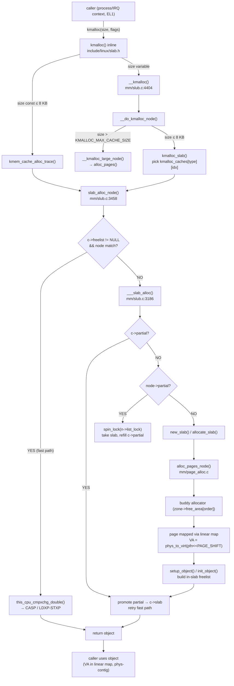
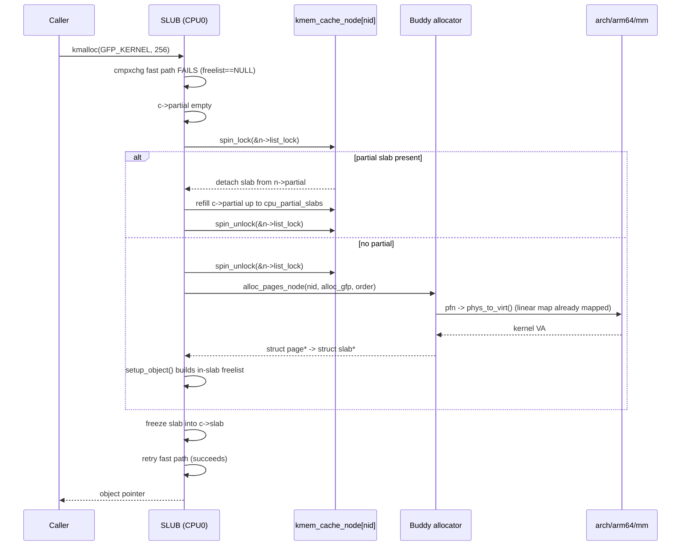

# kmalloc — ARM64 Call Flow

> Linux 6.6 · AArch64 · 4 KB pages · 48‑bit VA · `CONFIG_ARM64_LSE_ATOMICS=y`,
> `CONFIG_ARM64_PAN=y`, `CONFIG_ARM64_UAO` (deprecated in 6.6 — PAN-only path).

---

## 1. End-to-end Mermaid call graph



---

## 2. ARM64 architectural touch-points

### 2.1 Exception level

`kmalloc()` runs at **EL1 (kernel)**. Pointers it returns are kernel VAs in the **TTBR1** half (`0xffff_0000_0000_0000`..`0xffff_ffff_ffff_ffff`). User code at EL0 can never dereference them — attempting to do so traps via the translation fault handler in [`arch/arm64/mm/fault.c:do_translation_fault`](https://elixir.bootlin.com/linux/v6.6/source/arch/arm64/mm/fault.c#L466).

### 2.2 Page tables

The linear map that backs every `kmalloc`'d buffer is set up at boot in [`arch/arm64/mm/mmu.c:map_mem`](https://elixir.bootlin.com/linux/v6.6/source/arch/arm64/mm/mmu.c#L488) — it stitches all `memblock` RAM into a single 1:1 mapping under `PAGE_OFFSET`. Because the linear map is **pre-populated**, `kmalloc` itself never walks or modifies page tables on the fast path → no TLB invalidation, no `dsb`/`isb` needed.

> Contrast: `vmalloc()` *does* populate PTEs, *does* issue `flush_tlb_kernel_range()`, and *does* emit `dsb ishst; isb`. See [`../../02_large_memory_allocation/vmalloc/03_arm64_callflow.md`](../../02_large_memory_allocation/vmalloc/03_arm64_callflow.md).

### 2.3 ASID / TLB

Kernel mappings live in TTBR1 and are tagged as **global** (`nG=0`) — no ASID involvement. Because `kmalloc`'d memory is already mapped and is global, there is **no TLB shootdown** on either alloc or free. CPU migrations are transparent.

### 2.4 Atomic implementation of the fast path

`this_cpu_cmpxchg_double(freelist, tid, …)` translates on ARM64 to one of:

| `ARM64_HAS_LSE_ATOMICS` | Instruction               | Notes                          |
|-------------------------|---------------------------|--------------------------------|
| present (ARMv8.1+)      | `CASP`/`CASPA`/`CASPAL`   | Single-instruction 16 B CAS.   |
| absent                  | `LDXP` + `STXP` loop      | Exclusive monitor, may retry.  |

Selected at boot by alternatives patching ([`arch/arm64/include/asm/atomic_ll_sc.h`](https://elixir.bootlin.com/linux/v6.6/source/arch/arm64/include/asm/atomic_ll_sc.h), [`arch/arm64/include/asm/atomic_lse.h`](https://elixir.bootlin.com/linux/v6.6/source/arch/arm64/include/asm/atomic_lse.h)). The freelist+tid pair is 16 B and **16 B aligned** by `kmem_cache_cpu` layout → satisfies `CASP` alignment.

Acquire/release semantics are inherent: SLUB uses `cmpxchg_double()` which is sequentially consistent. On ARM64 that's the `CASPAL` variant (acquire + release).

### 2.5 Memory barriers

| Site                                    | Barrier             | Why                                              |
|-----------------------------------------|---------------------|--------------------------------------------------|
| Before reading `c->freelist`            | `READ_ONCE` + `barrier()` | Compiler barrier; CPU-level ordering provided by `CASPAL`. |
| New slab freshly mapped (linear map)    | none on alloc       | Mapping was set up at boot with `dsb ishst; isb`.|
| Object reuse after free                 | none required       | SLUB uses `cmpxchg_double` whose acquire side orders subsequent reads. |
| KASAN unpoison                          | `dmb ishst` (inside KASAN) | Make shadow update visible.                |

### 2.6 Cache lines

`ARCH_KMALLOC_MINALIGN` on arm64 is `cache_line_size()` aware. On a Cortex‑A76 SoC with 64‑B L1D lines, returned pointers are 64‑B aligned for buckets ≥ 64 B → no false sharing for typical cacheline-sized objects. For DMA, however, prefer `dma_alloc_coherent`; arm64 `ARCH_DMA_MINALIGN` can be 128 B and `kmalloc` may bounce through a swiotlb buffer when used with non-coherent DMA (`dma_kmalloc_needs_bounce()`).

### 2.7 PAN (Privileged Access Never)

PAN is set on entry to EL1 → kernel cannot dereference EL0 addresses by accident. `kmalloc` returns an EL1 address, so PAN does not affect it. (It matters for `copy_*_user`, where `__uaccess_enable()` temporarily clears PAN via `MSR PAN, #0`.)

### 2.8 Preemption & migration mid-allocation

Suppose CPU0 reads `tid` and `freelist`, then is preempted and rescheduled on CPU1. On CPU1:

1. `raw_cpu_ptr(s->cpu_slab)` now points to CPU1's `kmem_cache_cpu`.
2. The `this_cpu_cmpxchg_double` compares CPU1's `(freelist, tid)` against CPU0's snapshot → mismatch → cmpxchg fails → `goto again`.
3. The retry loads CPU1's per-CPU state and proceeds.

No locks, no IPIs. This is why SLUB scales so well on big-core ARM64 SoCs (e.g., Ampere Altra, Graviton 3, Snapdragon X Elite).

---

## 3. Slow-path detail — node partial under `n->list_lock`



---

## 4. Large `kmalloc` (> 8 KB) on ARM64


`kfree()` distinguishes via `folio_test_large_kmalloc()` ([`mm/slub.c:free_large_kmalloc`](https://elixir.bootlin.com/linux/v6.6/source/mm/slub.c#L4321)) and routes to `__free_pages()` directly.

---

## 5. ARM64-specific failure paths

| Symptom                                                | Source / cause |
|--------------------------------------------------------|----------------|
| `Unable to handle kernel paging request at virtual address ffff…` after free | UAF; KASAN catches via shadow at `KASAN_SHADOW_OFFSET = 0xdfff_8000_0000_0000` (4K/48b). |
| `BUG: KFENCE: out-of-bounds … in kmalloc-128`          | KFENCE-sampled allocation hit guard page. |
| `slub: Unable to allocate memory on node -1`           | `___slab_alloc` failed even after reclaim — usually fragmentation under high `order`. |
| Splat `BUG: sleeping function called from invalid context` | `GFP_KERNEL` used under spinlock; arm64 backtrace via `dump_backtrace()` in [`arch/arm64/kernel/stacktrace.c`](https://elixir.bootlin.com/linux/v6.6/source/arch/arm64/kernel/stacktrace.c). |

---

## 6. Quick disassembly hint (release build, GCC 13, ARM64)

The hot path of `kmalloc(64, GFP_KERNEL)` compiles to roughly:

```asm
    adrp    x0, kmalloc_caches+0x800       // type/index resolved at compile
    ldr     x0, [x0, #:lo12:kmalloc_caches+0x800]
    mov     w1, #0xcc0                     // GFP_KERNEL
    bl      kmem_cache_alloc_trace
    // inside slab_alloc_node:
    mrs     x4, tpidr_el1                  // per-CPU base
    add     x5, x4, x0_off_to_cpu_slab
    ldp     x6, x7, [x5]                   // freelist, tid (16B aligned)
    ...
    caspal  x6, x7, x10, x11, [x5]         // LSE 16B CAS
    cbnz    w_failed, .Lretry
    ret
```

`tpidr_el1` is the ARM64 per-CPU base register — see [`arch/arm64/include/asm/percpu.h`](https://elixir.bootlin.com/linux/v6.6/source/arch/arm64/include/asm/percpu.h). `caspal` is the LSE acquire-release CAS pair.

---

Next: [04_memory_map.md](04_memory_map.md) — where the returned pointer lives in the ARM64 virtual address space.
